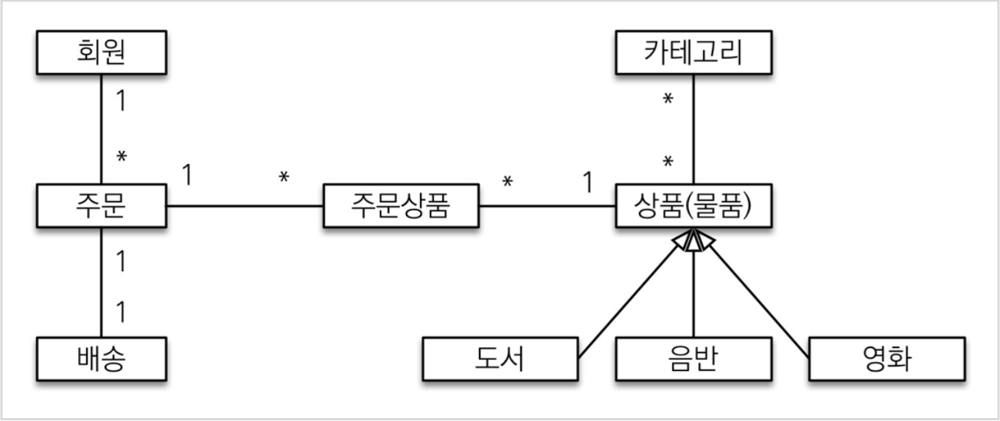
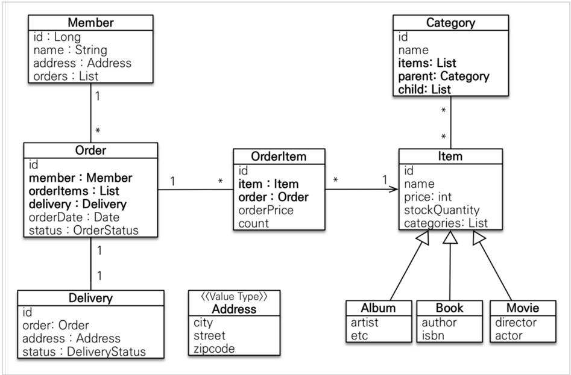
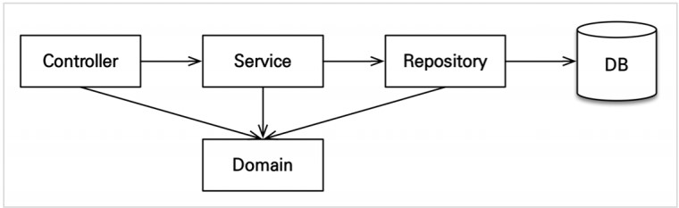

JPA 도메인 설계
===
### 환경
```
spring boot 2.7.17
java 17
```
### 의존성
```grooby
    // Spring boot
    implementation 'org.springframework.boot:spring-boot-starter-web'
    implementation 'org.springframework.boot:spring-boot-starter-data-jpa'
    implementation 'org.springframework.boot:spring-boot-starter-validation'

    // test
    testImplementation 'org.springframework.boot:spring-boot-starter-test'

    // lombok
    compileOnly 'org.projectlombok:lombok'
    annotationProcessor 'org.projectlombok:lombok'

    // lombok test
    testCompileOnly 'org.projectlombok:lombok'
    testAnnotationProcessor 'org.projectlombok:lombok'

    // h2
    runtimeOnly 'com.h2database:h2'

    // MySQL
    runtimeOnly 'com.mysql:mysql-connector-j'

    // thyleaf
    implementation 'org.springframework.boot:spring-boot-starter-thymeleaf'
    implementation 'org.springframework.boot:spring-boot-devtools'

    // p6spy
    implementation("com.github.gavlyukovskiy:p6spy-spring-boot-starter:1.5.6")
    // spring 3.0 이상시
    // implementation("com.github.gavlyukovskiy:p6spy-spring-boot-starter:1.9.0")
```

### application.yml
```yml
spring:

  datasource:
    url: "jdbc:mysql://localhost/jpashop"
    username: "root"
    password: "1234"
    driver-class-name: com.mysql.cj.jdbc.Driver

  jpa:
    hibernate:
      ddl-auto: create-drop
    properties:
      hibernate:
        # show_sql: false console 보다 log를 활용하자.
        format_sql: true
        dialect: org.hibernate.dialect.MySQL8Dialect
  

logging.level:
  org.hibernate.SQL: debug
```
+ spring.jpa.hibernate.ddl-auto:   
    내장 데이터베이스를 사용하고 스키마 관리자가 감지되지 않은 경우    
    "create-drop"으로 기본 설정됩니다. 그렇지 않으면 기본값은 "none"입니다.
    ```
    create : 기존 테이블을 삭제하고 새로 생성한다. DROP + CRREATE
    create-drop : create 속성에 추가로 어플리케이션을 종료할 때 생성한 DDL을 제거한다.
                  DROP + CREATE + DROP
    update : 데이터베이스 테이블과 엔티티 매핑정보를 비교해서 변경 사항만 수정한다.
    validate : 데이터베이스 테이블과 엔티티 매핑정보를 비교해서 차이가 있으면 경고를 남기고,
               애플리케이션을 실행하지 않는다. 이 설정은 DDL을 수정하지 않는다.
    none : 자동 생성 기능을 사용하지않는다.(외부 데이터베이스 일경우 기본 값)
    ```
   _객체와 테이블을 매핑하는 데 익숙하지 않다면 어떻게 매핑해야하는지 학습하기 좋은 설정이다_
    
### 기능 목록
+ 회원기능    

  + 회원등록
  + 회원조회
+ 상품 기능    

  + 상품 등록
  + 상품 수정
  + 상품 조회
+ 주문 기능    

  + 상품 주문
  + 주문 내역 조회    

  + 주문 취소    

+ 기타 요구 사항    

  + 상품의 재고 관리가 필요하다.   
  + 상품의 종류는 도서,음반,영화가 있다.    
  + 상품을카테고리로 구분할수 있다.   
  + 상품주문시 배송정보를입력할수있다.  
<br><br>


# 도메인 모델과 테이블 설계
</center>   

#### _관계_ 
**회원,주문,상품의 관계**: 
+ 회원은 여러 상품을 주문할 수 있다.
+ 한번 주문시 여러 상품을 선택할 수 있다.    
주문과 상품은 M:N 관계이기 때문에 중간 테이블을 만들어서 다대일,일대다 관계로 풀어낸다.    
중간 테이블에는 주문 날짜나 주문 수량, 특정 정보를 가질 수 있다.    

**상품 분류**:    
+ 상품은 도서,음반,영화로 구분한다.
+ 공통 속성을 사용하므로 상속 구조로 표현했다.
+ 테이블에는 상속 개념이 없기 때문에 공통 속성을 어떻게 관리할지 고민해봐야한다.    

## 회원 엔티티 분석
<div style="text-align: center;"></div>   

### 회원(Member)    
이름과 임베디드 타입인 주소(Address),주문(orders) 리스트를 가진다.  
> 임베디드 타입은 사용자가 직접 정의한 타입으로 데이터의 관계를 표현할 수 있다.  
  
### 주문(Order)  
주문 테이블 id 하나에 주문 아이템(OrderItem)이 참조하는 1:N 관계  
주문은 상품을 주문한 회원과 배송 정보, 주문 날짜,주문 상태를 가진다.  
주문 상태는 열거형을 사용하여 주문(ORDER),취소(CANCEL)을 표현할 수 있다.  
> Real MySQL8.0에서 열거형 타입은 성능 저하가 발생할 수 있다고 한다.  
확인해보려고 한다.  
  
### 주문상품(OrderItem)  
주문 테이블과 상품 테이블을 매핑해주는 중간 테이블로 두 테이블을 참조하는 경우에 해당되며,  
두 테이블의 PK를 참조하고, 중간 테이블에 필요한 주문 수량, 주문 시간등이 포함된다.  

  
### 상품(Item)  
이름, 가격 , 재고수량을 가지고 있다. 상품을 주문하면 재고 수량이 줄어든다.  
상품의 종류로는 도서,음반,영화가 있는데 각각이 필요한 속성이 조금씩 다르다.  
> 필드가 많을 경우에는 테이블을 하나에 사용하지 않고 분리된 테이블로 관리되어지고 있다.  

### 배송(Delivery)  
1:1 매핑에 관련된 테이블로 생각하고 연습하면 될듯하다.  
  
### 카테고리(Category)  
다대다 관계를 맺지만, 주문상품 테이블과 다르게 중간 테이블을 별개로 만들어서 관리하지 않는 경우에 해당한다.  
카테고리 테이블내에서 서로 참조하여 부모,자식 카테고리를 연결하는 과정을 공부한다.  

### 주소(Address)  
값 타입(임베티드 타입)이다. 테이블 내에서 서로 연관된 칼럼을 묶어서 목적을 나타낼수 있다.  

```
객체지향적 설계와 실무와는 다르기 때문에 회원이 주문을 참조하지 않고,
주문 테이블에 있는 회원 고유번호를 참조하기 때문에 다대일 관계가 맞다.
```  
#### MEMBER  
회원 엔티티의 `Address` 임베티드 타입 정보가 회원 테이블에 그대로 들어간다.  
#### ITEM  
공통 칼럼을 가진 엔티티를 하나의 테이블로 관리하고 `DTYPE` 칼럼으로 구분한다.  

### 연관관계 매핑 분석  
#### 양방향 관계 :  
MEMBER 1 : N ORDERS 테이블은 외래키가 ORDERS 테이블에 있다.  
비지니스로 볼 때에는 MEMBER 테이블이 가지고 있는게 맞을 수 있지만,  
실제로 수정되는 테이블은 ORDERS 테이블이고 MEMBER 테이블에 있는 ORDERS 객체를  
수정하는 건 관리와 유지보수가 어렵고, 추가적으로 별도의 업데이트 쿼리가 발생하기 때문에  
외래키를 가지고 있는 ORDERS 테이블이 연관관계 주인 객체가 되는게 맞다.  
#### 엔티티 관계 :  
테이블끼리 관계를 매핑할 때 공통 속성을 FK로 표시하듯이  
엔티티끼리 관계를 매핑할 때는 참조하는 객체에 애노테이션으로 표시(매핑)를 한다.  

## 엔티티 클래스 개발
+ 예제에서는 설명을 하기위해 getter,setter를 모두 열고, 단순하게 설계  
+ 실무에서는 필요한 부분만 getter를 사용하고, setter는 조심히 사용해야한다.  
```
참조 : 
이론적으로 Getter,Setter 모두 열어두고, 꼭 필요한 별도의 매서드를 제공하는게 이상적이다.
하지만 실무에서는 엔티티의 데이터는 조회하고, 다양한 로직에서 필요하기 때문에 열어두는 편이 편하다.
Getter는 단순 조회이기 때문에 발생할 수 있는 문제가 없지만 Setter는 데이터가 변하기 때문에 필요하고
어디서든지 사용할 경우 데이터의 수정이 발생된 위치를 찾기가 어렵다.
```
__`엔티티를 변경할 때는 Setter 대신에 변경 지점이 명확하도록 비즈니스 메서드를 별도로 제공해야한다`__

#### 회원 엔티티
```java
@Entity(name = "memberOnly")
@Getter
@Setter
public class Member {

    @Id
    @GeneratedValue(strategy = GenerationType.IDENTITY)
    @Column(name = "member_id")
    private Long id;

    private String name;

    @Embedded
    private Address address;

    @OneToMany(mappedBy = "member")
    private List<Order> orders = new ArrayList<>();

}
```
> 변수명이 칼럼명이 된다. 변경을 할 때에는 @Column(name="xxx")로 입력하면된다.  
id 대신에 테이블의 pk를 구분할 수 있는 memberId로 사용해도 된다.
#### 주문 엔티티
```java
@Entity
@Getter
@Setter
@Table(name = "orders")
public class Order {

    @Id
    @GeneratedValue
    @Column(name = "order_id")
    private Long id;

    @ManyToOne(cascade = CascadeType.ALL)
    @JoinColumn(name = "member_id") // FK 칼럼이기때문에
    private Member member ;

    @OneToMany(mappedBy = "order")
    private List<OrderItem> orderItems = new ArrayList<>();

    @OneToOne
    @JoinColumn(name = "delivery_id")
    private Delivery delivery;

    private LocalDateTime orderDate;

    @Enumerated(EnumType.STRING)
    private OrderStatus status;

    //=== 연관관계 매서드===/
    public void saveMember(Member member) {
        List<Order> orders = member.getOrders();
        boolean existOrder = orders.stream().anyMatch(order -> order.getId() == this.id);
        if(existOrder){
            return;
        }
        this.member = member;
        member.getOrders().add(this);
    }

    public void setDelivery(Delivery delivery) {
        this.delivery = delivery;
        delivery.setOrder(this);
    }

    public void addOrderItem(OrderItem orderItem) {
        this.orderItems.add(orderItem);
        orderItem.setOrder(this);
    }
}
```
#### 주문상태(Enum)
```java
public enum OrderStatus {
    ORDER,CANCEL

}
```
#### orders table
```sql
create table orders
(
    order_id    bigint auto_increment
        primary key,
    order_date  datetime(6)  null,
    status      varchar(255) null,
    delivery_id bigint       null,
    member_id   bigint       null,
    constraint FKce70udedy4yw8lbbmahcgye0i
        foreign key (member_id) references member_only (member_id),
    constraint FKtkrur7wg4d8ax0pwgo0vmy20c
        foreign key (delivery_id) references delivery (delivery_id)
);
```
> 제가 생각한 결과는 MySQL의 ENUM 타입이나 CHECK 제약조건을 사용하는 줄 알았다.  
예상과 다르게 VARCHAR(255) 문자열 타입으로 값을 저장한다.  
#### 주문상품 엔티티  
```java
@Entity
@Getter
@Setter
@Table(name = "order_item")
public class OrderItem {

    @Id
    @GeneratedValue
    @Column(name = "order_item_id")
    private Long id;

    @ManyToOne
    @JoinColumn(name = "item_id")
    private Item item;

    @ManyToOne
    @JoinColumn(name = "order_id")
    private Order order;

    private int orderPrice;
    private int count;

}
```
#### 상품 엔티티  
```java
@Entity
@Getter
@Setter
@Inheritance(strategy = InheritanceType.SINGLE_TABLE)
@DiscriminatorColumn(name = "DTYPE")
public abstract class Item {

    @Id
    @GeneratedValue
    @Column(name = "item_id")
    private Long id;

    private String name;
    private int price;
    private int stockQuantity;

    @ManyToMany(mappedBy = "items")
    private List<Category> categories = new ArrayList<>();

}
```
#### 상품-도서,앨범,영화 엔티티
```java
@Getter
@Setter
@Entity
@DiscriminatorValue("B")
public class Book extends Item {

    private String author;
    private String isbn;

}
// Getter,Setter,Entity는 동일
@DiscriminatorValue("M")
public class Movie extends Item {

    private String director;
    private String actor;

}
@DiscriminatorValue("A")
public class Album extends Item {

    private String artist;
    private String etc;

}
```
#### 배송 엔티티
```java
@Entity
@Getter
@Setter
public class Delivery {

    @Id
    @GeneratedValue
    @Column(name = "delivery_id")
    private Long id;

    @OneToOne(mappedBy = "delivery")
    private Order order;

    @Embedded
    private Address address;

    @Enumerated(EnumType.STRING)
    private DeliveryStatus status;

}
```  
#### 배송 상태
```java
public enum DeliveryStatus {
    READY,COMP

}
```  
#### 카테고리 엔티티
```java
@Entity
@Getter @Setter
public class Category {
    @Id @GeneratedValue
    @Column(name = "category_id")
    private Long id;
    private String name;
    @ManyToMany
    @JoinTable(name = "category_item",
            joinColumns = @JoinColumn(name = "category_id"),
            inverseJoinColumns = @JoinColumn(name = "item_id"))
    private List<Item> items = new ArrayList<>();
    @ManyToOne(fetch = FetchType.LAZY)
    @JoinColumn(name = "parent_id")
    private Category parent;
    @OneToMany(mappedBy = "parent")
    private List<Category> child = new ArrayList<>();
    //==연관관계 메서드==//
    public void addChildCategory(Category child) {
        this.child.add(child);
        child.setParent(this);
    }
}
```
> 실무에서는 M:N 관계인 @ManyToMany는 사용하지 않는걸 권장한다.  
중간 테이블(CATEGORY_ITEM)에 칼럼을 추가할 수 없고, 세밀하게 쿼리를 실행하기  
어렵기 때문에 실무에서 사용하기에는 한계가 명확하다. 중간 엔티티(CategoryItem)을 만들고  
@ManyToOne,@OneToMany로 매핑해서 사용하자.  
다대다 매핑을 -> 다대일 매핑으로 풀어서 사용한다.  
  
#### 주소 값 타입(임베디드)
```java
@Embeddable
public class Address {

    private String city;
    private String street;
    private String zipcode;

    protected Address() {}
    public Address(String city, String street, String zipcode) {
        this.city = city;
        this.street = street;
        this.zipcode = zipcode;
    }

}
```
> **값 타입은 변경 불가능하게 설계해야한다.**  
@Setter를 제거하고, 생성자에서 값을 모두 초기화해서 변경 불가능한 클래스로 만든다.  
JPA 스펙상 엔티티나 임베디드 타입(@Embeddeble)은 자바 기본 생성자(defualt)를 public 또는 protected로 설정해야한다. `public`으로 두는 것보다는 protected로 설정하는 것이 그나마 더 안전하다.  
JPA 구현 라이브러리가 객체를 생성할 때 리플렉션 같은 기술을 사용할 수 있도록 지원해야 하기 때문이다.  
## 엔티티 설계시 주의점
### 1. 엔티티에는 가급적 Setter를 사용하지 말자.  
Setter가 모두 열려있다. 변경 포인트가 너무 많아서, 유지보수가 어렵다.  
나중에 리펙토링으로 Setter를 제거해야한다.  
### 2. 모든 연관관계는 지연로딩으로 설정  
+ 즉시로딩(EAGER)은 예측이 어렵고,어떤 SQL이 실행될지 추적하기 어렵다.  
특히 JPQL을 실행 할 때 N+1문제가 자주 발생한다.
+ 실무에서 모든 연관관계는 지연로딩(LAZY)으로 설정해야 한다.
+ 연관관 엔티티를 함께 DB에서 조회한다면,fetch join또는 엔티티 그래프를 사용한다.  
+ @xToOne 관계는 기본이 즉시로딩이므로 지연로딩으로 변경해야한다.  
### 3. 컬렉션은 필드에서 초기화 한다.  
컬렉션은 필드에서 바로 초기화하는 것이 안전하다.
+ NULL 문제애서 안전하다  
+ 하이버네이트는 엔티티(테이블)을 영속화 할 때, 컬렉션을 감싸서 하이버네이트가  
제공하는 내장 컬렉션으로 변경한다. 내부 메커니즘에 오류가 생길 수 있으므로  
필드 레벨에서 생성하는 것이 가장 안전하고, 코드도 간결하다  
### 4. 테이블명, 컬렉션 생성 전략  
스프링 부트에서 하이버네이트 기본 매핑 전략을 변경해서 실제 테이블 필드명은 다르다.  
하이버네이트 기존 구현 : 엔티티의 필드명 그대로 테이블의 컬럼명으로 사용  
```yml
  jpa:
    hibernate:
      ddl-auto: create
      naming:
        physical-strategy: org.springframework.boot.orm.jpa.hibernate.SpringPhysicalNamingStrategy
```  
스프링 부트 신규 설정( 엔티티(필드)-> 테이블 (칼럼))
1. 카멜 케이스 -> 언더스코어(memberPoint -> member_point)
2. .(점) -> _(언터스코어)
3. 대문자 -> 소문자
```sql
create table member_only (
       member_id bigint not null auto_increment,
        city varchar(255),
        street varchar(255),
        zipcode varchar(255),
        name varchar(255),
        primary key (member_id)
    ) engine=InnoDB
```  
#### 적용 2단계  
1.  논리명생성: 명시적으로컬럼, 테이블명을 직접 적지않으면 ImplicitNamingStrategy 사용  
spring.jpa.hibernate.naming.implicit-strategy : 테이블이나, 컬럼명을 명시하지않을 때논리명 적용
2.  물리명적용:
spring.jpa.hibernate.naming.physical-strategy : 모든 논리명에적용됨, 실제 테이블에적용   
(username -> usernm 등으로 회사룰로바꿀수있음)  
```yml
spring:
  jpa:
    hibernate:
      ddl-auto: create
      naming:
        implicit-strategy: org.springframework.boot.orm.jpa.hibernate.SpringImplicitNamingStrategy
```  

## 애플리케이션 구현 준비  
### 구현 요구사항  
+ 회원기능   
  + 회원등록  
  + 회원조회  
+ 상품기능  
  + 상품등록  
  + 상품수정  
  + 상품조회  
+ 주문기능  
  + 상품주문  
  + 주문내역조회  
  + 주문취소  

### 애플리케이션 아키텍처
<div style="text-align: center;"></div>

#### 계층형구조 사용
+ controller, web: 웹계층
+ service: 비즈니스로직, 트랜잭션 처리
+ repository: JPA를직접 사용하는계층, 엔티티 매니저사용 
+ domain: 엔티티가모여있는 계층, 모든계층에서 사용  

#### 패키지구조 
+ jpabook.jpashop
  + domain 
  + exception 
  + repository 
  + service 
  + web

### 개발순서:   
서비스, 리포지토리계층을개발하고, 테스트 케이스를작성해서 검증, 마지막에웹 계층적용
> 단위 테스트를 진행후 서비스 -> 컨트롤러 테스트로 진행한다.  

## 회원 도메인 개발  
### 구현기능
+ 회원 등록
+ 회원 목록 조회  

### 순서  
+ 회원 엔티티 코드 다시보기
+ 회원 리포지토리 개발
+ 회원 서비스 개발 
+ 회원 기능 테스트  

### 회원 리포지토리 개발
#### 회원 리포지토리 코드
```java
@Repository
@Slf4j
public class MemberRepository {

    @PersistenceContext
    private EntityManager entityManager;

    public void save(Member member) {
        entityManager.persist(member);
    }

    public Member findOne(Long id) {
        return entityManager.find(Member.class, id);
    }

    public List<Member> findAll() {
        return entityManager.createQuery("SELECT m FROM memberOnly m", Member.class)
        .getResultList();
    }

    public List<Member> findByName(String name) {
        log.info("들어온 정보 {}",name);
        return entityManager
                .createQuery("select m from memberOnly m where m.name =: name", Member.class)
                .setParameter("name",name).getResultList();
    }
}
```

#### 기술 설명  
+ @Repository: 스프링 빈으로 등록,JPA 예외를 스프링 기반 예외로 예외 변환
+ @PersistenceContext: 엔티티 매니저 주입(EntityManager)  
+ @PeristenceUnit: 엔티티 매니저 팩토리(EntityManagerFactory) 주입  
  
### 회원 서비스 개발
```java
@Service
@Transactional(readOnly = true)
@Slf4j
public class MemberService {

    private final MemberRepository memberRepository;

    public MemberService(MemberRepository memberRepository) {
        this.memberRepository = memberRepository;
    }

    /**
     * 회원가입
     */
    @Transactional
    public Long join(Member member) {
        validateMember(member);
        return member.getId();
    }

    private void validateMember(Member member) {
        List<Member> findMembers = memberRepository.findByName(member.getName());
        log.info("member size = {}",findMembers.size());
        if (!findMembers.isEmpty()) {
            log.info("여기에 들어오나요 ?");
            throw new IllegalStateException("이미 존재하는 회원 입니다");
        }
        if (findMembers.isEmpty()) {
            log.info("여기에 들어오나요 ?");
            throw new IllegalStateException("이미 존재하는 회원 입니다");
        }
        /*
        내가 작성한 코드
        List<Member> findMembers = memberRepository.findByName(member.getName());
        for(findMember in findMembers){
            if(findMember.getName().equals(member.getName())){
                throw new IllegalStateException("이미 존재하는 회원 입니다.");
            }
        }
         */
    }

    public List<Member> findMembers() {
        return memberRepository.findAll();
    }

    public Member findOne(Long id) {
        return memberRepository.findOne(id);
    }

}
```  
> 강사님 코드와 제 코드의 차이  
validateMember() 메서드의 목적은 해당 이름으로 저장된 데이터를 확인하는 것.  
하지만 제 코드는 불필요한 반복문과 조건문을 사용하여 주석을 사용하지 않는 이상  
코드의 목적을 파악하기 어렵게 작성했다.  
강사님의 코드는 있다 없다를 명확하게 표현하는 List.isEmpty()를 사용했기때문에  
별다른 주석을 추가하지 않아도 목적을 알 수 있다.
  
## 회원 기능 테스트
### 테스트 요구사항
+ 회원가입을 성공해야 한다.  
+ 회원가입할 때 같은 이름이 있으면 예외가 발생해야 한다.  
> 테스트 코드 작성시 테스트의 목적을 명시적으로 작성한다.
```java
@DisplayName("주문 생성 시 주문 등록 시간을 기록한다.")
@DisplayName("회원의 이름으로 회원 정보를 조회한다.")
          :
```  
#### 테스트 코드  
+ 레포지토리 테스트
```java
//@SpringBootTest
@DataJpaTest
//@SpringBootTest
//@Transactional
@Import(MemberRepository.class)
@AutoConfigureTestDatabase(replace = AutoConfigureTestDatabase.Replace.NONE)
class MemberRepositoryTestBySelf {

    @Autowired
    MemberRepository memberRepository;

    @DisplayName("등록된 회원이 있을 경우 회원 정보를 모두 조회한다.")
    @Test
    void findAll(){
        //given
        String name1 = "둘리";
        String name2 = "또치";
        Member member1 = createMember(name1);
        Member member2 = createMember(name2);
        memberRepository.save(member1);
        memberRepository.save(member2);

        //when
        List<Member> findMembers = memberRepository.findAll();

        //then
        Assertions.assertThat(findMembers).hasSize(2)
                .extracting("name")
                .containsExactlyInAnyOrder(name1,name2);
    }

    @DisplayName("등록된 회원이 있을 경우 없을 경우 조회 결과는 비어있다.")
    @Test
    void findAllWhenMemberIsEmpty(){
        //when
        List<Member> findMembers = memberRepository.findAll();

        //then
        Assertions.assertThat(findMembers).isEmpty();
    }

    @DisplayName("해당 이름으로 등록된 회원이 있을 때 이름으로 회원정보를 조회한다.")
    @Test
    void findByName(){
        //given
        String targetName = "둘리";
        Member member = createMember(targetName);
        memberRepository.save(member);

        //when
        List<Member> findMemberList = memberRepository.findByName(targetName);

        //then
        Assertions.assertThat(findMemberList).hasSize(1)
                .extracting("name")
                .contains(targetName);
    }

    private Member createMember(String name) {
        Member member = new Member();
        member.setName(name);
        member.setAddress(new Address("서울시","마포구","아현동"));
        return member;
    }
}
```
+ 서비스 테스트 
```java

@SpringBootTest
@Transactional
public class MemberServiceTestSelf {

    @Autowired
    MemberService service;

    @DisplayName("중복된 회원 이름이 없을 경우 회원가입이 된다.")
    @Test
    void joinMember(){
        //given
        String name = "둘리";
        Member member = createMember(name);

        //when
        Long memberId = service.join(member);

        //then
        Assertions.assertThat(member.getId()).isEqualTo(memberId);
        Assertions.assertThat(member.getName()).isEqualTo(name);
    }

    @DisplayName("동일한 회원 이름으로 가입할 경우 예외가 발생한다.")
    @Test
    void saveMemberWhenDuplicateName(){
        //given
        String targetName = "둘리";
        Member member = createMember(targetName);
        Member sameNameMember = createMember(targetName);
        service.join(member);

        //when //then
        Assertions.assertThatCode(()->service.join(sameNameMember))
                .isInstanceOf(IllegalStateException.class)
                .hasMessage("이미 존재하는 회원 입니다");
    }

    private Member createMember(String name) {
        Member member = new Member();
        member.setName(name);
        member.setAddress(new Address("서울시","마포구","아현동"));
        return member;
    }
}
```
### 테스트 케이스를 위한 설정  
테스트 케이스는 격리된 환경에서 실행하고, 끝나면 데이터를 초기화하는 것이 좋다.  
그러면에서 메모리 DB를 사용하는 것이 이상적이다.  
추가로 테스트 케이스를 위한 스프링 환경과, 이반적인 애플리케이션 환경은 보통 다르므로  
다음과 같이 간단하게 테스트용 설정 파일을 추가하면 된다.  
> test/resources/application.yml
```yml
# yml 파일
spring:
#  datasource:
#    url: jdbc:h2:mem:testdb 
#    username: sa
#    password:
#    driver-class-name: org.h2.Driver
#  jpa:
#    hibernate:#      ddl-auto: create
#    properties:
#      hibernate:
#        show_sql: true
#        format_sql: true 
#    open-in-view: false
logging.level:
org.hibernate.SQL: debug 
#  org.hibernate.type: trace
```
테스트에서 스프링을 실행하면 이 위치에 있는 설정파일을 읽는다.  
(만약 이 위치에 없으면 `src/resources/apllication.yml`을 읽는다.)  
  
스프링 부트는 datasource 설정이 없으면, 기본적으로 메모리 DB를 사용하고,  
driver-class도 현재 등록된 라이브러리를 보고 찾아준다.  
추가로 ddl-auto도 create-drop모드로 동작한다.  
따라서 데이터소스나, JPA 관련된 별도의 추가 설정을 하지 않아도 된다.  

#### 설정한 DB로 테스트를 진행하고 싶은 경우
```java
@AutoConfigureTestDatabase(replace = AutoConfigureTestDatabase.Replace.NONE)
```
어노테이션을 붙여주면 된다.
