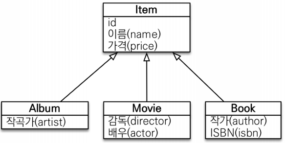

# 다형성 쿼리
<div style="text-align: center;"></div>  
  
[공식문서 링크](https://docs.jboss.org/hibernate/orm/6.4/querylanguage/html_single/Hibernate_Query_Language.html#functions-typecasts)  
<!-- TOC -->
* [다형성 쿼리](#다형성-쿼리)
  * [TYPE](#type)
  * [TREAT(JPA 2.1)](#treatjpa-21)
    * [정리](#정리)
<!-- TOC -->
## TYPE

엔티티 타입을 평가하는 함수인 `type()`은 식별 변수에 적용되며, **참조된 엔티티의 엔티티 이름을 평가합니다**. 이는 주로 엔티티 상속 계층 구조를 다룰 때 유용합니다.  
공식문서 예제 :
```jpaql
select payment
from Payment as payment 
where type(payment) = CreditCardPayment
```

+ 테스트 코드
```java
@DisplayName("타입 테스트")
@Test
void t1(){
    Book book = new Book();
    book.setAuthor("이영한");
    book.setIsbn("12-457-57");
    book.setName("JPA");
    book.setPrice(35000);
    em.persist(book);

    em.flush();
    em.clear();

    Item findBook = em.createQuery("select i from Item as i where type(i) = Book ", Item.class).getSingleResult();
    System.out.println(findBook.getName());
}
```
+ `@Inheritance(strategy = InheritanceType.SINGLE_TABLE)`
    ```sql
    select
        item.*
    from
        Item iteam 
    where
        iteam.DTYPE='Book'
   ```  
+ `@Inheritance(strategy = InheritanceType.JOINED)`
    ```sql
    select
        item.id as id2_3_,
        item.name as name3_3_,
        item.price as price4_3_,
        book.author as author1_2_,
        book.isbn as isbn2_2_,
        album.artist as artist1_1_,
        movie.actor as actor1_5_,
        movie.director as director2_5_,
        item.DTYPE as dtype1_3_ 
    from
        Item item 
    left outer join
        Book book on item.id=book.id 
    left outer join
        Album album on item.id=album.id 
    left outer join
        Movie movie on item.id=movie.id 
    where
        item.DTYPE='Book'
    ```  
  
**_상속 매핑 전략마다 쿼리가 달라집니다._**  
  
## TREAT(JPA 2.1)
treat() 함수는 **식별 변수의 타입을 좁히는 데 사용**될 수 있습니다. 이것은 엔티티 상속 계층 구조를 다룰 때 유용합니다.   

공식문서 예제:
```jpaql
select payment
from Payment as payment
where length(treat(payment as CreditCardPayment).cardNumber)
        between 16 and 20
```

+ 테스트 코드
    ```java
    @DisplayName("treat 테스트")
    @Test
    void t2(){
        Book book = new Book();
        book.setAuthor("이영한");
        book.setIsbn("12-457-57");
        book.setName("JPA");
        book.setPrice(35000);
        em.persist(book);
    
        em.flush();
        em.clear();
    
        Item findBook = em.createQuery("select i from Item as i where treat (i as Book).author = '이영한' ", Item.class).getSingleResult();
        System.out.println(findBook.getName());
    }
    ```
    ```sql
    select
        item.*
    from
        Item item 
    where
        item.DTYPE='Book' 
        and item.author='이영한'
    ```  
+ 자바의 타입 캐스팅과 유사
+ 상속 구조에서 **부모 타입을 특정 자식 타입으로 다룰 때 사용**
+ `FROM`, `WHERE`, `SELECT`(하이버네이트 지원) 사용  

### 정리

| Special function | Purpose          | Signature          | JPA standard |
|------------------|------------------|--------------------|--------------|
| type()           | (구체적인) 엔티티 이름 반환 | type(e)            | ✔            |
| treat()          | 엔티티 타입을 좁힘       | treat(e as Entity) | ✔            |
