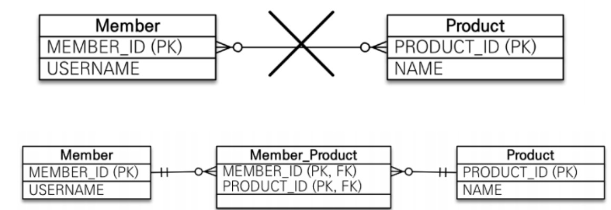
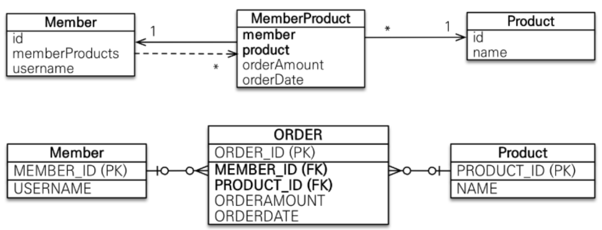

# 다대다 [N:M] 연관관계 매핑  
<div style="text-align: center;"></div>  
  
다대다 [N:M] 관계는 RDBMS 테이블 관계에서는 표현할 수 없다. 
왜냐하면 **_정규화된 테이블 2개는 다대다를 표현할 수 없기 때문입니다._** 
정규화된 테이블은 식별자로 레코드를 구분합니다. 아래와 같이 테이블로 간단하게 표현해보면 

| member_id | username | product_id1 | product_id2 |
|-----------|----------|-------------|-------------|
| 1         | 둘리       | 1           | 2           |
| 2         | 또치       | 2           | 1           |

| product_id | name | member_id1 | member_id2 |
|------------|------|------------|------------|
| 1          | 칸쵸   | 1          | 2          |
| 2          | 빈츠   | 1          | 2          |
  
상품을 추가할때마다 `Member` 테이블은 칼럼을 추가해야하고, 반대로 `Product` 테이블도 칼럼을 추가해야합니다. 
여기서 상품을 제거했다고하면 칼럼을 제거하거나 비워둬야겠죠. 확장성이 떨어지고, 
`둘리`가 선택한 상품을 조회하기도 어렵습니다.  
레코드를 쌓는 방식으로 표현한다고 한다면 식별자로 데이터를 관리할 수 없게 됩니다.

| member_id | username | product_id |
|-----------|----------|------------|
| 1         | 둘리       | 1          |
| 1         | 둘리       | 2          |
  
그래서 테이블에서는 `[M:N]` 관계를 표현할 수 없고 중간 테이블을 만들어서 
일대다, 다대일로 풀어냅니다.  
  
그런데 객체는 테이블과 다르게 다대다 관계를 만들 수 있습니다. 
서로 필드에 `List<Member>,List<Product>`로 참조하면 됩니다. 
 
하지만 ORM은 결국 테이블과 매핑을 해야하기 때문에 중간 테이블을 만들어서 연결합니다.  
다대다 단방향 매핑 코드입니다.
```java

@Entity
public class Product {
    @Id
    private Long id;
    private String name;
}
@Entity
public class Member {
    @Id
    @Column(name = "member_id")
    private Long id;
    private String username;
    @ManyToMany
    private List<Product> products = new ArrayList<>();
}
```
#### 다대다 양방향
다대다 양방향도 가능합니다.
```java
@Entity
public class Product {
    @Id
    private Long id;
    private String name;
    @ManyToMany(mappedBy="products")
    private List<Member> members = new ArrayList();
}   
```  

```sql
create table Member_Product (
       Member_member_id bigint not null,
        products_id bigint not null
)
alter table Member_Product
    add constraint FKcptdhatwstej13fgof03lx38i
        foreign key (products_id)
            references Product
alter table Member_Product
    add constraint FK4pepk58dqihq3pb7wy022800m
        foreign key (Member_member_id)
            references Member
```  
개발자가 만들지 않은 테이블을 만들고 두 테이블을 참조하는 FK 필드를 만들었습니다.  
연결 테이블에 대한 설정을 애노테이션으로 추가할 수 있습니다.
```java
@ManyToMany
@JoinTable(name = "CUSTOM_MEMBER_PRODUCT",
    joinColumns = @JoinColumn(name = "member_id"),
        inverseJoinColumns = @JoinColumn(name = "product_id"))
private List<Product> products = new ArrayList<>();
```
```sql
create table CUSTOM_MEMBER_PRODUCT (
   member_id bigint not null,
    product_id bigint not null
)
```  
#### @JoinTable의 속성
+ name : 매핑할 연결 테이블 이름을 지정합니다.
+ joinColumns : 현재 방향인 회원과 매핑할 조인 칼럼 정보를 지정합니다.
+ inverseJoinColumns : 반대 방향인 상품과 매핑할 조인 칼럼 정보를 지정합니다.
  
여기서 실제로 데이터를 저장하고 조회를 할때 SQL을 확인해보겠습니다.  
  
```java
@DisplayName("다대다 관계일 때 조회시")
@Test
void t1(){
    EntityTransaction tx = em.getTransaction();
    tx.begin();
    //given
    Product product = new Product();
    product.setId(1L);
    product.setName("레노버");
    em.persist(product);
    Member member = new Member();
    member.setUsername("둘리");
    em.persist(member);
    member.setProducts(List.of(product));
    em.flush();
    em.clear();
    //when
    Member findMember = em.find(Member.class, member.getId());
    List<Product> findMemberProducts = findMember.getProducts();

    for (Product findMemberProduct : findMemberProducts) {
        System.out.printf("product.name = %s%n",findMemberProduct.getName());
    }

    //then
    tx.commit();
}
```
```sql
select
    customTable.member_id as member_i1_0_0_,
    customTable.product_id as product_2_0_0_,
    product.id as id1_6_1_, -- 실제 사용 엔티티 필드
    product.name as name2_6_1_ -- 실제 사용 엔티티 필드
from
    CUSTOM_MEMBER_PRODUCT customTable
        inner join
    Product product
    on customTable.product_id=product.id
where
    customTable.member_id=?
```   
중간 테이블인 `CUSTOM_MEMBER_PRODUCT`와 `Product`을 조인해서 연관된 상품을 조회합니다. 
그리고 조회 결과에서 custom으로 중간테이블의 데이터와 매핑해야할 `product` 엔티티의 필드는 `as`에 id,name으로 변환해서 매핑하는 것을 확인할 수 있습니다. 
그러면 임의로 `CUSTOM_MEMBER_PRODUCT`에 필드를 추가한다면 어떻게 될지 확인해보겠습니다.
```sql
ALTER TABLE CUSTOM_MEMBER_PRODUCT
ADD COLUMN reg_date DATE DEFAULT CURRENT_DATE;
```
```xml
<property name="hibernate.hbm2ddl.auto" value="none"/> <!-- 변경 -->
```
| MEMBER_ID | PRODUCT_ID | REG_DATE   |
|-----------|------------|------------|
| 1         | 1          | 2023-11-25 |
| 3         | 2          | 2023-11-25 |
실제 연결 테이블의 정보는 위와 같습니다. 그런데 JPA가 실행하는 쿼리를 보면 
```java
select
    customTable.member_id as member_i1_0_0_,
    customTable.product_id as product_2_0_0_,
    product.id as id1_6_1_, -- 실제 사용 엔티티 필드
    product.name as name2_6_1_ -- 실제 사용 엔티티 필드
from
    CUSTOM_MEMBER_PRODUCT customTable
inner join
    Product product
    on customTable.product_id=product.id
where
    customTable.member_id=?
```  
아까와 동일합니다. `Member.products`는 `List<Product>`이기 때문에 엔티티에 매핑해야할 테이블 정보만 읽어왔습니다.  
중간 테이블을 읽어오고 싶어도 매핑된 Entity 클래스가 없기 때문에 중간 테이블을 활용할 수가 없습니다.
  
### 다대다 매핑의 한계와 극복 및 연결 엔티티 사용
회원과 상품사이에 관계를 나타낼때 주문으로 관계를 표현할 수 있습니다. 
주문 테이블은 N:M을 풀어주는 연결 테이블이며 해당 테이블은 주문한 날짜, 주문 수량등을 추가로 나타내야합니다. 
  
테이블의 데이터 변경이나 조회가 필요하다면 식별자를 추가하여 엔티티 클래스로 관리합니다. 

<div style="text-align: center;"></div>  

MemberProduct 테이블의 PK를 설정할 때 두 가지 방법이 있습니다. 
1. 대리키를 PK로 설정한다.
2. 복합키를 PK로 설정한다.  

먼저 대리키를 PK로 설정하여 중간 테이블로 다대다 관계를 풀어보겠습니다. 
```java
@Entity
public class MemberProduct {
    @Id @GeneratedValue
    private Long id;
    @ManyToOne
    private Member member;
    @ManyToOne
    private Product product;
    private int orderAmount;
}
```
+ 테스트 코드 입니다.
```java
@DisplayName("대리키를 가진 중간 테이블로 풀어서 사용")
@Test
void t1(){
   //given
   EntityTransaction tx = em.getTransaction();
   tx.begin();

   Member member = new Member();
   member.setUsername("둘리");
   em.persist(member);

   Product product = new Product();
   product.setName("탕후루");
   em.persist(product);

   MemberProduct memberProduct = new MemberProduct();
   memberProduct.setMember(member);
   memberProduct.setProduct(product);
   memberProduct.setOrderAmount(3);

   member.setMemberProducts(List.of(memberProduct));
   product.setMemberProducts(List.of(memberProduct));

   em.persist(memberProduct);
   //then
   tx.commit();
}
```  
이제 MemberProduct를 Member를 통해서 가져와보겠습니다.  
```java
public class MtoN {
    private EntityManager em;
    private static final EntityManagerFactory emf = Persistence.createEntityManagerFactory("hello");
    @BeforeEach
    void setUp(){
        em = emf.createEntityManager();
    }
    @AfterAll
    static void finish(){
        emf.close();
    }

   @DisplayName("대리키를 가진 중간 테이블로 풀어서 사용")
   @Test
   void t1(){
       //given
       EntityTransaction tx = em.getTransaction();
       tx.begin();

       Member member = new Member();
       member.setUsername("둘리");
       em.persist(member);

       Product product = new Product();
       product.setName("탕후루");
       em.persist(product);

       MemberProduct memberProduct = new MemberProduct();
       memberProduct.setMember(member);
       memberProduct.setProduct(product);
       memberProduct.setOrderAmount(3);
       em.persist(memberProduct);

       member.setMemberProducts(List.of(memberProduct));
       product.setMemberProducts(List.of(memberProduct));

       em.flush();
       em.clear();
       Member findMember = em.find(Member.class, member.getId());
       for (MemberProduct findMemberMemberProduct : findMember.getMemberProducts()) {
           System.out.println("주문수량"+ findMemberMemberProduct.getOrderAmount());
       }

       //then
       tx.commit();
   }
}
```  
```sql
select
    -- MemberProduct Entity
    memberprod0_.id as id1_3_0_,
    memberprod0_.id as id1_3_1_,
    memberprod0_.orderAmount as orderamo2_3_1_,
    memberprod0_.member_id as member_i3_3_1_,
    memberprod0_.member_id as member_i3_3_0_,
    memberprod0_.product_id as product_4_3_1_,
    -- Product Entity
    product1_.id as id1_6_2_,
    product1_.name as name2_6_2_ 
from
    MemberProduct memberprod0_ 
left outer join
    Product product1_ 
        on memberprod0_.product_id=product1_.id 
where
    memberprod0_.member_id=?
```   
+ 복합키는 추후에 수정하겠습니다. 
+ 