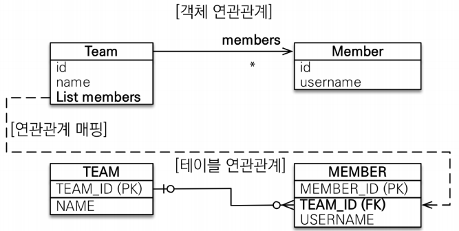

# 일대다 [1:N] 연관관계 매핑
<div style="text-align: center;"></div>  
  
일대다 관계는 다대일 관계의 반대 방향입니다. 일대다 관계는 엔티티를 하나 이상 참조할 수 있으므로 자바 컬렉션인 
Collection, List, Set, Map 중에서 하나를 사용해야합니다.   

## 일대다 단방향[1:N]  
하나의 팀은 여러 선수를 참조할 수 있는데 이런 관계를 일대다 관계라고 합니다. 
그리고 팀은 회원을 참조하지만 선수는 팀을 참조하지 않으면 둘의 관계는 단방향입니다. 
  
그림을 보면 팀 엔티티의 `Team.members`필드로 선수 테이블의 외래 키를 관리합니다. 
이 매핑은 자식 테이블에 있는 외래키를 부모 테이블이 수정하는 걸 ORM이 매핑을 통해서 
관리 할 수 있도록 합니다. 하지만 N 인 선수 엔티티는 외래키를 매핑할 수 있는 참조 필드가 없습니다. 
대신 반대쪽인 Team 엔티티만 참조 필드인 `Team.members`가 있습니다.   
  
_**일대다 관계는 `@JoinColumn`을 반드시 명시해야합니다.**_  
그렇지 않으면 JPA는 연결 테이블을 중간에 두고 연관관계라를 관리하는 조인 테이블(`JoinTable`) 전략을 기본으로 사용해서 매핑합니다. 
물론 조인 테이블에 대한 명세도 가능합니다.  
  
일대다 단방향 매핑을 코드로 보겠습니다.  
```java
@Entity
@Getter @Setter
@NoArgsConstructor
public class Member {

    @Id @GeneratedValue(strategy = GenerationType.SEQUENCE)
    @Column(name = "member_id")
    private Long id;
    @Column(length = 10, nullable = false)
    private String username;
    
}

@Entity
@Getter @Setter
@NoArgsConstructor
public class Team {

    @Id @GeneratedValue
    @Column(name = "team_id")
    private Long id;
    private String name;
    
    @OneToMany//(mappedBy = "team")
    @JoinColumn(name = "team_id") // member 테이블의 team_id (FK)
    private List<Member> members = new ArrayList<>();
    
}
```  
  
## 일대다 단방향 매핑의 단점  
일대다 단방향 매핑은 매핑한 객체가 관리하는 외래 키가 다른 테이블에 있습니다.  
1. 팀 엔티티의 `members`를 수정하면 선수 엔티티의 `수정 SQL`이 발생한다.  
2. 1번으로 인해 많은 테이블을 관리하는데 유지보수가 어려워진다.  
이렇게 간단하게 정리를 할 수 있습니다.  

```java
@Test
@DisplayName("팀 엔티티를 수정했는데 선수테이블 SQL이 발생한다.")
void updateAnother(){

    EntityTransaction tx = em.getTransaction();
    tx.begin();
    //given
    Member keria = new Member();
    keria.setUsername("케리아");
    em.persist(keria);

    Team team = new Team();
    team.setName("T1");
    team.getMembers().add(keria);
    em.persist(team);

    tx.commit();
}
```  
+ JPA 변경감지로 팀을 먼저 저장하고 나중에 `Team.members`에 추가해도 쿼리는 동일합니다.  
```sql
Hibernate: 
    /* insert jpabook.Team */ 
    insert into Team (name, team_id) values (?, ?)
Hibernate: 
    /* insert jpabook.Member */ 
    insert into Member (username, member_id) values (?, ?)
Hibernate: 
    /* create one-to-many row jpabook.Team.members */ 
    update Member set team_id=? where member_id=?
```  
실행한 SQL을 보면 다대일 관계와 다르게 다른 테이블을 수정해야하기 때문에 UPDATE 쿼리가 추가로 발생했습니다. 
  
그러면 이렇게 생각해볼 수 도 있습니다. 
Team 테이블에서 참조하는 선수의 고유 번호(PK)를 관리하면 되지 않을까?  
RDBMS는 속성(칼럼)값을 통해 관계를 맺어 조인을 하는 모델링을 가지고 있습니다. 
그래서 하나의 속성에는 하나의 값이 들어가야 합니다. 그러면 1:N 관계로 하나의 팀 테이블은 
참조하는 선수 레코드가 발생할 때마다 추가 칼럼을 만들어 관리해야합니다. 참조하지 않을 경우 필요없는 칼럼은 다시 
삭제를 하거나 관리를 해야하는 상황이 생깁니다.  
아니면 팀을 참조하는 선수 레코드가 추가될 때마다 팀 레코드를 저장하면 되지 않을까 생각을 할 수 있지만, 
그러면 N:M 관계가 되어버리니 중간 연결 테이블을 사용해야하죠  
  
그래서 참조하는 테이블에서 연관관계 외래키를 관리하는 겁니다.  

객체지향적으로 보면 팀은 선수의 속성이나 기능을 알고 싶은데, 
선수는 팀의 속성이나 기능이 필요없는 경우가 일대다 관계에 해당합니다. 
객체 입장에서는 이런 설계가 나올 확률이 높습니다.   
  
그런데 DB 입장에서는 선수는 자식 테이블이고 팀은 부모 테이블이 됩니다. 
선수 -> 팀의 PK를 참조하는 구조로 무조건 선수 테이블 내에 외래키를 관리하게 됩니다.
  
## 일대다 단방향의 단점을 보완하는 방법
+ 다대일 양방향(트레이드오프)  
  
선수 객체를 통해서 팀 객체를 조회하는 경우가 없을 지라도 개발의 유지보수와 편의를 위해서 
선수 엔티티가 연관관계 주인으로 설정하고, 양방향 연관관계 매핑을 통해서 조회를 방법을 권장합니다. 
  
일대다 양방향 매핑도 가능합니다. 다(N)쪽 엔티티 참조 필드 위에 아래 코드를 추가합니다.  
```java
@JoinColumn(name = "team_id",insertable = false,updatable = false)
@ManyToOne(fetch = FetchType.LAZY)
private Team team;
```  

### 양방향 매핑을 할때  
연관관계를 맺은 두 엔티티에 모두 연관관계 편의 메소드를 넣으면 안됩니다. 
순환 참조가 발생하기 때문이죠.  
예를 코드로 들어보면,
```java
//Member
public void setTeam(Team team){
    this.team = team;
    team.addMember(this);
}
//Team
public void addMember(Member member){
    this.members.add(team);
    member.setTeam(this);    
}
```  
두 엔티티에게 작성하게 되면 순환 참조가 발생할 수 있기 때문에 
연관관계 주인이거나 `CASCADE`옵션이 설정된 엔티티에게만 추가해야합니다.  
  
### 양방향 편의 메소드와 삭제 메소드  
양방향 편의 메소드로 두 객체에 모두 참조를 추가 했습니다.  
그러면 데이터를 삭제할 때도 두 객체에 저장된 참조도 삭제를 해야합니다. 
```java
public void deleteMember(Long memberId,Long teamId){
    Team team = em.find(Team.class,teamId);
    Member member = em.find(Member.class,memberId);
    em.remove(member);
    team.getMembers.remove(member);
}
```
이렇게 작성할 필요는 사실 없습니다.  
만약 객체를 삭제하고, 이후에 관련된 객체에서 삭제된 객체를 활용하는 로직이 있다면 
remove를 해서 연관관계 엔티티끼리 동기화를 해야하는 게 맞습니다.  
하지만 실용적인 관점에서는 삭제한 이후에 삭제한 객체를 활용하는 로직이 대부분 없고 
delete라는 행위가 거의 없기 때문입니다. 데이터에 관한 이력을 다 남겨두어야 하기 때문이죠  

### SELF JOIN을 엔티티로 나타내기
```sql
create table Category (
  id bigint not null,
  name varchar(255),
  parent_id bigint,
  primary key (id)
)
```
이런 유형의 테이블 관계는 보통 재귀적인 구조를 나타내거나 조직도, 계층 구조, 카테고리 분류 등과 같은 데이터를 표현하는 데 사용됩니다.  
대표적인 계층구조는 사원-매니저,댓글-댓글 구조로 나타낼 수있고 여기 예제처럼 카테고리 안에 카테고리로 표현할 수 있습니다.  
테이블로 보면 이해가 되는 코드인데 엔티티로 표현하면 어렵습니다.  
```sql
@Entity
public class Category {
    @Id @GeneratedValue
    private Long id;
    private String name;
    
    @ManyToOne
    private Category parent;
    //아래 필드는 테이블 칼럼이 존재하지 않습니다 (mappedBY)
    @OneToMany(mappedBy = "parent")
    private List<Category> child = new ArrayList<>();
```
여기서 `mappedBy`를 지운다고 해서 칼럼이 추가되지 않습니다. 
엔티티는 테이블을 객체로 사용하기 위해 DB에 있는 테이블과 매핑을 한 것이고, 
테이블의 칼럼(속성)은 단일 값을 가지고 있어야 하기 때문이죠.

연관 관계에 따라 테이블 스키마가 변경되는 것은 `@JoinColumn`, `@JoinTable `등 
다른 매핑 설정들을 통해 이뤄집니다. 
mappedBy는 단지 연관 관계의 **반대쪽에서 해당 필드를 매핑하는 데 사용**됩니다.

즉, mappedBy를 삭제한다고 해서 데이터베이스 테이블의 컬럼이 
추가되거나 변경되는 것은 아닙니다. 그러나 이를 삭제하면 JPA가 엔티티 간 관계를 
어떻게 해석하는지가 변경될 수 있으므로 주의해야 합니다.