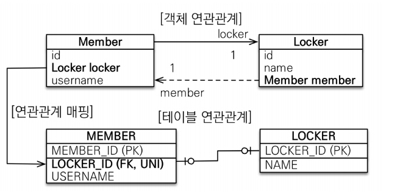
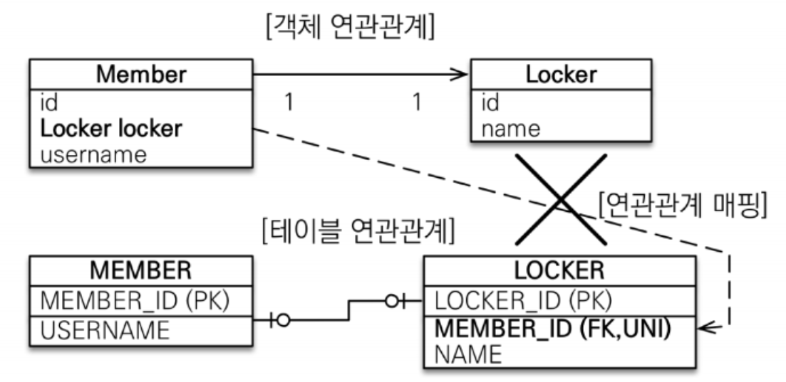

# 일대일 [1:1] 연관관계 매핑  
헬스장에서 사물함과 사람이 1:1로 맺어지고, 전입신고도 사람과 방이 1:1로 매핑이 되어지는 관계를 말합니다.  
일대일 관계는 다음과 같은 특징이 있습니다.  
+ 일대일 관계는 그 반대도 일대일 관계다.
+ 일대일 관계는 주 테이블이나 대상 테이블 둘 중 어느 곳이나 외래 키를 가질 수 있다.  
  
일대일 관계은 주 테이블과 대상 테이블 중에서 누가 외래 키를 필드로 관리할지 선택해야합니다.  
<div style="text-align: center;"></div> 
Member 엔티티가 연관관계 주인으로 Locker 테이블을 참조하는 구조  

## 연관관계 주인 기준을 정하는 방법
### 테이블을 기준으로 볼때 
#### 1. 일대일 관계가 `불변`이라면
미래에 상황이 변하지 않고 1:1 관계가 유지가 된다면, 
주로 사용하는 테이블이 `Member`라면 `Member` 테이블이 연관관계 주인으로 설정합니다. 
장점을 나열해보겠습니다.  
1. JPA를 사용한다면 별도의 로직추가 없이 지연로딩 사용이 가능합니다.
2. 비즈니스 로직을 작성할 때 `Locker` 유무나 별도의 처리가 간단합니다.  

단점은 Member 엔티티 필드에 `null`이 들어오기 때문에 별도의 관리가 필요합니다.  

Member 테이블을 조회하면 회원이 Locker를 사용하는지 안하는지, Locker의 PK값으로 추가 로직을 수행할 때, 
Locker 테이블을 추가로 조회하지 않아도 됩니다. **_일대일 양방향 매핑을 한다면_** JPA의 지연 로딩은 Member 테이블을 조회하고 테이블의 `LOCKER_ID`의 값이 있으면 프록시 객체를 넣어주고, 
값이 `NULL`일 경우 프록시 객체를 넣지 않습니다. Member 엔티티가 LOCKER_ID를 관리하지 않는다면 데이터 유무를 확인할 수 없기 프록시 객체를 넣어주려면 
`LOCKER Table`을 조회해서 참조 칼럼에 `MEMBER_ID`가 있는지 확인해야합니다. 그러면 이미 `SELECT * FROM LOCKER`로 결과를 받았기 때문에 
지연로딩을 할 필요없이 그 결과를 MEMBER 엔티티에 넣어주면 됩니다.  
  
1번에 연장으로 `Member` 테이블만 조회해도 `Locker`에 대한 비즈니스 로직을 수행할 때 해당 필드가 `null` 유무나 특정 값일 경우에는 
`Locker`테이블을 추가로 조회하지 않아도 비즈니스 로직 작성이 가능합니다.  
  
#### 2. Member `1:N` Locker 관계로 변할 수 있다면  
한명의 회원이 여러 개의 사물함을 소유할 수 있는 환경이 된다면 `Locker` 엔티티가 연관관계 주인이 되어야합니다. 
다대일,일대다 관계로 생각할 때도 `N`쪽, 자식 테이블(`Locker`)에 `INSERT`만 작성하면 되기 때문이죠. 
만약 일대일 관계에서 `UNIQUE`제약 조건이 걸려있을 경우 제거만 하면 테이블 수정이나 애플리케이션에서 수정할 곳이 없죠  

#### 3. Member `N:1` Locekr 관계로 변할 수 있다면  
하나의 상물함이 여러명의 회원을 소유 하는 환경이 된다면 반대로 `Member` 엔티티가 연관관계 주인이 되어야 합니다. 
이유는 2번과 동일합니다. Member 테이블에 `INSERT`만 하면 되기 때문이죠  
  
#### UNIQUE 제약조건 유무?  
결론부터 이야기하자면 유니크 제약조건은 없어도 됩니다. 
제약 조건이 있을 경우에는 DB에서 유니크로 관리를 하기 때문에 오류가 날 확률이 낮지만
제약 조건을 제거한 경우 웹 어플리케이션에서 중복이 발생 할 수 없게 로직작성 및 관리를 해야합니다.  

### 일대일 단방향 매핑 코드  
```java
public class Member {
    @Id
    private Long id;
    private String username;
    @OneToOne
    private Locker locker;
}
public class Locker {
    @Id
    private Long id;
    private int lockNumber;
}
```  

일대다 단방향 관계에서 대상 테이블에 외래 키가 있는 매핑을 허용했습니다. 
하지만 `일대일` 단 방향은 이런 매핑을 허용하지 않습니다.   

기본적으로 일대일일 경우 외래키를 가진 테이블이 연관관계 주인이 됩니다.  
<div style="text-align: center;"></div>  
  
대상 테이블의 엔티티인 `Locker`가 외래 키를 관리하지만, 객체로 볼때 `Locker`를 통해서 `Member`객체를 사용하지 않는다면 
일대일 양방향 매핑을 통해서 `Member`를 통해서 `Locker`에 접근할 수 있도록 작성합니다. 
순수하게 객체지향적으로 단방향 관계가 좋을 수 있지만, 트레이드 오프와 **JPA의 한계**로 받아드리는게 낫습니다. 
  
### 일대일 양방향 매핑 코드
```java
public class Member {
    @Id
    @Column(name= "member_id")
    private Long id;
    private String username;
    @OneToOne(mappedBy = "member")
    private Locker locker;
}
public class Locker {
    @Id
    private Long id;
    private int lockNumber;
    @OneToOne
    private Member member;
}
```  
만약 `@Id`로 PK로 사용할 필드에 `@Column`을 통해서 칼럼 명을 변경했다면, 
참조하는 필드도 `@JoinColumn`으로 칼럼명을 지정해주셔야합니다.  
  
#### @Column을 사용했는데 @JoinColumn을 사용하지 않을 경우
```java
@Entity
public class Member {
    @Id @GeneratedValue(strategy = GenerationType.SEQUENCE)
    @Column(name = "member_id")
    private Long id;
    // 이하 생략
}
@Entity
public class Locker {
    @Id @GeneratedValue
    private Long id;
    @OneToOne
    private Member member;
}
``` 
```sql
Hibernate: 
    create table Locker (
       id bigint not null,
        lockNumber integer not null,
        member_member_id bigint,
        primary key (id)
    )
```  
자식 테이블에서 참조하는 칼럼명의 `default`값이 지저분해집니다.  

#### @JoinColumn 정리
1. 부모 테이블의 엔티티에 `@Column`으로 칼럼명을 명시했다면, 자식 테이블의 엔티티도 `@JoinColumn`으로 참조 칼럼명을 명시한다.  
2. 부모 테이블의 엔티티에 `@Column`을 사용하지 않았다면, 선택사항이지만 `@JoinColumn`으로 참조하는 칼럼명을 지정하거나, 생략할 수 있다.  
 

## 총 정리
### 주 테이블에 외래 키
+ 주 객체가 대상 객체의 참조를 가지는 것 처럼 주 테이블에 외래 키를 두고 대상 테이블을 찾음
+ 객체 지향적인 구조관계
+ JPA 매핑이 편리하다.
+ 장점: 주 테이블만 조회해도 대상 테이블에 데이터 유무 확인 가능
+ 단점: 값이 없을 경우 `NULL`이 허용된다.  
### 대상 테이블에 외래 키 
+ 대상 테이블에 외래 키가 존재
+ 상황에 따라 DB에 맞게 설계할 경우 유리하다.
+ 장점 : 대상 테이블이 N으로 관계가 변경될 경우 테이블 구조 유지 가능
+ 단점 : JPA 프록시 기능의 한계로 지연 로딩으로 설정해도 항상 즉시 로딩됨