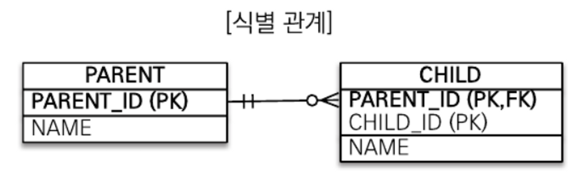
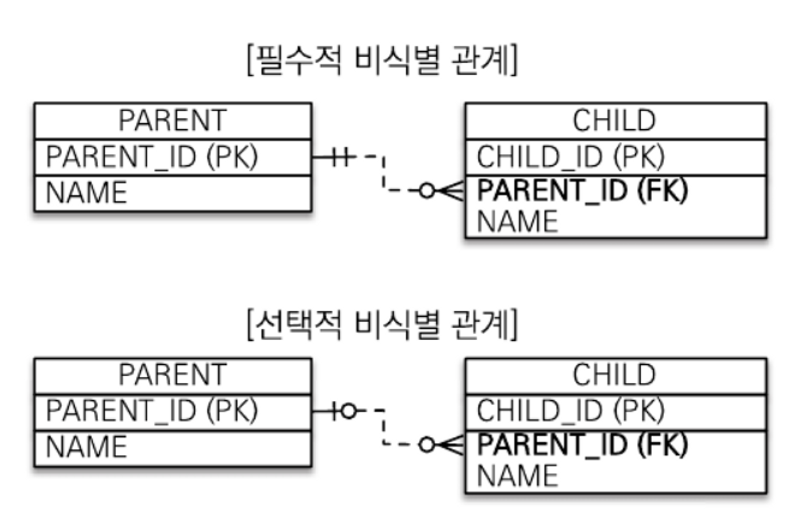
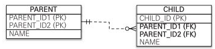
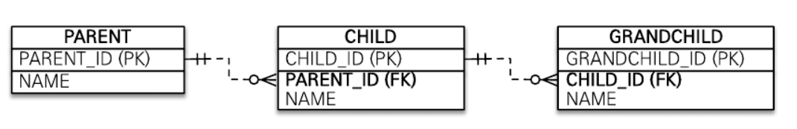
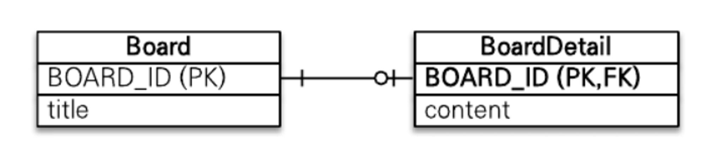

# 복합 키와 식별 관계 매핑 
<!-- TOC -->
* [복합 키와 식별 관계 매핑](#복합-키와-식별-관계-매핑-)
  * [식별 관계와 비식별 관계](#식별-관계와-비식별-관계)
    * [식별 관계](#식별-관계)
    * [비식별 관계](#비식별-관계-)
      * [복합 키 : 비식별 관계 매핑](#복합-키--비식별-관계-매핑-)
      * [@IdClass](#idclass)
      * [@EmbeddedId](#embeddedid)
    * [복합 키와 `equals()`,`hashCode()`](#복합-키와-equalshashcode-)
      * [`@IdClass` vs `@EmbeddedId`](#idclass-vs-embeddedid-)
      * [@GeneratedValue](#generatedvalue)
  * [복합키: 식별 관계 매핑](#복합키-식별-관계-매핑)
    * [@IdClass와 식별 관계](#idclass와-식별-관계-)
    * [@EmbeddedId와 식별 관계](#embeddedid와-식별-관계-)
    * [비식별 관계로 구현](#비식별-관계로-구현-)
  * [일대일 식별 관계](#일대일-식별-관계)
    * [@MapsId와 상관없이 어플리케이션 개발자가 해야하는 일](#mapsid와-상관없이-어플리케이션-개발자가-해야하는-일)
    * [식별,비식별 관계의 장단점](#식별비식별-관계의-장단점-)
      * [데이터베이스 설계 관점](#데이터베이스-설계-관점)
      * [객체 관계 매핑의 관점](#객체-관계-매핑의-관점)
      * [식별 관계의 장점](#식별-관계의-장점)
    * [정리](#정리)
<!-- TOC -->
## 식별 관계와 비식별 관계
데이터베이스 테이블 사이에 관계는 외래 키가 기본 키에 포함되는지 여부에 따라 
식별 관계와 비식별 관계로 구분합니다.
1. 식별 관계(Identifying relationship)  
    **_자식 엔티티의 식별/존재가 오로지 부모 엔티티에 의존하는 경우입니다._** 부모엔티티가 없으면 
    자식 엔티티도 없습니다. 예를 들어, 주문 테이블(Order Table)을 삭제하면 주문에 속한 모든 주문 라인 아이템(Order_Line_Item)도 
    함께 삭제하고 싶을 겁니다. 왜냐하면 주문이 없는 주문 라인 아이템은 의미가 없기 때문이죠. 
    주문 라인 아이템의 식별은 해당 주문이 존재하는지에만 의존합니다.
2. 비식별 관계(Non-identifying relationship)  
    자식 엔티티가 부모 엔티티가 없어도 독립적으로 존재할 수 있는 경우를 말합니다. 
    예를들어, 작가 테이블과 책 테이블을 가지고 있다고 가정해봅시다. 어떤 책에 대한 데이터를 저장하고 
    싶지만 작가 정보를 알지 못할 수 있습니다. 책의 식별/존재는 작가 정보와는 독립적입니다.  
  
### 식별 관계
식별 관계는 부모 테이블의 기본 키를 내려받아서 자식 테이블의 기본 키+ 외래키로 사용하는 관례입니다. 
(고유성을 제공하는 다른 열들과 함께 사용합니다)  
<div style="text-align: center;"></div>  
그림을 보면 부모 테이블의 식별자를 자식 테이블의 PK로 포함해 사용하고 있습니다.  

### 비식별 관계  
비식별 관계는 부모 테이블의 기본 키를 받아서 자식 테이블의 외래 키로만 사용하는 관계입니다.  
<div style="text-align: center;"></div>  

비식별 관계는 외래 키에 `NULL`을 허용하는지에 따라 필수적 비식별 관계와 선택적 비식별 관계로 나뉩니다. 
+ 필수적 비식별 관계(`Mandatory`-의무적):  
    외래 키에 NULL을 **허용하지 않습니다**. 연관관계를 필수적으로 맺어야 합니다.  
+ 선택적 비식별 관계(`Optional`):  
    외래 키에 NULL을 **허용**합니다. 연관관계를 맺을지 말지 선택할 수 있습니다.   
  
데이터베이스 테이블을 설계할 때 식별 관계나 비식별 관계중 하나를 선택해야합니다. 
최근에는 비식별 관계를 주로 사용하고 있고 꼭 필요한 곳에만 식별 관계를 사용하는 추세입니다. 
**JPA는 식별/비식별 관계를 모두 지원합니다.**  
  
#### 복합 키 : 비식별 관계 매핑  
```java
@Entity
public class Sample {
    @Id
    private String id1;
    @Id
    private String id2;
}
```  
위 코드는 매핑 오류가 발생합니다. JPA에서 식별자를 둘 이상 사용하려면 변도의 식별자 클래스를 만들어 사용해야합니다.  

JPA는 영속성 컨택스트에 엔티티를 보관할 때 엔티티의 식별자를 키로 사용합니다. 그리고 식별자를 구분하기 위해서 
`equals`와 `hashCode`를 사용해서 동등성 비교를 합니다. 그런데 식별자 필드가 하나일 때는 보통 자바의 기본 타입을 사용하므로 
문제가 없지만, 식별자 필드가 **2개 이상**이면 별도의 식별자 클래스를 만들고 그곳에 `equals`와`hashCode`를 구현해야합니다.  

JPA는 복합 키를 지원하기 위해 `@IdClass`와 `@EmbeddedId` 2가지 방법을 제공합니다.
`@IdClass`는 관계형 데이터베이스에 가까운 방법이고 `@EmbeddedId`은 좀 더 객체지향에 가까운 방법입니다.  

#### @IdClass
<div style="text-align: center;"></div>  

복합 키 테이블은 비식별 관계고 부모 테이블은 복합 키를 사용합니다. 
부모 테이블과 자식 테이블의 관계는 객체지향에서 말하는 상속 관계는 아닙니다. 
CHILD 테이블이 PARENT 테이블을 참조하는 모습을 `물리적 모델링`으로 표현했습니다  
  
PARENT 테이블을 보면 기본 키를 `PARENT_ID1,PARENT_ID2`를 복합 키로 구성했습니다. 
복합 키를 매핑하기 위해 식별자 클래스를 별도로 만들어야 합니다.  
```java
@Entity @Getter @Setter
@IdClass(ParentId.class)
public class Parent {

    @Id @Column(name = "parent_id1")
    private Long id1;

    @Id @Column(name = "parent_id2")
    private String id2;
    private String name;
}
@EqualsAndHashCode
public class ParentId implements Serializable {

    private Long id1; //Parent.id1 매핑
    private String id2; //Parent.id2 매핑
    
    public ParentId(){}
    //테스트 용도
    public ParentId(Long id1, String id2) {
        this.id1 = id1;
        this.id2 = id2;
    }
}
```
+ 테스트 코드 및 SQL 확인
```java
@DisplayName("도미노 피자 정보를 저장하려면 복합키를 사용한다.")
@Test
void t1(){
    //given
    EntityTransaction tx = em.getTransaction();
    tx.begin();
    //when
    Parent parent = new Parent();
    parent.setId1(1L);
    parent.setId2("1577-8282");
    parent.setName("도미노피자");
    em.persist(parent);

    //then
    tx.commit();
}
```
```sql
Hibernate: 
    /* insert solo.Parent */ 
    insert into Parent (name, parent_id1, parent_id2) 
        values (?, ?, ?)
```
`@IdClass`를 사용할 때 식별자 클래스는 다음 조건을 만족해야합니다. 
1. **_식별자 클래스의 속성명과 엔티티에서 사용하는 식별자의 속성명이 같아야 합니다._**  
    예제 Parent.id1과 ParentId.id1 그리고 Parent.id2와 ParantId.id2가 같습니다.  
2. `Serializable` 인터페이스를 구현해야 한다.
3. `equals`,`hashCode`를 구현해야합니다.
4. 기본 생성자가 있어야 합니다.
5. 식별자 클래스는 public 이어야 합니다.  
  
테스트 코드를 보면 식별자 클래스인 `ParentId`를 사용하지 않았는데, 
em.persist()를 호출하면 영속성 컨텍스트에 엔티티를 등록하기 직전에 내부에서 Parent.id1,Parent.id2 값을 
사용해서 식별자 클래스인 `ParentId`를 생성하고 영속성 컨택스트의 키로 사용한다. 그래서 비교를 위해 
`hashCode`와 `equals`를 오버라이드 해야한다.  

이제 복합 키를 사용해서 조회를 할 수 있습니다.  
```java
@DisplayName("도미노 피자 정보를 저장하려면 복합키를 사용한다.")
@Test
void t1(){
    //given
    EntityTransaction tx = em.getTransaction();
    tx.begin();
    //when
    Parent parent = new Parent();
    parent.setId1(1L);
    parent.setId2("1577-8282");
    parent.setName("도미노피자");
    em.persist(parent);
    em.flush();
    em.clear();

    ParentId parentId = new ParentId(1L, "1577-8282");

    Parent parent1 = em.find(Parent.class, parentId);
    Assertions.assertEquals(parent1.getName(),"도미노피자");

    //then
    tx.commit();
}
```  
+ 자식 테이블도 생성후 저장해보겠습니다.
```java
@Entity @Getter @Setter
public class Child {
    @Id
    private String id;
    @ManyToOne
    @JoinColumns(value = {
            @JoinColumn(name = "p_id1",referencedColumnName = "parent_id1"),
            @JoinColumn(name = "p_id2",referencedColumnName = "parent_id2")},
            foreignKey = @ForeignKey(name = "custom_fk"))
    private Parent parent;
}
```
테이블에 인덱스가 있을 경우에는 클래스 레벨에 `@Table`을 활용하여 인덱스 명을 명시적으로 작성하고, 
외래 키 인덱스의 경우 `@JoinColumns`를 활용하여 명시적으로 작성하는게 낫다.  

```java
@DisplayName("자식 테이블을 저장해보자")
@Test
void t2(){
    EntityTransaction tx = em.getTransaction();
    tx.begin();
    Parent parent = new Parent();
    parent.setId1(1L);
    parent.setId2("1577-8282");
    parent.setName("도미노피자");
    em.persist(parent);

    Child child = new Child();
    child.setId("포테이토 피자");
    child.setParent(parent);
    em.persist(child);

    em.flush();
    em.clear();

    Child child1 = em.find(Child.class, child.getId());
    System.out.println(child1.getParent());
    
    tx.commit();
}
```  
```sql
create table Child (
    id varchar(255) not null,
    p_id1 bigint,
    p_id2 varchar(255),
    primary key (id)
)
alter table Child add constraint custom_fk
        foreign key (p_id1, p_id2)  references Parent
insert into Child (p_id1, p_id2, id) 
        values (?, ?, ?)

select
    child.id as id1_0_0_,
    child.p_id1 as p_id2_0_0_,
    child.p_id2 as p_id3_0_0_,
    parent.parent_id1 as parent_i1_2_1_,
    parent.parent_id2 as parent_i2_2_1_,
    parent.name as name3_2_1_
from
    Child child
        left outer join
    Parent parent
    on child.p_id1 = parent.parent_id1
        and child.p_id2 = parent.parent_id2
where
    child.id=?        
```    
`@IdClass` 비식별 관계는 `OUTER LEFT JOIN`으로 데이터를 가져오는 것을 확인할 수 있다.

#### @EmbeddedId
`@IdClass`가 데이터베이스에 맞춘 방법이라면 `@EmbeddedId`는 좀 더 객체지향적인 방법입니다.
```java
@Entity
@Getter @Setter
public class ParentEmbedded {
    @EmbeddedId
    private ParentEmbeddedId id;
    private String name;
}
@Embeddable @Getter @Setter
@EqualsAndHashCode
public class ParentEmbeddedId implements Serializable {

    @Column(name = "parent_id1")
    private Long id1;
    @Column(name = "parent_id2")
    private String id2;
}
```  
`@IdClass`와 다르게 `@EmbeddedId`를 적용한 식별자 클래스는 식별자 클래스(`ParentEmbeddedId`)에 기본키를 직접 매핑합니다. 
`@Embeddable`를 적용한 식별자 클래스는 다음 조건을 만족해야합니다.  
1. `@Embeddable` 애노테이션을 붙여준다.
2. `Serializable` 인터페이스를 구현해야한다.
3. `equals`,`hashCode`를 구현해야합니다.
4. 기본 생성자가 있어야 합니다.
5. 식별자 클래스는 public 이어야 합니다.  
  
+ 테스트 코드입니다.
```java
@DisplayName("객체지향적 복합키")
@Test
void t3(){
    EntityTransaction tx = em.getTransaction();
    tx.begin();

    ParentEmbedded parent = new ParentEmbedded();
    ParentEmbeddedId parentId = new ParentEmbeddedId();
    parentId.setId1(1L);
    parentId.setId2("도미노피자");
    parent.setId(parentId);
    parent.setName("포테이토피자");
    em.persist(parent);

    ChildEmbedded child = new ChildEmbedded();
    child.setId("공덕동");
    child.setParent(parent);
    em.persist(child);

    em.flush();
    em.clear();

    ParentEmbedded findParent = em.find(ParentEmbedded.class, parentId);
    Assertions.assertEquals(findParent.getName(),"포테이토피자");
    
    tx.commit();
}
```  
저장하는 코드를 보면 식별자 클래스 `ParentEmbeddedId`를 직접 생성해서 사용합니다. 
엔티티를 조회하는 경우에는 동일한 방법으로 식별자 클래스로 조회가 가능합니다.  
  
### 복합 키와 `equals()`,`hashCode()`  
```java
ComposeKey key1 = new ComposeKey();
key1.setId1(1L);
key1.setId2("도미노피자");
ComposeKey key2 = new ComposeKey();
key2.setId1(1L);
key2.setId2("도미노피자");
```  
순수한 자바 코드입니다. 모두 내용이 동일한 인스턴스이지만 적절한 `equals()`,`hashCode()`오버라이딩이 없을 경우에 `key1.equals(key2)`는 거짓입니다. 
자바의 모든 클래스는 기본으로 `Object` 클래스를 상속을 받는데 
기본으로 제공하는 비교메소드는 참조 값 비교인 `==` 비교(동일성 비교)를 하기 때문입니다.  
  
영속성 컨택스트는 엔티티의 식별자를 키로 사용해서 엔티티를 관리합니다. 
그리고 식별자를 비교할 때 `equals()`,`hashCode()`를 사용합니다. 
따라서 식별자 객체의 동등성이 지켜지지 않으면 예상과 다른 엔티티가 조회되거나 엔티티를 찾을 수 없습니다. 
따라서 복합 키 클래스(사용자 정의 클래스)일 때에는 반드시 `equals()`,`hashCode()`를 구현해야합니다. 
**식별자 클래스는 보콩 `equals()`,`hashCode()`를 구현할 때 모든 필드를 사용합니다.**  
  
#### `@IdClass` vs `@EmbeddedId`  
`@IdClass`와 `@EmbeddedId`는 각각 장단점이 있습니다. 
`@EmbeddedId`가 `@IdClass`와 비교해서 더 객체지향적이고 중복도 없어서 좋아보이지만 
특정 상황에 `JPQL`이 조금 더 길어 질 수 있습니다.
```java
em.createQuery("select p.id1,p.id2 from Parent as p", Object[].class)//@IdClass
em.createQuery("select p.id.id1,p.id.id2 from Parent as p", Object[].class)//@EmbeddedId
```  

#### @GeneratedValue
+ `@EmbeddedId`는 모두 적용이 안된다.
+ `@IdClass`는 `@GeneratedValue(strategy = GenerationType.IDENTITY)`만 적용이 안된다.  
  
하지만 복합 키 클래스로 매핑할 경우 시퀀스나, 자동 생성은 권장하지 않습니다.  
> 공식문서
> Jakarta Persistence 명세서에는 이 기능에 대한 명시적인 지원 여부가 명확하지 않으며, 
> 이를 통한 이식성이 보장되지 않을 수 있다
[hibernate 권장사항](https://docs.jboss.org/hibernate/orm/current/userguide/html_single/Hibernate_User_Guide.html#identifiers-composite-nonaggregated)
  

## 복합키: 식별 관계 매핑
<div style="text-align: center;"></div>  
  
부모, 자식, 손자까지 계속 기본 키를 전달하는 식별 관계입니다. 
식별 관계에서 자식 테이블은 부모 테이블의 기본 키를 포함해서 복합 키를 구성해야 하므로 
`@IdClass`나 `@EmbeddedId`를 사용해서 식별자를 매핑해야 합니다.  

### @IdClass와 식별 관계  
```java
@Entity @Getter @Setter
public class Parent {
    @Id
    private String id;
    private String name;
}
@Entity @Getter @Setter
@IdClass(Child.ChildId.class)
public class Child {

    @Id @ManyToOne 
    @JoinColumn(name = "parent_id")
    public Parent parent;

    @Id @Column(name = "child_id")
    private String childId;
    private String name;
    @EqualsAndHashCode
    @Getter @Setter
    public static class ChildId implements Serializable {
        private String parent;//Child.parent 매핑
        private String childId;//Child.childId 매핑
    }
}
@IdClass(GrandChild.GrandChildId.class)
@Entity @Getter @Setter 
public class GrandChild {
    @Id @ManyToOne
    @JoinColumns({
            @JoinColumn(name = "parent_id"),
            @JoinColumn(name = "child_id")})
    private Child child;
    @Id @Column(name = "grandchild_id")
    private String id;
    private String name;

    @EqualsAndHashCode
    @Getter @Setter
    public static class GrandChildId implements Serializable {
        private Child.ChildId child;
        private String id;
    }
}
```  
식별 관계는 기본 키와 외래 키를 같이 매핑하면 됩니다. 따라서 식별자 매핑인 `@Id`와 연관관계 매핑인 `@ManyToOne`을 같이 사용하면 됩니다. 
```java
@Id
@ManyToOne
@JoinColumn(name = "parent_id")
public Parent parent;
```
Child 엔티티의 parent 필드를 보면 @Id로 기본 키를 매핑하면서 `@ManyToOne`과 `@JoinColumn`으로 외래 키를 같이 매핑합니다.  

+ 테스트 코드  
```java
Parent parent = new Parent();
parent.setId("A001");
parent.setName("할아버지");
em.persist(parent);

Child child = new Child();
child.setName("아버지");
child.setChildId("F001");
child.setParent(parent);
em.persist(child);
```
```sql
create table Child (
    child_id varchar(255) not null,
    parent_id varchar(255) not null,
    name varchar(255),
    primary key (child_id, parent_id)
)
alter table Child add constraint parent_fk -- joinColumn에서 지정한 이름
        foreign key (parent_id) references Parent
```  
기본 키가 복합키로 부모 테이블의 PK와 본인의 ID를 묶어서 사용한다. 조회를 해보고 SQL을 확인해보면 차이점이 있다.  
```java
Child.ChildId primaryKey = new Child.ChildId();
primaryKey.setChildId("F001");
primaryKey.setParent(parent.getId());
Child findChild = em.find(Child.class, primaryKey);
System.out.println(findChild.getName());
```  
```sql
select
    child.child_id as child_id1_0_0_,
    child.parent_id as parent_i2_0_0_,
    child.name as name3_0_0_,
    parent.id as id1_2_1_,
    parent.name as name2_2_1_ 
from
    Child child 
inner join
    Parent parent on child.parent_id=parent.id 
where
    child.child_id=? and child.parent_id=?
```  
비 식별 매핑과 다르게 `INNER JOIN`으로 데이터를 가져오는 걸 확인할 수 있습니다.  

### @EmbeddedId와 식별 관계  
`@EmbeddedId`을 식별 관계로 사용할 때에는 `@MapsId`를 사용해야 합니다.  
```java
@Entity @Getter @Setter
public class EmParent {
    @Id
    private String id;
    private String name;
}
@Entity @Getter @Setter
public class EmChild {

    @EmbeddedId
    private EmChildId id;
    @MapsId("parentId")
    @ManyToOne
    @JoinColumn(name = "parent_id",foreignKey = @ForeignKey(name = "parent_fk"))
    public EmParent parent;

    private String name;

    @EqualsAndHashCode
    @Getter @Setter @Embeddable
    public static class EmChildId implements Serializable {
        private String parentId;//@MapsId("parentId")와 매핑
        @Column(name = "child_id")
        private String id;//Child.childId 매핑
    }
}
@Entity @Getter @Setter
public class EmGrandChild {
    @MapsId("childId")
    @ManyToOne
    @JoinColumns({
            @JoinColumn(name = "parent_id"),
            @JoinColumn(name = "child_id")})
    private EmChild child;
    @EmbeddedId
    private EmGrandChildId id;
    private String name;

    @EqualsAndHashCode
    @Embeddable
    public static class EmGrandChildId implements Serializable {
        private EmChild.EmChildId childId;
        @Column(name = "grandchild_id")
        private String id;
    }
}
```  
  
`@EmbeddedId`는 식별 관계로 사용할 연관관계 속성에 `@MapsId`를 사용하면 된다.  
`EmChild`엔티티의 `EmParent parent` 필드를 보면
```java
@MapsId("parentId") @ManyToOne
@JoinColumn(name = "parent_id",foreignKey = @ForeignKey(name = "parent_fk"))
public EmParent parent;
```  
`@Id`와 다른 점은 `@Id` 대신에 `@MapsId`를 사용한 점이다. 
`@MapsId`는 외래키와 매핑한 연관관계를 기본 키에도 매핑하겠다는 뜻이다. 
`@MapsId`의 속성 값은 `@EmbeddedId`를 사용한 식별자 클래스의 기본 키 필드를 
지정하면 된다.
```java
@Embeddable
public static class EmChildId implements Serializable {
    private String parentId;//@MapsId("parentId")와 매핑
}
```  
`@Embeddable`을 붙인 클래스 EmChildId의 parentId와 
`@MapsId("parentId")`와 매핑을 한 것을 확인할 수 있습니다.  
  
필드에 Id로 사용한 필드는 `EmChildId` 와 `EmParent` 타입 두 개가 공존하는데 
어디 값을 넣어줘야 할까 생각을 했습니다.  
```java

EmParent emParent = new EmParent();
emParent.setName("내장 할아버지");
emParent.setId("A001");

em.persist(emParent);
//복합키 만들기
EmChild.EmChildId id = new EmChild.EmChildId();
id.setId("F001");
id.setParentId("이건 넣어도 소용이 없는 String key값");
//자식 엔티티 생성
EmChild emChild = new EmChild();
//자식 엔티티에 복합키 주입하기
emChild.setId(id);

//여기서 넣는 parent가 child엔티티의 fk면서 pk가 됩니다.
EmParent fakeParent = new EmParent();
fakeParent.setId("fake");

emChild.setParent(fakeParent);
emChild.setName("내장 아버지");
em.persist(emChild);
//영속성 컨택스트 초기화후 찾기
EmChild emChild1 = em.find(EmChild.class, id);
System.out.println("자식의 매핑된 부모의 아이디 " + emChild1.getParent().getId());
//        자식의 매핑된 부모의 아이디 fake
System.out.println("자식의 매핑된 부모의 이름 " + emChild1.getParent().getName());
//        자식의 매핑된 부모의 이름 null
System.out.println("자식의 복합키의 FK 값 " + emChild1.getId().getParentId());
//        자식의 복합키의 FK 값 fake
System.out.println("자식의 복합키의 PK 값 " + emChild1.getId().getId());
//        자식의 복합키의 PK 값 F001
```  
여기서 확인할 수 있는건 복합키 객체(`EmChildId`)를 만들지만 참고하는건 자신의 고유 PK값이고 
저장된 Parent 엔티티의 Id를 참고하여 복합키 객체를 만들고 
자신의 복합키 클래스(`EmChildId`)에 저장한다는 것을 확인할 수 있습니다.  
  
### 비식별 관계로 구현  
<div style="text-align: center;"></div>  
  
식별 관계 테이블을 위 그림과 같이 `비 식별 관계`로 변경해겠습니다.  
```java
@Entity @Getter @Setter
public class Parent {
    @Id @GeneratedValue
    public Long id;
    private String name;
}
@Entity @Getter @Setter
public class Child {
    @Id @GeneratedValue
    private Long id;
    private String name;
    @ManyToOne
    private Parent parent;
}
@Entity @Getter @Setter
public class GrandChild {
    @Id @GeneratedValue
    private Long id;
    private String name;
    @ManyToOne
    private Child child;
}
```

식별 관계의 복합 키를 사용한 코드와 비교하면 매핑도 쉽고 코드도 단순해집니다. 
복합 키가 없으므로 복합 키 킅래스를 만들지 않아도 됩니다.  
  
## 일대일 식별 관계
<div style="text-align: center;"></div>  
  
일대일 식별 관계는 자식 테이블의 기본 키 값으로 부모 테이블의 기본키만 사용합니다. 
그래서 부모 테이블의 기본 키가 복합 키가 아니니면 자식 테이블의 기본 키는 복합키로 구성하지 않아도 됩니다.  
```java
@Entity @Getter @Setter
public class Board {
    @Id
    @GeneratedValue
    private Long id;
    private String title;
    @OneToOne(mappedBy = "board")
    private BoardDetail boardDetail;
}
@Entity
public class BoardDetail {
    @Id
    private Long boardId;

    @MapsId // BoardDetail.boardId와 매핑
    @OneToOne
    @JoinColumn(name = "board_id")
    public Board board;

    private String content;
}

```  
지금까지 코드를 보면 간단한 규칙이 있다. 
식별 관계일 경우 부모의 아이디를 등록하고 매핑할 필드에 값을 넣어주는 것이 중요합니다. 
`BoardDetail`처럼 식별자가 단순히 칼럼 하나면 `@MapsId`를 사용하고 속성값은 비워두면 됩니다. 
이때 `@MapsId`는 `@Id`를 사용해서 식별자로 지정한 **BoardDetail.boardId**와 매핑됩니다.  
  
+ 테스트코드 
```java
Board board = new Board();
board.setTitle("T1 4번째 월즈 우승");
em.persist(board);

BoardDetail boardDetail = new BoardDetail();
boardDetail.setContent("상형아 축하한다. 2013년 부터 항상 응원하고 있어");
boardDetail.setBoard(board);
em.persist(boardDetail);
```  

### @MapsId와 상관없이 어플리케이션 개발자가 해야하는 일
```java
@Entity(name = "Person")
public static class Person  {

	@Id
	private Long id;

	@NaturalId
	private String registrationNumber;

	public Person() {}

	public Person(String registrationNumber) {
		this.registrationNumber = registrationNumber;
	}

	//Getters and setters are omitted for brevity
}

@Entity(name = "PersonDetails")
public static class PersonDetails  {

	@Id
	private Long id;

	private String nickName;

	@OneToOne
	@PrimaryKeyJoinColumn
	private Person person;

	public void setPerson(Person person) {
		this.person = person;
		this.id = person.getId();
	}

	//Other getters and setters are omitted for brevity
}
```  
연관관계 편의 메소드처럼 식별 관계일 때에 `PersonDetails.id`값은 `Person.person`으로 결정되지만 
객체에는 저장되지 않기 때문에 수동으로 값을 넣어야합니다.


### 식별,비식별 관계의 장단점  
#### 데이터베이스 설계 관점
식별 관계보다 **_비식별 관계를 선호_** 합니다.  
+ 식별 관계는 부모 테이블의 기본 키를 자식 테이블로 전파하면서 자식 테이블의 
    기본 키 컬럼이 점점 늘어납니다. 
+ 식별 관계는 2개 이상의 칼럼을 합해서 복합 기본 키를 만들어야하는 경우가 많습니다.
+ 식별 관계를 사용할 때 기본 키로 비즈니스 의미가 있는 자연 키 칼럼을 조합하는 경우가 많습니다. 
    반면 비식별 관계의 기본 키는 비즈니스와 전혀 관계없는 대리 키를 주로 사용합니다. 
    비즈니스 요구사항은 시간이 지남에 따라 언젠가는 변합니다. 식별 관계의 자연 키 칼럼들이 
    자식에 손자까지 전파되면 변경하기 힘듭니다.   
+ 식별 관계는 부모 케이블의 기본 키를 자식 테이블의 기본 키로 사용하므로 비식별 관계보다 테이블 구조가 유연하지 못합니다.  
  
#### 객체 관계 매핑의 관점
**_비식별 관계를 선호합니다._**  
+ 일대일 관계를 제외하고 식별 관계는 2개 이상의 칼럼을 묶은 복합 기본  키를 사용합니다. 
    JPA에서 복합 키는 별도의 복합 키 클래스를 만들어 사용해야 하며 칼럼이 하나인 기본 키를 
    사용하는 것보다 많은 노력이 필요합니다. 
+ 비식별 관계의 기본 키는 주로 대리 키를 사용하는데 JPA는 `@GeneratedValue`처럼 대리 키를 생성하기 위한 
    편리한 방법을 제공합니다.  
  
#### 식별 관계의 장점
1. 기본 인덱스를 활용하기 좋다.
2. 상위 테이블들의 기본 키 칼럼을 자식,손자 테이블들이 가지고 있으므로 
    특정 상황에 조인 없이 하위 테이블만으로 검색을 완료할 수 있습니다.  
+ 부모 아이디가 A인 모든 자식 조회
    ```sql
    SELECT * FROM CHILD
    WHERE PARENT_ID = 'A';
    ```
+ 부모 아이디가 A고 자식 아이디가 B인 자식 조회
    ```sql
    SELECT * FROM CHILD
    WHERE PARENT_ID = 'A' AND CHILD_ID = 'B';
    ```  

두 경우 모드 CHILD 테이블의 기본 키 인덱스를 PARENT_ID + CHILD_ID 로 구성하면 별도의 
인덱스를 생성할 필요 없이 기본 키 인덱스만 사용해도 됩니다.  
  
### 정리
ORM 신규 프로젝트시 추천하는 방법은 **비식별 관계를 사용하고 기본 키는 Long타입의 대리 키를 사용**하는 것이다. 
대리 키는 비즈니스와 아무 관련이 없습니다. 따라서 비즈니스가 변경되어도 유연한 대처가 가능하다는 장점이 있습니다. 
JPA는 `@GeneratedValue`를 통해 간편하게 대리 키를 생성 할 수 있습니다.  
  
식별자의 데이터 타입은 Long을 추천합니다 920경까지 담을수 있지만 
Integer 타입은 20억 정도가 끝입니다.  

그리고 선택적 비식별 관계보다 **_필수적 비식별 관계_**가 좋습니다.  
선택적 비식별 관계는 NULL을 허용하기 때문에 조인할 때에 외부 조인을 사용하지만, 
필수적 관계는 NOT NULL로 항상 관계가 있다는 것을 보장하기 때문에 내부 조인만 사용해도 됩니다.  
  
데이터베이스에서 NULL이 있는 필드와 조인하는 것보다 NOT NULL인 필드와 조인하는 것이 
더 효율이 좋기 때문입니다. 데이터베이스에서 NULL은 모두 동일한 값으로 구분하기 때문입니다. 
