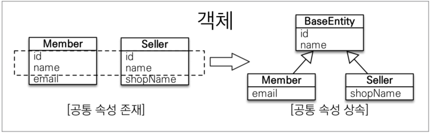

# `@MappedSupperClass`  
<!-- TOC -->
* [`@MappedSupperClass`](#mappedsupperclass-)
<!-- TOC -->
상속 관계 매핑 클래스와 다르게 부모 클래스는 엔티티로 관리하지 않고 `상속 받은`자식 클래스에게 
**_매핑 정보만 제공_** 하고 싶을 때 사용하는 애노테이션입니다.  
<div style="text-align: center;"></div>  

```java
@Getter @Setter
@MappedSuperclass
public class BaseEntity {

    @Id
    @GeneratedValue
    @Column(name = "base_id")
    private Long id;

    private String createdBy;
    private LocalDateTime createdByDate;
    private String lastModifiedBy;
    private LocalDateTime localDateTime;

}
@Entity
@Getter @Setter
public class Team extends BaseEntity {

    @Id
    @GeneratedValue
    private Long id;

    private String name;

    @OneToMany//(mappedBy = "team")
    @JoinColumn(name = "team_id") // member 테이블의 team_id (FK)
    private List<Member> members = new ArrayList<>();
}
```  
```sql
create table Member (
    base_id bigint not null,
    createdBy varchar(255),
    createdByDate timestamp,
    lastModifiedBy varchar(255),
    localDateTime timestamp,
    username varchar(10) not null,
    team_id bigint,
    primary key (base_id)
)
```  
`BaseEntity`에는 객체들이 주로 사용하는 공통 매핑 정보를 정의합니다. 
그리고 자식 엔티티는 상속을 통해 `BaseEntity`의 매핑 정보를 물려받습니다. 
부모로부터 물려받은 매핑 정보를 재정의하려면 `@AttributeOverrides`나 
`@AttributeOverride`를 사용하고, 연관관계를 재정의하려면 `@AssociateionOverrides`나
`@AssociateionOverride`를 사용합니다. 

참고로 `@Entity`로 지정된 클래스는 상속할 수 있는 클래스는 
`@Entity`나 `@MappedSuperClass`만 가능합니다. 

```java
@MappedSuperclass
public class BaseEntity {
    @Id
    @GeneratedValue
    @Column(name = "base_id")
    private Long id;
}

@AttributeOverride(name="id",column = @Column(name = "custom_id"))
public class Team extends BaseEntity { }
```
```sql
create table Team (
--  base_id bigint not null,에서 아래로 변경됨
    custom_id bigint not null,
    createdBy varchar(255),
    createdByDate timestamp,
    lastModifiedBy varchar(255),
    localDateTime timestamp,
    name varchar(255),
    primary key (custom_id)
)
```  
명시적으로 작성하면 DDL 생성할 때 도움을 주거나, 혹은 해당 엔티티를 사용하는 개발자에게 
코드 이해를 돕기위해 주석을 추가하는 느낌이다.  

`Spring Data JPA`를 사용하게 되면, 수정한 날짜, 등록한 날짜, 수정한 Session의 Id값을 자동화하여 넣어줄 수 있다고 합니다.
