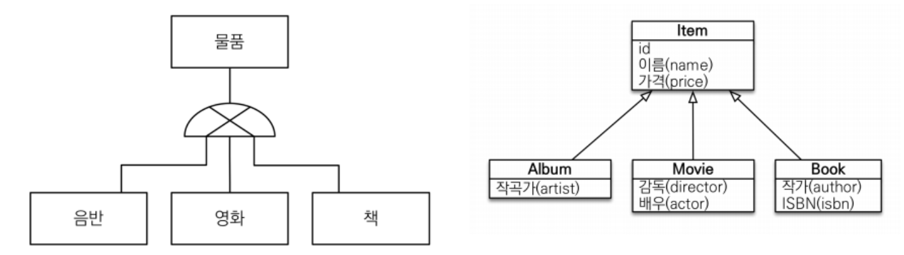
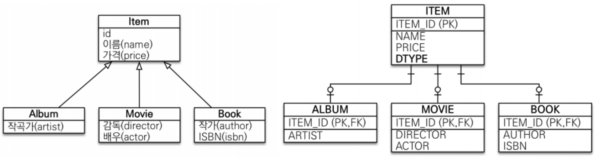
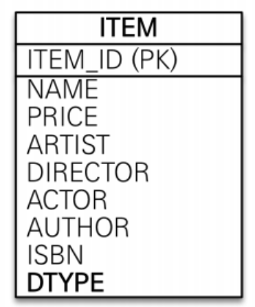
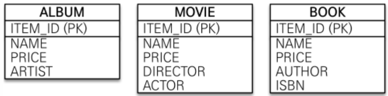

# 상속 관계 매핑  
<!-- TOC -->
* [상속 관계 매핑](#상속-관계-매핑-)
  * [주요 애노테이션](#주요-애노테이션)
  * [조인 전략](#조인-전략)
    * [조인 전략 정리](#조인-전략-정리-)
      * [장점](#장점)
      * [단점](#단점)
      * [특징](#특징)
  * [단일 테이블 전략](#단일-테이블-전략)
    * [단일 테이블 전략 정리](#단일-테이블-전략-정리)
      * [장점](#장점-1)
      * [단점](#단점-)
      * [특징](#특징-)
  * [구현 클래스마다 테이블 전략](#구현-클래스마다-테이블-전략)
      * [장점](#장점-2)
      * [단점](#단점-1)
      * [특징](#특징--1)
  * [상속 관계 매핑 비교하기](#상속-관계-매핑-비교하기)
    * [공통 처리를 위해 Item 엔티티로 받을 경우](#공통-처리를-위해-item-엔티티로-받을-경우)
    * [정리](#정리)
<!-- TOC -->
관계형 데이터 베이스에는 객체지향 언어에서 다루는 상속이라는 개념이 없습니다. 
대신 슈퍼타입-서브타입 관계(`Super-Type Sup-Type Relationship`) 라는 모델링 기법이
객체의 상속 개념과 가장 유사합니다.  
<div style="text-align: center;"></div>
  
그러면 ORM(JPA)는 데이터 베이스의 슈퍼-서브 타입 논리 모델인 테이블로 구현할 때는 
3가지 방법을 선택할 수 있습니다. 
+ 각각 테이블로 변환 -> **조인 전략**
+ 통합 테이블로 변환 -> **단일 테이블 전략**
+ 서브타입 테이블로 변환 -> **구현 클래스마다 테이블 전략**  

## 주요 애노테이션
+ `@Inheritance(strategy=InheritanceType.XXX)`
  + **JOINED** : 조인 전략
  + **SINGLE_TABLE** : 단일 테이블 전략
  + **TABLE_PER_CLASS** : 구현 클래스마다 테이블 전략
+ `@DiscriminatorColumn(name=“DTYPE”)`
  + 구분할 속성**명**
+ `@DiscriminatorValue(“XXX”)`
  + 구분할 속성**값**

## 조인 전략
<div style="text-align: center;"></div>
  
**데이터베이스 관점**
+ 데이터베이스의 스키마에서 서브 클래스의 고유한 속성들을 별도의 테이블에 저장하고, 부모 클래스와 서브 클래스 간의 관계를 조인을 통해 관리하는 방식을 의미합니다.  
  
자식 테이블이 부모 테이블의 기본 키를 받아서 **기본 키 + 외래 키로 사용하는 전략**입니다.  
객체는 타입으로 구분할 수 있지만 테이블은 타입의 개념이 없기 때문에 타입을 구분하는 
칼럼을 추가해야 합니다. 여기서 기본값은 `DTYPE` 칼럼을 구분값으로 사용합니다. 
```java
@Entity @Getter @Setter
@Inheritance(strategy = InheritanceType.JOINED)
@DiscriminatorColumn(name = "DTYPE")
public abstract class Item {
    @Id @GeneratedValue
    @Column(name = "item_id")
    private Long id;
    private String name; // 이름
    private int price; // 가격
}
@Entity @Getter @Setter
@DiscriminatorValue("Movie")
public class Movie extends Item{
    private String director;
    private String actor;
}
@Entity @Getter @Setter
@DiscriminatorValue("Movie")
@PrimaryKeyJoinColumn(name = "Movie_id")
public class Movie extends Item{
    private String director;
    private String actor;
}
@Entity @Getter @Setter
@DiscriminatorValue("Book")
public class Book extends Item{
    private String author;
    private String isbn;
}
```  
```sql
create table item (
    DTYPE varchar(31) not null, -- 구분 속성명
    item_id bigint not null,
    name varchar(255),
    price integer not null,
    primary key (item_id)
)
create table Book (
    author varchar(255),
    isbn varchar(255),
    item_id bigint not null, -- 부모 테이블의 ID 칼럼명 그대로 사용
    primary key (item_id)
)
create table Movie (
   actor varchar(255),
    director varchar(255),
    Movie_id bigint not null, -- PrimaryKeyJoinColumn로 지정한 이름 사용
    primary key (Movie_id)
)
```   

### 조인 전략 정리  

#### 장점
+ 테이블이 정규화된다.
+ 외래 키 참조 무결성 제약조건을 활용할 수 있다.
+ 저장공간을 효율적으로 사용한다.
#### 단점
+ 조회할 때 조인이 많이 사용하므로 성능이 저하될 수 있다.   
  기본키가 (PK,FK)이기 때문에 조회시 성능 저하는 크게 발생할 확률이 낮다. 
    이유는 상황에 따라 다르지만 PK를 `=`를 통해서 조인할 경우 조인 성능이 최상위이기 때문이다. 
    조인 타입이 (`qe-ref`) 이기 때문이다.
+ 조회 쿼리가 복잡하다.( 큰 단점 )
+ 데이터를 등록할때 `INSERT SQL`을 두 번 실행한다.

```java
@Test
@DisplayName("조인 전략시 INSERT SQL 확인합니다.")
void t4(){
    EntityTransaction tx = em.getTransaction();
    tx.begin();
    Movie movie = new Movie();
    movie.setPrice(1000);
    movie.setName("드래곤볼 GT");
    movie.setActor("모름");
    em.persist(movie);
    tx.commit();
}
```
```sql
/* insert jpabook.item.Movie */
insert into item (name, price, DTYPE, item_id) 
        values (?, ?, 'Movie', ?)
/* insert jpabook.item.Movie */
insert into Movie (actor, director, Movie_id) 
        values (?, ?, ?)
```
진짜로 두 번 날린다. 

#### 특징
+ JPA 표준 명세는 구분 칼럼을 사용하도록 하지만 하이버네이트를 포함한 몇몇 구현체는 구현 칼럼(`@DiscriminatorColumn`)이 없어도 동작한다. 
```sql
create table item (
   item_id bigint not null,
    name varchar(255),
    price integer not null,
    primary key (item_id)
)
```
구분 칼럼이 사라진걸 확인할 수 있다. 하지만 명시하는 걸 권장한다. 
데이터베이스나 상위 엔티티만 가지고 조회를 할 수있는데 그때에 활용가능하기 때문이다.  
  
## 단일 테이블 전략
<div style="text-align: center;"></div>  
  
이름 그대로 테이블 하나만 사용한다. 그리고 구분 칼럼(`DTYPE`)으로 어떤 자식 클래스 데이터가 저장되었는지 구분한다. 
조회할 때 조인을 사용하지 않으므로 일반적으로 가장 빠르다.  
```java
@Entity @Getter @Setter
@Inheritance
@DiscriminatorColumn(name = "DTYPE")
public abstract class Item {}

public @interface Inheritance {
    InheritanceType strategy() default SINGLE_TABLE;
}
```
```sql
create table item (
    DTYPE varchar(31) not null,
    item_id bigint not null,
    name varchar(255),
    price integer not null,
    artist varchar(255),
    actor varchar(255),
    director varchar(255),
    author varchar(255),
    isbn varchar(255),
    primary key (item_id)
)
```  
### 단일 테이블 전략 정리

#### 장점
+ 조인이 필요없으므로 일반적인 조회 성능은 제일 빠르다.
+ 조회 쿼리가 단순하다.
#### 단점  
+ 자식 엔티티가 매핑한 칼럼은 모두 `null`**을 허용**해야한다.**_(치명적인 단점)_**
+ 단일 테이블에 모든 것을 저장하므로 테이블이 커질 수 있다. 
    따라서 상황에 따라서는 조회 성능이 오히려 느릴 수 있다.
#### 특징 
- 구분 칼럼을 꼭 사용해야한다. 따라서 `@DiscriminatorColumn`을 꼭 설정해야한다.
- `@DiscriminatorValue()`를 지정하지 않으면 기본으로 엔티티 이름을 사용한다.
```java
@Entity @Getter @Setter
//@DiscriminatorValue("Movie")
public class MovieMovieMovieMovie extends ItemKind{
    private String director;
    private String actor;
}
```
```sql
/* insert jpabook.item.MovieMovieMovieMovie */ 
insert into item (name, price, actor, director, DTYPE, item_id) 
        values (?, ?, ?, ?, 'MovieMovieMovieMovie', ?)
```  

## 구현 클래스마다 테이블 전략
<div style="text-align: center;"></div>  
  
```java
@Entity @Getter @Setter
@Inheritance(strategy = InheritanceType.TABLE_PER_CLASS)
@DiscriminatorColumn(name = "DTYPE")
public abstract class Item {}
```  
별개의 테이블로 관리하지만 PK는 `Item.id`에서 설정한 것을 통일해서 사용한다. 

#### 장점
+ 서브 타입을 구분해서 처리할 때 효과적이다.
+ not null 제약조건을 사용할 수 있다.
#### 단점
+ 여러 자식 테이블을 함께 조회할 때 성능이 느리다.**_(SQL UNION 사용)_**
+ 자식 테이블을 통합해서 쿼리하기 어렵다.
#### 특징  
+ 구분 칼럼을 사용하지 않는다.  
+ `@GeneratedValue(strategy = GenerationType.IDENTITY)`에서는 사용이 불가능하다.  
    `Cannot use identity column key generation with <union-subclass> mapping`  
    예상하는 바로는 상속 관계 매핑은 id값이 테이블마다 별개로 관리되어서는 안되기 때문인거 같다.
   

## 상속 관계 매핑 비교하기
### 공통 처리를 위해 Item 엔티티로 받을 경우
```java
Item item = em.find(Item.class, 1L);
```
+ **`JOINED`**
    ```sql
    select
        item.item_id as item_id2_6_0_,
        item.name as name3_6_0_,
        item.price as price4_6_0_,
        item1_.artist as artist1_0_0_,
        item2_.actor as actor1_10_0_,
        item2_.director as director2_10_0_,
        item3_.author as author1_1_0_,
        item3_.isbn as isbn2_1_0_,
        item.DTYPE as dtype1_6_0_ 
    from
        item_kind item 
    left outer join
        Album item1_ 
            on item.item_id=item1_.item_id 
    left outer join
        MovieMovieMovieMovie item2_ 
            on item.item_id=item2_.Movie_id 
    left outer join
        Book item3_ 
            on item.item_id=item3_.item_id 
    where
        item.item_id=?
    ```
+ **`SINGLE_TABLE`**
    ```sql
  select
        item.item_id as item_id2_4_0_,
        item.name as name3_4_0_,
        item.price as price4_4_0_,
        item.artist as artist5_4_0_,
        item.actor as actor6_4_0_,
        item.director as director7_4_0_,
        item.author as author8_4_0_,
        item.isbn as isbn9_4_0_,
        item.DTYPE as dtype1_4_0_ 
    from
        item_kind item 
    where
        item.item_id=?
    ```
+ **`TABLE_PER_CLASS`**
    ```sql
    select
        item.item_id as item_id1_6_0_,
        item.name as name2_6_0_,
        item.price as price3_6_0_,
        item.artist as artist1_0_0_,
        item.actor as actor1_10_0_,
        item.director as director2_10_0_,
        item.author as author1_1_0_,
        item.isbn as isbn2_1_0_,
        item.clazz_ as clazz_0_ 
    from
        ( select
            item_id,
            name,
            price,
            artist,
            null as actor,
            null as director,
            null as author,
            null as isbn,
            1 as clazz_ 
        from
            Album 
        union
        all select
            item_id,
            name,
            price,
            null as artist,
            actor,
            director,
            null as author,
            null as isbn,
            2 as clazz_ 
        from
            MovieMovieMovieMovie 
        union
        all select
            item_id,
            name,
            price,
            null as artist,
            null as actor,
            null as director,
            author,
            isbn,
            3 as clazz_ 
        from
            Book 
    ) item 
    where
        item.item_id=?
    ```   

### 정리
기본적으로 조인 전략을 가져가고, 조인과 단일 테이블 전략에서 트레이드 오프로 
결정하는 것을 추천합니다.  
+ 조인 전략을 추천하는 경우 
    1. 테이블의 칼럼 수정이 있는 경우
    2. 비즈니스적으로 복잡하고 중요할 경우
+ 단일 테이블을 추천하는 경우
  1. 테이블의 칼럼 수정이 없는 경우
  2. 테이블의 확장 가능성이 낮고 단순한 경우
+ 구현 클래스마다 테이블 전략은 사용 금지  

실무에서는 어떻게 사용할까?  
반복작업을 하더라도 `Item`엔티티에 필드를 대부분 집어넣고 
중요하지 않은 정보라면 각자 별개로 관리된 값은 `json`으로 말아넣는 선택도 있다.  
  
상속 관계를 사용할 때 사용자가 많지 않다면 잘 동작하지만 
데이터가 억단위가 넘어가고 파티셔닝을 해야하는 상황이 되면 복잡해진다. 
그러면 테이블을 단순하게 유지해야 합니다. 그런 경우 위 예시와 같이 사용합니다.  
  
우선은 객체지향적으로 설계를 하다가 애플리케이션이 커지면서 트레이드 오프로 넘어가는 시점에 
시스템을 개비하면 됩니다.  
