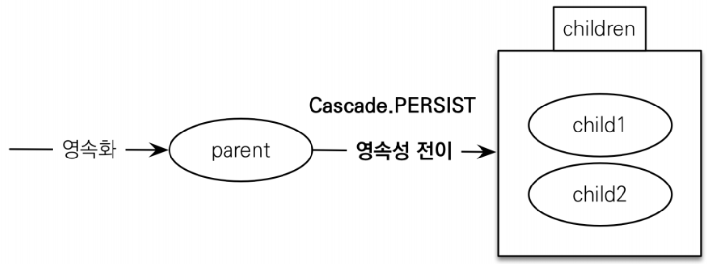

# 영속성 전이 : CASCADE  

자식 엔터티의 라이프사이클이 종종 어떤 **_부모의 라이프사이클에 완전히 의존하는 경우_** 가 많습니다. 
특히 **_다대일_** 및 **_일대일_** 관계에서 이는 매우 흔한데, 다대다 관계에서는 매우 드뭅니다.

예를 들어, 동일한 트랜잭션에서 주문(`Order`)과 그 모든 아이템(`Item`)을 
영속화(`persistent`)하는 것이 매우 일반적이거나, 한 번에 프로젝트(`Project`)와 
그 파일들(`Files`)을 삭제하는 경우가 있습니다. 
이러한 관계를 종종 전체/부분 유형(whole/part-type) 관계라고 합니다.

캐스케이딩(cascading)은 부모에서 자식으로 특정 연산(Operation)을 전파할 수 있게 해주는 편의 기능입니다. 
캐스케이딩을 설정하기 위해 보통` @OneToMany` 또는 `@OneToOne`과 같은 연관 매핑 어노테이션의 cascade 멤버를 지정합니다.


```java
@Entity
class Order {
    ...
    @OneToMany(mappedBy = "order",
    // Order에서 It   em으로 persist(), remove(), refresh()를 전파
    cascade = { PERSIST, REMOVE, REFRESH },
    // 고아 객체(Orphaned Items)도 함께 remove()
    orphanRemoval = true)
    private Set<Item> items;
    ...
}
```
고아 객체 제거(orphan removal)는 Item이 부모 Order에 속한 아이템 집합에서 제거되면 해당 Item이 자동으로 삭제되어야 함을 나타냅니다.  
<div style="text-align: center;"></div>  
+ @OneToMany(mappedBy="parent", cascade=CascadeType.PERSIST)  
  
## 영속성 전이: CASCADE - 주의  
+ 영속성 전이는 연관관계 매핑하느 것과 아무 관련이 없습니다.
    영속성 전이는 설명대로 연산을 전파한다고 생각하면 됩니다.  
+ 엔티티를 영속화 할 때 연관된 엔티티도 함께 영속화하는 편리함을 제공해줍니다.  
  
cascade를 사용하기 전에는 모든 엔티티는 영속성 컨택스트에 관리하고 있어야 저장이 됩니다. 
cascaed옵션을 사용하면 저장 연산이 내부 필드 객체에도 persist()가 전파가 됩니다.  

### CASCADE의 종류
+ `ALL`: 모두 적용
+ `PERSIST`: 영속
+ `REMOVE`: 삭제
+ MERGE: 병합
+ REFRESH: REFRESH 
+ DETACH: DETACH  

부모 테이블을 저장할 때 자식 테이블도 함께 영속성 컨택스트에 저장하는 로직을 만들어보겠습니다. 
```java
@OneToMany(mappedBy = "team", cascade = CascadeType.PERSIST)
@JoinColumn(name = "team_id") // member 테이블의 team_id (FK)
private List<Member> members2 = new ArrayList<>();
```
+ 테스트 코드
```java
@DisplayName("caseCade Persist 저장 관련 cascade")
@Test
void t5(){
    EntityTransaction tx = em.getTransaction();
    tx.begin();

    Team t1 = new Team();
    t1.setName("T1");

    Member member1 = new Member();
    member1.setUsername("페이커");
    Member member2 = new Member();
    member2.setUsername("구마유시");
    Member member3 = new Member();
    member3.setUsername("제우스");

    t1.getMembers2().addAll(List.of(member1, member2, member3));
    em.persist(t1);

    tx.commit();
}
```  
자식 엔티티를 별도로 persist로 관리하지않고 , Team t1만 persist()를 했습니다.  
```sql
/* insert jpabook.Team */ insert into Team (createdBy, createdByDate, lastModifiedBy, localDateTime, name, custom_id) values (?, ?, ?, ?, ?, ?)
/* insert jpabook.Member */ insert into Member (createdBy, createdByDate, lastModifiedBy, localDateTime, team_id, username, base_id) values (?, ?, ?, ?, ?, ?, ?)
/* insert jpabook.Member */ insert into Member (createdBy, createdByDate, lastModifiedBy, localDateTime, team_id, username, base_id) values (?, ?, ?, ?, ?, ?, ?)
/* insert jpabook.Member */ insert into Member (createdBy, createdByDate, lastModifiedBy, localDateTime, team_id, username, base_id) values (?, ?, ?, ?, ?, ?, ?)
```  

해당 데이터는 올바르게 저장이 되지 않습니다.    

| BASE_ID | USERNAME | TEAM_ID |
|---------|----------|---------|
| 2       | 페이커      | null    |
| 3       | 구마유시     | null    |
| 4       | 제우스      | null    |  

이유는 자신이 가지고 있는 엔티티에게 연산(persist(),remove(),merge())등을 전파만 할뿐이지 
연관관계를 맺어주는게 아닙니다.  
  
Member 엔티티에 팀 객체를 넣어주고 저장을 해야 올바르게 값이 들어갑니다.  
```java
Member member1 = new Member();
member1.setUsername("페이커");
member1.setTeam(t1); // 연관관계 주인에 값을 넣어야 합니다.
Member member2 = new Member();
member2.setUsername("구마유시");
member2.setTeam(t1); // 연관관계 주인에 값을 넣어야 합니다
Member member3 = new Member();
member3.setUsername("제우스");
member3.setTeam(t1); // 연관관계 주인에 값을 넣어야 합니다
```
  
#### cascade.REMOVE 
```java
Team team = em.find(Team.class, t1.getId());
em.remove(team);
```
```sql
/* delete jpabook.Member */ delete from Member where base_id=?
/* delete jpabook.Member */ delete from Member where base_id=?
/* delete jpabook.Member */ delete from Member where base_id=?
/* delete jpabook.Team */ delete from Team where custom_id=?
```  
  
cascade로 설정된 필드에 객체가 있다면 부모 엔티티의 연산을 그대로 실행할 뿐 입니다.  

Team.members 필드에 영속성 컨택스트에서 관리하지 엔티티를 넣어놓고 `em.remove()`를 실행하면 
내부에 있는 member 엔티티는 `em.move()`가 실행될까요?  
  
```java
@DisplayName("caseCade Persist 저장 관련 cascade")
@Test
void t6(){
        EntityTransaction tx = em.getTransaction();
        tx.begin();

        Team t1 = new Team();
        t1.setName("T1");

        Member member1 = new Member();
        member1.setUsername("페이커");
        Member member2 = new Member();
        member2.setUsername("구마유시");
        Member member3 = new Member();
        member3.setUsername("제우스");

        em.persist(t1);
        em.persist(member1);
        em.persist(member2);
        em.persist(member3);

        em.flush();
        em.clear();

        Team team = em.find(Team.class, t1.getId());
    System.out.println("팀에 소속된 선수 = "+ team.getMembers2().size()+"명");
    // 팀에 소속된 선수 = 0명
    team.getMembers2().addAll(List.of(member1, member2, member3));

    em.remove(team);
    tx.commit();
}
```
```java
Removing a detached instance jpabook.Member#2
```  
비영속 엔티티이기 때문에 오류가 발생합니다. persist와 다르게 remove는 전이가 되려면 
엔티티가 영속 상태여야 합니다.  
  
## orphanRemoval 고아 객체  
부모 엔티티와 연관관계가 끊어진 자식 엔티티를 자동으로 삭제하는 기능을 제공합니다. 
이 기능을 고아 객체(ORPHAN) 제거라 합니다. 
**부모 엔티티의 컬렉션에서 자식 엔티티의 참조만 제거하면 자식 엔티티가 자동으로 삭제됩니다.**  
```java
@OneToMany(mappedBy = "team",cascade = CascadeType.ALL,orphanRemoval = true)
private List<Member> members2 = new ArrayList<>();
```
+ 테스트 코드  
```java
@DisplayName("고아객체는 참조를 제거시 테이블 레코드도 삭제된다.")
@Test
void t7(){
    EntityTransaction tx = em.getTransaction();
    tx.begin();

    Team t1 = new Team();
    t1.setName("T1");

    Member member1 = new Member();
    member1.setUsername("페이커");
    member1.setTeam(t1);

    em.persist(t1);
    em.persist(member1);

    em.flush();
    em.clear();

    Team team = em.find(Team.class, t1.getId());
    team.getMembers2().remove(0);// team 엔티티 members에 저장된 엔티티 첫번째 제거

    tx.commit();
}
```
```sql
/* delete jpabook.Member */ delete from Member where base_id=?
```
만약 자식 엔티티 Member.team에 매핑을 `casecade.All` 일 경우 
```sql
Hibernate: 
    /* delete jpabook.Member */ delete 
        from Member where  base_id=?
Hibernate: 
    /* delete jpabook.Team */ delete 
        from Team  where custom_id=?
```  
영속성 전이로 같이 제거가 됩니다.  
팀에 선수가 여러명 있을때 선수 한명을 지우려다가 팀 전체가 삭제되는 상황이 발생됩니다.

**따라서 영속성 전이는 단방향으로 설정해야합니다.**  
  
