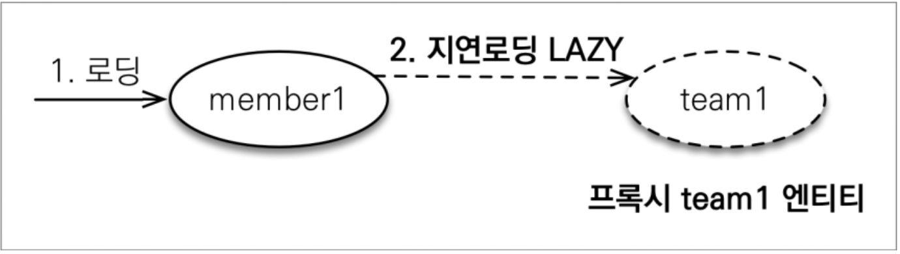

# 즉시 로딩과 지연 로딩    
<!-- TOC -->
* [즉시 로딩과 지연 로딩](#즉시-로딩과-지연-로딩-)
  * [즉시 로딩](#즉시-로딩-)
  * [NULL 제약 조건과 JPA 조인 전략](#null-제약-조건과-jpa-조인-전략-)
  * [지연 로딩](#지연-로딩-)
  * [프록시와 즉시로딩 주의](#프록시와-즉시로딩-주의-)
    * [N+1 문제](#n1-문제-)
    * [N+1 해결 방법](#n1-해결-방법)
<!-- TOC -->
선수 테이블과 팀 테이블이 있습니다.   

| id | team_name |
|----|-----------|
| 1  | T1        |
| 2  | DRX       |    

| id | member_name | team_id |
|----|-------------|---------|
| 1  | 이상혁         | 1       |
| 2  | 케리아         | 2       |  

+ 두 테이블을 Member.team_id = Team.id로 조인을 했습니다.  

| m.id | m.member_name | m.team_id | t.id | t.team_name |
|------|---------------|-----------|------|-------------|
| 1    | 이상혁           | 1         | 1    | T1          |
| 2    | 케리아           | 2         | 2    | DRX         |  

JPA는 객체 그래프 탐색을 통해서 데이터를 조회할 수 있습니다. 
그러면 Member 엔티티는 Team 엔티티와 연관관계가 다대일 관계일 때 
사용자는 Team 엔티티의 정보를 매번 조인을 통해서 초기화를 해야합니다.  

JPA는 연관된 엔티티의 조회 시점을 선택 할 수 있도록 다음과 같은 선택지를 제공합니다.
+ 즉시 로딩 : 엔티티를 조회할 때 연관된 엔티티도 함께 조회한다.
  - 예: `em.find(Member.class,1L)`를 호출할 때 선수와 연관된 팀 엔티티도 같이 조회가 됩니다.
  - 설정 방법 : `@ManyToOne(fetch = FetchType.EAGER)`
+ 지연 로딩 : 연관된 엔티티를 실제 사용할 때 조회한다.
    - 예: `member.getTeam().getName()`처럼 조회한 팀 엔티티를 실제로 사용하는 시점에 
    JPA가 SQL을 호출해서 팀 엔티티를 조회합니다.  
    - 설정 방법 : `@ManyToOne(fetch = FetchType.LAZY)`  
    
## 즉시 로딩  
즉시 로딩을 사용하려면 연관관계 매핑의 `(fetch = FetchType.EAGER)`로 설정합니다.  
```java
@Getter @Setter @Entity
public class Member extends BaseEntity {
    
    @Id @GeneratedValue
    private Long id;
    private String username;
    
    @ManyToOne(fetch = FetchType.EAGER)
    private Team team;
}
@Getter @Setter @Entity
public class Team extends BaseEntity {

    @Id
    @GeneratedValue
    private Long id;

    private String name;
}
```  
+ 테스트 코드  
```java
Member member = new Member();
member.setUsername("이상혁");
em.persist(member);

Team team = new Team();
team.setName("T1");
em.persist(team);

member.setTeam(team);

em.flush();
em.clear();

em.find(Member.class,member.getId());
```
```sql
select
    member0_.team_id as team_id7_8_0_,
    member0_.username as username6_8_0_,
    team1_.team_id as team_id_i1_15_1_,
    team1_.name as name6_15_1_,
    Member member0_ 
left outer join
    Team team1_ 
        on member0_.team_id = team1_.team_id 
where
    member0_.base_id=?
```  
즉시 로딩으로 설정하면 멤버를 조회할 때 연관된 엔티티도 같이 초기화하여 영속성 컨택스트에 로드가 되고 두 객체를 매핑해줍니다. 
이때 member_id로 Member 테이블을 조회하고 Member.team_id로 Team 테이블을 각각 조회해서 매핑하는게 아니라 
**_즉시 로딩을 최적화하기 위해 가능하면 조인 쿼리를 사용합니다._**  
  
## NULL 제약 조건과 JPA 조인 전략  
즉시 로딩을 실행할 때 발생되는 SQL을 살펴보면 내부 조인(`INNER JOIN`)이 아닌 외부 조인(`LEFT OUTER JOIN`)을 
사용했습니다. 현재 선수 테이블은 외래 키를 참조하는 칼럼이 `nullable`인 상태로 팀을 참조하지 않은 테이블이 존재할 수 도 있습니다.  
`em.find()`를 호출할 때 기준이 `Member` 엔티티 이기 때문에 회원에 대한 정보는 모두 가져와야하고, 
`Team`에 대한 정보는 유무는 알 수가 없습니다. 그렇다보니 `LEFT OUTER JOIN`을 JPA는 실행합니다.  
  
하지만 외부 조인보다 내부 조인이 성능과 최적화에서 더 유리합니다. 
간단하게 설명을 하면 인덱스는 카디널리티 ( 고유성 )이 높을 수록 인덱스를 효율적으로 사용할 수 있습니다. 
특히 PK값이나, UNIQUE일 경우에는 더욱 최적화가 되어있습니다. 
  
내부 조인을 사용하여 최적화를 적용하고 싶다면 외래 키 칼럼의 매핑된 필드에 NOT NULL 제약 조건을 설정하면 됩니다. 
```java
@Getter @Setter @Entity
public class Member extends BaseEntity {
    // ..    
    @ManyToOne(fetch = FetchType.EAGER)
    @JoinColumn(nullable = false) // 
    private Team team;
    // ..
}
@Getter @Setter @Entity
public class Member extends BaseEntity {
    // ..    
    @ManyToOne(fetch = FetchType.EAGER,optional = false)
    private Team team;
    // ..
}
```  
연관관계 애노테이션이나 `@JoinColumn` 애노테이션에 옵션을 주면됩니다.  
추가로 애노테이션에 not null 옵션을 넣을 경우 엔티티를 생성할 때 해당 필드가 초기화가 되어야합니다.  
```java
Member member = new Member();
member.setUsername("이상혁");
em.persist(member);

Team team = new Team();
team.setName("T1");
em.persist(team);
// 예외 발생
member.setTeam(team);
```  
영속성 컨택스트 관리 대상에 넣을 때 이미 엔티티에 not null로 선언한 필드는 초기화가 되어야합니다.  
  
## 지연 로딩  
<div style="text-align: center;"></div>  
  
조회한 엔티티에 지연 로딩으로 설정된 연관관계 필드에 초기화 되지 않은 프록시 객체를 넣어서 반환합니다.  
```java
Book book = new Book();
book.setId(1L);
book.setIsbn("123-456-7890");
book.setAuthor(session.getReference(Person.class, personId));
return book;
```  
코드로 보면 이렇게 엔티티를 초기화해서 반환한다고 생각하시면 됩니다.  
  
지연 로딩된 엔티티는 이미 가지고 있는 PK값을 제외하고 나머지 필드를 조회할 경우 
영속성 컨택스트에게 초기화를 요청하여 프록시 객체내에 실제 엔티티를 가지게 됩니다.  
  
만약 프록시 객체가 들어가야할 엔티티가 이미 영속성 컨택스트에서 관리중이라면 
기존에 관리중이던 실제 엔티티가 들어가게 됩니다.  
```java
@Getter @Setter @Entity
public class Member extends BaseEntity {
    // ..    
    @ManyToOne(fetch = FetchType.LAZY)
    private Team team;
    // ..
}
```  
지연 로딩 설정은 `fetch = FetchType.LAZY`로 변경합니다.  
```java
Team team = new Team();
team.setName("T1");
em.persist(team);

Member member = new Member();
member.setUsername("이상혁");
member.setTeam(team);
em.persist(member);

em.flush();
em.clear();

em.find(Team.class,team.getId());
Member findMember = em.find(Member.class, member.getId()); 

System.out.println("Team.getClass = "+findMember.getTeam());
//Team.getClass = class jpabook.Team
```
반대로 Team 엔티티를 프록시로 호출하고, 즉시 로딩으로 Member를 호출 했다면 
Member의 team 필드에는 프록시 객체가 들어있을 겁니다.  
```java
// 즉시 로딩일때
em.getReference(Team.class,team.getId());
Member findMember = em.find(Member.class, member.getId());
System.out.println("Team.getClass = "+findMember.getTeam().getClass());
Team.getClass = class jpabook.Team$HibernateProxy$gEZHwCyE
```  
  
## 프록시와 즉시로딩 주의  
+ 가급적 지연 로딩만 사용합니다(실무에서)  
+ 즉시 로딩을 적용하면 예상하지 못한 SQL이 발생합니다. 
+ 즉시 로딩은 JPQL에서 **_N+1_** 문제를 일으킵니다.  
+ @xxToOne은 기본이 즉시로딩 -> LAZY로 설정합니다.  
+ @xxToMany는 기본이 지연로딩 입니다.   
  
### N+1 문제  
JPQL은 영속성 컨택스트를 먼저 조회하지 않고 SQL로 파싱되고 DB에 요청과 응답을 받습니다. 
응답을 영속성 컨택스트에 관리 대상이 아닐 경우 load를 하고 그 결과를 반환하기 때문에 
`em.find(Member.class,1L)`처럼 지연 로딩과 즉시 로딩에 대한 최적화 처리를 할 수 없습니다. 
즉시 로딩일 경우 먼저 Member 테이블을 조회후 매핑하다가 해당 필드 옵션이 즉시 로딩이라면 그 때 다시 데이터 베이스에 쿼리를 실행합니다.  
  
코드로 보겠습니다.  
1. 모든 멤버가 동일한 팀일 경우
```java
select
    team0_.custom_id as custom_i1_15_0_,
    team0_.createdBy as createdb2_15_0_,
    team0_.createdByDate as createdb3_15_0_,
    team0_.lastModifiedBy as lastmodi4_15_0_,
    team0_.localDateTime as localdat5_15_0_,
    team0_.name as name6_15_0_ 
from
    Team team0_ 
where
    team0_.custom_id=?
```   
해당 쿼리가 한번 동작합니다. 
2. 모든 멤버가 다 다른 팀일 경우
```java
select
    team0_.custom_id as custom_i1_15_0_,
    team0_.createdBy as createdb2_15_0_,
    team0_.createdByDate as createdb3_15_0_,
    team0_.lastModifiedBy as lastmodi4_15_0_,
    team0_.localDateTime as localdat5_15_0_,
    team0_.name as name6_15_0_ 
from
    Team team0_ 
where
    team0_.custom_id=?
```  
모두 다른 team_id를 참조하고 있을 경우 해당 쿼리는
그 조회한 엔티티 갯수만큼 반복합니다.  

이런 문제를 JPQL로 쿼리를 실행하고 연관관계가 즉시로딩일때 발생합니다.  
  
### N+1 해결 방법
N+1 문제를 해결하는 방법은 3가지 방법이 있습니다.[공식 문서](https://docs.jboss.org/hibernate/orm/6.4/introduction/html_single/Hibernate_Introduction.html#join-fetch)  

외부 조인 페치(Outer join fetching)는 연관된 데이터를 가져오는 가장 좋은 방법으로 일반적으로 사용됩니다. 
그리고 우리는 대부분의 경우에 이를 사용합니다. 
그러나 외부 조인 페치는 그 본질적인 특성으로 인해 단순히 지연 로딩(lazy loading)이 될 수 없습니다.
따라서 외부 조인 페치를 사용하려면 미리 계획을 세워야 합니다.
우리의 일반적인 조언은 다음과 같습니다  

**_N+1 쿼리 문제의 주 원인인 지연 로딩 사용을 피하세요._**

우리는 연관성(associations)을 기본적으로 즉시 로딩(eager fetching)으로 매핑해야 한다는 것은 말하는 것이 아닙니다! 그렇게 한다면 거의 전체 데이터베이스를 가져오는 단순한 세션 작업이 발생하여 혼란스러운 상황이 될 수 있습니다. 
따라서:  

**_대부분의 연관성은 기본적으로 지연 로딩으로 매핑해야 합니다._**

이 조언은 이전의 조언과 모순되는 것처럼 들릴 수 있지만, 사실 그렇지 않습니다.  
**_필요한 경우에만 명시적으로 eager fetching을 지정해야 한다는 것을 의미합니다._**

특정 트랜잭션에서 **eager join fetching**이 필요한 경우,  

이를 지정하는 네 가지 다른 방법이 있습니다.
1. **JPA EntityGraph 전달**
2. **명명된 페치 프로필 지정**  
    키워드 : Named fetch profiles
3. **HQL/JPQL에서 left join fetch 사용**
4. **Criteria 쿼리에서 From.fetch() 사용**

지연 로딩에 관련된 내용이기 때문에 자세한 내용은 [공식문서](https://docs.jboss.org/hibernate/orm/6.4/introduction/html_single/Hibernate_Introduction.html#association-fetching) 를 참고해주세요.