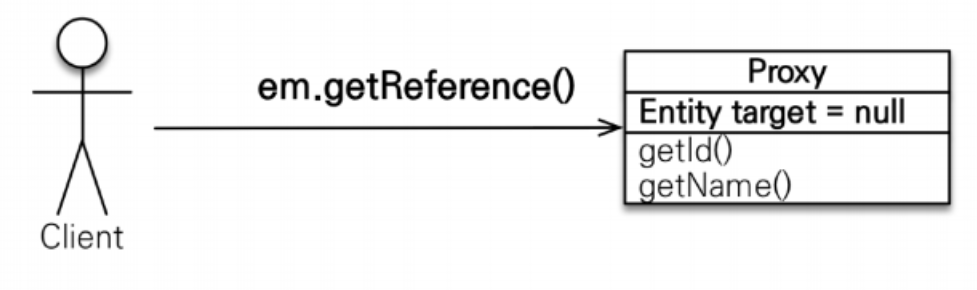
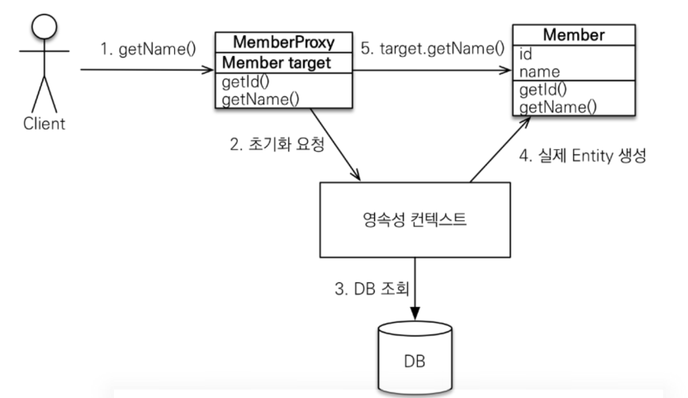

# 프록시와 연관관계 관리   
<!-- TOC -->
* [프록시와 연관관계 관리](#프록시와-연관관계-관리-)
  * [프록시 기초](#프록시-기초-)
    * [프록시 특징](#프록시-특징-)
    * [프록시 객체 초기화](#프록시-객체-초기화-)
    * [프록시 특징](#프록시-특징--1)
    * [예제 코드](#예제-코드)
    * [프록시와 식별자](#프록시와-식별자-)
<!-- TOC -->
엔티티를 조회할 때 연관관계인 엔티티들의 정보가 필요하지 않습니다. 
비즈니스 로직에 따라 연관관계인 엔티티의 정보가 필요할 수 있지만, 그렇지 않을 때도 있습니다.  
  
선수와 팀이 있습니다. 선수와 팀은 1:N 관계라고 할 때 선수의 정보만 필요할 경우가 있습니다. 
그런데 아무 설정 없이 선수 엔티티를 조회하면 팀 엔티티도 같이 조회가 됩니다.  
  
JPA는 이런 문제를 해결하려고 엔티티가 실제 사용될 때까지 데이터베이스 조회를 지연하는 방법을 
제공합니다. 이것을 **지연로딩**이라 합니다.  
  
엔티티의 값이 필요할 때 `team.getName()`와 같이 필요한 데이터를 조회하는 시점에 
데이터베이스에서 정보를 조회합니다. 
지연 로딩 기능을 사용하려면 실제 엔티티 객체 대신에 데이터베이스 조회를 지연할 수 있는 
가짜 객체가 필요한데 이것을 프록시 객체라 합니다.  
  
## 프록시 기초  
JPA에서 식별자를 엔티티 하나를 조횔할 때는 `EntityManager.find()`를 사용합니다. 
이 메소드는 영속성 컨텍스트에 엔티티가 없으면 데이터베이스를 조회합니다.  
  
엔티티를 실제 사용하는 시점까지 데이터베이스의 조회를 미루고 싶다면 `EntityManager.getReference()`를 사용하면 됩니다.  
`Member member = em.getReference(Member.class,1L);`
공식 문서에 설명입니다.  
+ **getReference()**  
  엔티티에 대한 참조를 얻습니다. 엔티티의 상태가 초기화되었을 수도, 아닐 수도 있습니다.
  해당 엔티티가 현재 실행 중인 세션에 이미 연관되어 있다면, 그 참조(로드되었든 아니든)가 반환됩니다.
  현재 세션에 엔티티가 로드되지 않았고 엔티티가 프록시 생성을 지원하는 경우, 초기화되지 않은 프록시가 생성되어 반환됩니다. 그렇지 않으면 데이터베이스에서 엔티티를 로드하고 반환합니다.  
+ 
<div style="text-align: center;"></div>  
  
### 프록시 특징  
프록시 클래스는 실제 클래스를 상속 받아서 만들어집니다. 실제 클래스와 겉 모양이 같기 때문에 
사용자 입장에서는 진짜인지 가짜인지 구분하지 않고 사용합니다.   
  
프록시 객체는 내부에 실제 객체를 내부 필드로 보관합니다. 그리고 프록시 메소드를 호출하면 
실제 객체의 메소드에게 위임합니다.  
  
### 프록시 객체 초기화  
<div style="text-align: center;"></div>  
  
```java
Member member = em.getReference(Member.class,1L);
member.getName() // 1. getName();
class MemberProxy extends Member {
    Member target = null; // 실제 엔티티 참조 저장
    public String getName(){
        if (target == null) {
            // 2.영속성 컨택스트 초기화 요청
            // 3.DB조회
            // 4.실제 엔티티 생성 및 참조 보관
            this.target = //...;
        }      
        // 5. target.getName();
        return target.getName();
    }
}
```  
  
1. 프록시 객체에 `member.getName()`을 호출해서 실제 데이터를 조회한다. 
2. 프록시 객체는 실제 엔티티가 생성되어 있지 않으면 영속성 컨택스트에 실제 엔티티 생성을 요청한다. 
    이를 **_초기화_** 라 합니다  
3. 영속성 컨택스트는 데이터베이스를 조회해서 실제엔티티 객체를 생성한다. 
4. 프록시 객체는 생성된 실제 엔티티 객체의 참조를 내부 필드에 보관한다. 
5. 프록시 객체는 실제 엔티티 객체의 `getName()`을 호출해서 결과를 반환한다.   

 ### 프록시 특징  
+ 프록시 객체는 처음 사용할 때 한 번만 초기화
+ 프록시 객체를 초기화 할 때, 프록시 객체가 실제 엔티티로 바뀌는 것은 아님, 
   초기화되면 프록시 객체를 통해서 실제 엔티티에 접근 가능
+ 프록시 객체는 원본 엔티티를 상속받음, 따라서 타입 체크시 주의해야함 (== 비
교 실패, 대신 instance of 사용)
+ 영속성 컨텍스트에 찾는 엔티티가 이미 있으면 em.getReference()를 호출해
도 실제 엔티티 반환
+ 영속성 컨텍스트의 도움을 받을 수 없는 준영속 상태일 때, 프록시를 초기화하면 
   문제 발생 (하이버네이트는 org.hibernate.LazyInitializationException 예외를 터트림)

### 예제 코드
+ 엔티티매니저 생성 테스트 코드
```java
public class OneToManyTest {
    private EntityManager em;
    private static EntityManagerFactory emf = Persistence.createEntityManagerFactory("hello");
    @BeforeEach
    void setUp() { em = emf.createEntityManager(); }
    @AfterAll
    static void finish() { emf.close(); }
}
```  
1. `find() -> getReference()`
  ```java
  @DisplayName("실제 객체 조회후 프록시 조회")
  @Test
  void p1(){
    EntityTransaction tx = em.getTransaction();
    tx.begin();
    Member member = new Member();
    member.setUsername("둘리");
    em.persist(member);
    
    em.flush();
    em.clear();
    
    Member conn = em.find(Member.class, member.getId());
    Member ref = em.getReference(Member.class, member.getId());
    
    System.out.println("conn.getClass = "+conn.getClass());
    System.out.println("ref.getClass = "+ref.getClass());
    System.out.println("ref == conn : "+(ref==conn));
//  conn.getClass = class jpabook.Member
//  ref.getClass = class jpabook.Member
//  ref == conn : true
    tx.commit();
  }
  ```  
2. `getReference() -> find()`  
```java
@DisplayName("프록시 조회후 실제 객체 조회")
@Test
void p1(){
    EntityTransaction tx = em.getTransaction();
    tx.begin();
    Member member = new Member();
    member.setUsername("둘리");

    em.persist(member);

    em.flush();
    em.clear();

    Member ref = em.getReference(Member.class, member.getId());
    Member conn = em.find(Member.class, member.getId());

    System.out.println("ref.getClass = "+ref.getClass());
    System.out.println("conn.getClass = "+conn.getClass());
    System.out.println("ref == conn : "+(ref==conn));
  //ref.getClass = class jpabook.Member$HibernateProxy$UnhK2At7
  //conn.getClass = class jpabook.Member$HibernateProxy$UnhK2At7
  //ref == conn : true

    tx.commit();
}
```  
  
영속성 컨택스트에 관리중인 엔티티일 경우 프록시 객체나 실제 객체나 관리가 되어지면 
`@Id`를 key로 객체는 value로 관리하기 때문에 먼저 `load`된 객체가 반환 됩니다.  
  
그러다보니 개발자는 `find,getReference`로 엔티티를 가져왔을때 이 객체가 
프록시인지 실제 객체인지 상관없이 로직을 수행할 수 있어야 합니다. 
엔티티의 타입을 체크할때 `==`가 아니라 `instanceOf`를 사용합니다.  
  
프록시 객체는 영속성 컨택스트에게 초기화를 요청하기 때문에 관리 대상이 아닌 `준영속`일 경우에는 
프록시 초기화가 되면 예외가 발생합니다. 
`org.hibernate.LazyInitializationException`  
  
### 프록시와 식별자  
엔티티를 프록시로 조회할 때 식별자(PK) 값을 파라미터로 전달합니다. 
프록시 객체는 이 식별자 값을 보관합니다. 
```java
Member member = em.getReference(Team.class,1L);
member.getId(); // 1 하지만 데이터베이스에는 연결되지 않습니다. 
```  
프록시 객체는 식별자 값을 가지고 있으므로 식별자 값을 조회하는 `member.getId()`를 호출해도 
프록시를 초기화 하지 않습니다.  

프록시는 다음 코드처럼 연관관계를 설정할 때 유용하게 사용할 수 있습니다.
예제 360. Hibernate API를 사용하여 데이터를 초기화하지 않고 엔터티 참조 얻기
[하이버네이트 공식 예제](https://docs.jboss.org/hibernate/orm/6.4/userguide/html_single/Hibernate_User_Guide.html#pc-get-reference)
```java
Book book = new Book();
book.setId(1L);
book.setIsbn("123-456-7890");
entityManager.persist(book);
book.setAuthor(session.getReference(Person.class, personId));   
```
위의 내용은 엔티티가 느린 로딩(lazy loading)을 허용하도록 정의되어 있다는 가정하에 작동합니다. 일반적으로 런타임 프록시를 사용합니다. 두 경우 모두, 반환된 프록시를 사용하는 어떤 방식에서든 실제 데이터에 대한 액세스가 필요한 경우에만 예외가 나중에 발생합니다.

엔티티 클래스가 final로 선언되지 않은 경우, 프록시는 엔티티 클래스를 상속(extends)합니다. 엔티티 클래스가 final인 경우, 프록시는 대신 인터페이스를 구현(implement )합니다. 자세한 내용은 @Proxy 매핑을 참조해주세요.  
  
```java
// 프록시 인스턴스의 초기화 여부 확인 
PersistenceUnitUtil.isLoaded(Object entity)
// 프록시 클래스 확인 방법
entity.getClass().getName() // 출력(..javasist.. or HibernateProxy…)
// 프록시 강제 초기화
org.hibernate.Hibernate.initialize(entity);
// 참고: JPA 표준은 강제 초기화 없음 
member.getName()
```
