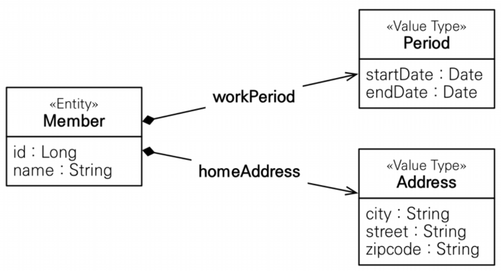
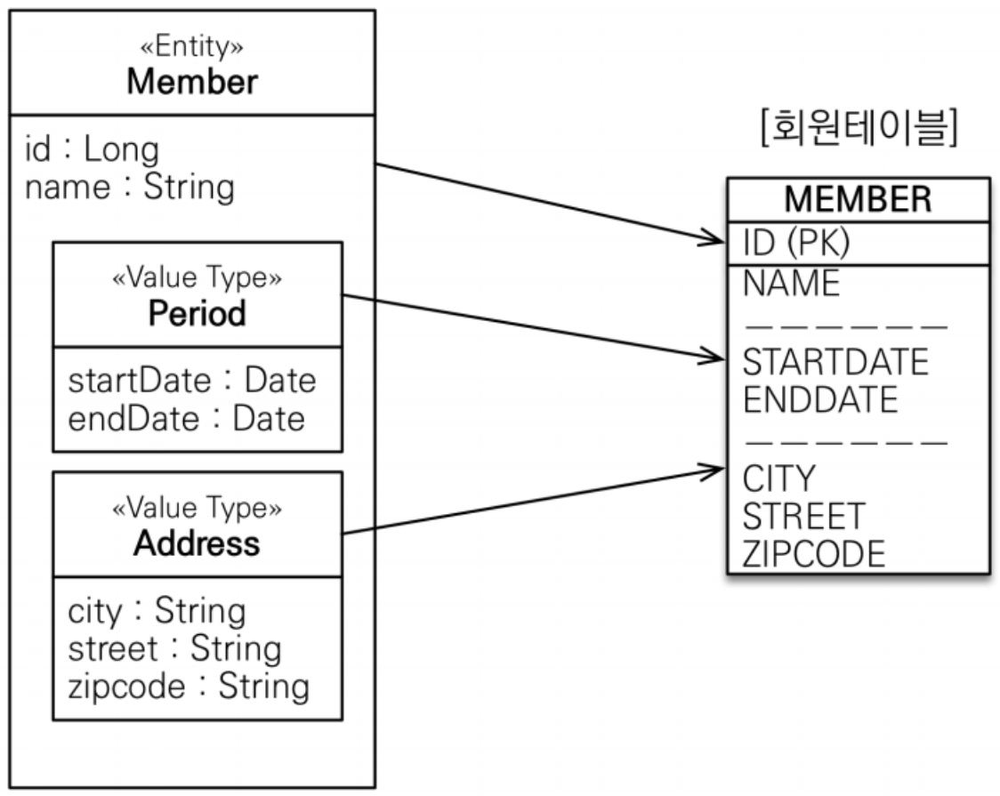
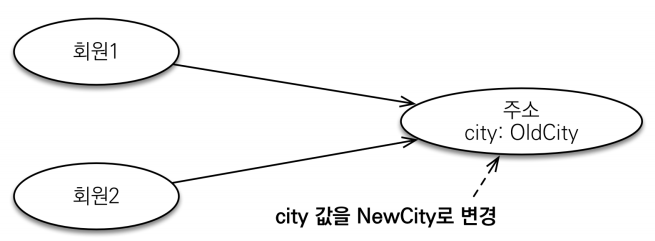
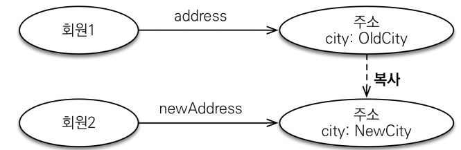
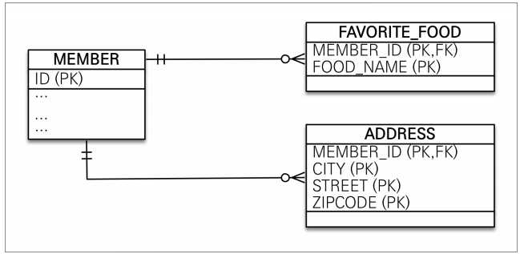

# 값 타입    
<!-- TOC -->
* [값 타입](#값-타입-)
  * [기본 값 타입](#기본-값-타입-)
  * [인베디드 타입(복합 값 타입)](#인베디드-타입복합-값-타입-)
    * [인베디드 타입과 테이블 매핑](#인베디드-타입과-테이블-매핑-)
    * [@AttributeOverride: 속성 재정의](#attributeoverride-속성-재정의-)
    * [인베디드 타입과 연관관계](#인베디드-타입과-연관관계-)
    * [인베디드 타입과 null](#인베디드-타입과-null-)
  * [값 타입과 불변 객체](#값-타입과-불변-객체-)
    * [값 타입 복사](#값-타입-복사-)
    * [불변객체](#불변객체-)
  * [값 타입 비교](#값-타입-비교-)
  * [값 타입 컬렉션](#값-타입-컬렉션-)
    * [값 타입 컬렉션 사용](#값-타입-컬렉션-사용)
      * [컬렉션 수정시](#컬렉션-수정시-)
      * [기본형 타입](#기본형-타입)
      * [임베디드 타입](#임베디드-타입)
      * [실무 상황](#실무-상황-)
  * [정리](#정리-)
    * [엔티티 타입의 특징](#엔티티-타입의-특징)
      * [엔티티 타입의 특징](#엔티티-타입의-특징-1)
      * [값 타입의 특징](#값-타입의-특징)
<!-- TOC -->
JPA에서는 데이터 타입을 가장 크게 분류하면 엔티티 타입과 값 타입으로 나눌 수 있습니다. 
엔티티 타입은 `@Entity`로 정의하는 객체이고, 값 타입은 자바 기본 타입, 객체를 말합니다.  
  
엔티티는 식별자를 통해 지속해서 추적할 수 있지만, 값 타입은 식별자가 없고 숫자나 문자같은 속성만 
있으므로 추적할 수 없습니다.  
  
선수 엔티티가 있을 때 선수의 식별자만 유효하면 선수의 나이, 이름은 변경되어도 같은 회원이라는 걸 알 수 있습니다. 
그와 다르게 선수 이름이 변경되면 아예 다른 값으로 대체가 됩니다.  

값 유형은 세 가지 하위 카테고리로 구분됩니다:

+ `기본 유형 ` 
    Contact 테이블을 매핑할 때 이름을 제외한 모든 속성은 기본 유형일 것입니다.
+ `내장 유형 `
   이름 속성은 내장 유형의 예시입니다.
+ `컬렉션 유형`  
  컬렉션 유형은 값 유형 중 하나의 독특한 카테고리입니다.  
  
## 기본 값 타입  
값 유형은 자체 수명 주기를 정의하지 않는 데이터 조각입니다.
실제로, 값 유형은 그 수명 주기를 정의하는 엔티티에 의해 소유됩니다.

또 다른 관점에서 보면, 엔티티의 모든 상태는 값 유형으로 완전히 구성됩니다.
이러한 상태 필드 또는 JavaBean 속성은 "지속적인 속성(persistent attributes)"이라고 불립니다.  
  
다른 관점은 값 타입은 공유하면 안됩니다. 

자바에서는 기본형 타입과 래퍼형 타입은 절대 공유가 되지 않습니다. 
이유는 `int a = 10 , int b = 20 , b = a `로 할당할 경우에 참조가 복사되는게 아니라 
값이 복사가 되기 때문에 문제가 발생하지 않습니다. 래퍼 클래스도 공유가능한 객체이지만 
변경은 되지 않습니다 !
  
## 인베디드 타입(복합 값 타입)  
새로운 값 타입 객체를 직접 정의할 수 있습니다. JPA에서 `인베디드 타입`이라고 합니다. 
중요한 것은 값 유형은 자체 수명 주기를 정의하지 않는 데이터 조각입니다.
실제로, 값 유형은 그 수명 주기를 정의하는 엔티티에 의해 소유됩니다.

중요한 것은 직접 정의한 인베디드 타입도 `int`,`String`처럼 값 타입입니다.  
```java
@Entity
public class Member {
    
    @Id @GeneratedValue
    private Long id;
    private String name;
    
    //근무기간
    private LocalDateTime startDate;
    private LocalDateTime endDate;
    
}
```   
엔티티를 보고 다른 사람에게 설명을 할때에는  
+ 회원 엔티티는 이름, 근무 시작일, 근무 종료일이 있다. 
  
이렇게 설명하는건 단순히 테이블에 대한 정보를 나열했습니다. 추상화를 통해서 설명을 쉽게 할 수 있다면 
+ 회원 엔티티는 이름과 근무기간을 가진다.  
  
회원 엔티티에 대한 상세한 칼럼에 대해서 설명하지 않아도 됩니다. 
회원 엔티티에 어떤 정보가 들어있다는 걸 추상화를 통해 이해가 쉬워입니다.

```java
@Entity
public class Member {
    
    @Id @GeneratedValue
    private Long id;
    private String name;
    
    //근무기간
    @Embedded Period workPeriod; // 근무기간
}
```
그리고 내부에 객체를 통해서 응집도를 높일 수 있습니다. 
```java
@Embeddable @Getter
public class Period {

    private LocalDateTime startDate;
    private LocalDateTime endDate;

    protected Period() {}

    private Period(LocalDateTime startDate, LocalDateTime endDate) {
        this.startDate = startDate;
        this.endDate = endDate;
    }

    public Period createPeriod(LocalDateTime startDate, LocalDateTime endDate){
        return new Period(startDate, endDate);
    }

    public boolean isWork(LocalDateTime dateTime) {
        // .. 로직
        return false;
    }
}
```    
<div style="text-align: center;"></div>  
  
선수 엔티티가 더 의미가 있고 응집력 있게 변했습니다.  
+ startDate,endDate를 합하여 Period(기간) 클래스를 만들었습니다.  
  
새로 정의한 값 타입들은 기본 유형 매핑을 그룹화하고 여러 엔터티에서 재사용하는 데 사용됩니다. 
해당 값 타입만 사용하는 의미 있는 메소드도 추가로 만들 수 있습니다.  
  
인베디드 타입을 사용하려면 2가지 애노테이션이 필요합니다.

+ `@Embeddable`은 매핑 유형 자체를 설명하는 데 사용됩니다 (예: Period)  
    값 타입을 **정의하는 곳에 표시**
+ `@Embedded`는 특정한 내장 가능한(embeddable) 유형을 참조하는 데 사용됩니다 (예: member.workPeriod)  
    값 타입을 **사용하는 곳에 표시**  
+ **기본 생성자 필수**  
  
두 애노테이션중 하나는 생략해도 가능하지만, 둘다 사용하는 것을 추천합니다. 
애노테이션이라는건 개발자가 명시할 수 있는 주석이기도 하기 때문입니다.
  
엔티티와 임베디드 타입의 관계를 UML로 표현하면 컴포지션(composition) 관계가 됩니다.  
하이버 테이트는 임베디드 타입을 컴포넌트(components)라 합니다.  
  
### 인베디드 타입과 테이블 매핑  
<div style="text-align: center;"></div>  
  
인베디드 타입은 엔티티의 값일 뿐입니다. 따라서 값이 속한 엔티티의 테이블에 매핑됩니다. 
임베디드 타입을 사용하기 **_전과 후도 매핑하는 테이블은 같습니다._**  
  
인베디드 타입으로 객체와 테이블을 아주 세밀하게(fine-grained) 매핑하는 것이 가능합니다. 잘 설계한 ORM 애플리케이션은 
매핑한 테이블의 수 보다 클래스 수가 더 많습니다. 
  
현업에서는 많이 사용하지 않습니다.  
엔티티를 만들다 보면 필요한 도메인이 있을 때 만들면 됩니다.  
만들어 놓은 인베디드 타입 클래스는 공통으로 관리할 수 있고, 
코드도 공통화,도메인의 언어를 공통으로 사용할 수 있다는 장점이 있습니다.  
  
### @AttributeOverride: 속성 재정의  
공통 인베디드 클래스를 사용한다고 할때 엔티티에 맞는 칼럼명으로 변경하고 싶을 때 사용합니다. 
또는 같은 타입의 인베디드 클래스를 사용한다고 할 때도 가능합니다.  
```java
@Embedded
@AttributeOverrides({
    @AttributeOverride(name="startDate",column = @Column(name = "joinDate")),
    @AttributeOverride(name="endDate",column = @Column(name = "farewellDate"))})
private Period workPeriod;
```  
```sql
create table Member (
   id bigint not null,
    username varchar(10) not null,
    farewellDate timestamp,
    joinDate timestamp,
    team_id bigint,
    primary key (id)
)
```  

### 인베디드 타입과 연관관계  
인베디드 타입은 값을 포함하거나 엔티티를 참조할 수 있습니다.  
엔티티는 공유될 수 있으므로 참조한다고 표현하고, 값 타입은 특정 주인에 소속되고 논리적인 개념상 공유되지 않으므로 포함한다고 표현합니다.  
```sql
@Embeddable @Getter
public class Period {

    private LocalDateTime startDate;
    private LocalDateTime endDate;
    @ManyToOne
    @JoinColumn(name = "embedded_team")
    private Team team; 
    
}
```  
인베디드 타입에 연관관계 매핑을 추가 했습니다. 
```sql
create table Member (
    id bigint not null,
    username varchar(10) not null,
    farewellDate timestamp,
    joinDate timestamp,
    team_id bigint,
    embedded_team bigint,
    primary key (id)
)
```
테이블에도 embedded_team 이라고 연관관계 주인인 테이블에 외래 키 칼럼이 생긴것을 확인할 수 있습니다. 
  
### 인베디드 타입과 null 
인베디드 타입에 null이면 매핑한 칼럼 값은 모두 `null`이 됩니다.  
```java
member.setWorkPeriod(null);
em.persist(member);
```  
Member 테이블의 farewellDate, joinDate 칼럼은 모두 null이 들어갑니다.   
  
## 값 타입과 불변 객체  
값 타입은 복잡한 객체를 조금이나마 단순화하려고 만든 개념입니다. 
따라서 참조 값이 전달되는 인베디드 값 타입은 안전하게 다룰 수 있어야 합니다.  
<div style="text-align: center;"></div>  
  
이미지와 다르지만 period 인베디드 타입을 하나를 만들고 두 선수에게 전달하고 저장했습니다. 
```java
Period workPeriod = Period.createPeriod(LocalDateTime.of(2013, 4, 13,0,0), LocalDateTime.of(2025, 4, 13,0,0));
Member m1 = new Member();
m1.setUsername("둘리");
m1.setWorkPeriod(workPeriod);
em.persist(m1);

Member member2 = new Member();
member2.setUsername("둘리");
member2.setWorkPeriod(workPeriod);
em.persist(member2);

m1.getWorkPeriod().setEndDate(LocalDateTime.now());
```  
```sql
/* update jpabook.Member */ update Member set team_id=?, username=?, farewellDate=?, joinDate=? where id=?
/* update jpabook.Member */ update Member set team_id=?, username=?, farewellDate=?, joinDate=? where id=?
```  
같은 `Period` 인베디드 클래스를 참조하는 m1의 `period`를 수정하니 member2의 데이터도 수정된 것을 확인할 수 있습니다.   
공유 참조로 발생하는 버그는 찾기 어렵기 때문에 부작용(side effect)가 발생합니다.  
  
### 값 타입 복사  
값 타입을 실제 인스턴스를 공유하는 것은 위험합니다. 대신에 인스턴스를 복사해서 사용해야합니다. 
<div style="text-align: center;"></div>  
  
```sql
Period workPeriod = Period.createPeriod(LocalDateTime.of(2013, 4, 13,0,0), LocalDateTime.of(2025, 4, 13,0,0));
Member m1 = new Member();
m1.setUsername("둘리");
m1.setWorkPeriod(workPeriod);
em.persist(m1);

Member member2 = new Member();
member2.setUsername("둘리");

Period newPeriod = workPeriod.clone();
member2.setWorkPeriod();
em.persist(member2);
```  
이렇게 복사된 인스턴스를 저장하면 공유 참조로 인해 발생하는 부족용을 피할 수 있습니다. 
문제는 객체를 대입할 때마다 인스턴스를 복사해서 대입하면 해당 문제를 피할 수 있지만, 
복사하지 않고 원본의 참조 값을 직접 넘기는 것을 막을 방법이 없습니다. 
 
자바는 넘어오는 인스턴스가 값 타입인지 신경을 쓰지 않습니다. 
**_객체의 공유 참조는 피할 수 없습니다._**  
  
단순한 방법은 객체의 값을 수정하지 못하게 막으면 됩니다.  
`Period` 임베디드 타입의 `setter`를 모두 제거하면 됩니다.  
  
### 불변객체  
값 타입은 부작용 걱정 없이 사용할 수 있어야 합니다. 
객체를 불변하게 만들면 값을 수정할 수 없으므로 부작용을 원천 차단할 수 있습니다. 
따라서 값 타입은 될수 있으면 **_불변 객체_** 로 설계해야합니다.  
  
방법은 3가지가 있습니다. 
1. 생성자 매서드와 수정자를 제거한다.
2. 빌더 패턴을 사용한다.
3. 팩토리 매서드와 수정자를 제거한다.
4. 복사 생성자를 사용한다.  

불변 객체를 이용하고 특정 필드만 setter를 열고 싶을 때 사용할 수 있을 거같다.   
```java
//Period
public static Period createPeriod(LocalDateTime startDate, LocalDateTime endDate){
        return new Period(startDate, endDate);
}
//Member Entity
public void setWorkPeriod(Period period) {
    this.workPeriod = Period.createPeriod(period.getStartDate(),period.getEndDate());
}
```  
이렇게 코드를 작성하면 필요한 임베디드 타입에도 특정 필드만 setter를 열어둘수 있을거라 생각합니다.  
만약 필드가 많다면 복사 생성자를 `Period`에 추가하는 것도 방법이라고 생각됩니다.  
  
+ 테스트코드 
```java
 Period workPeriod = Period.createPeriod(LocalDateTime.of(2013, 4, 13,0,0), LocalDateTime.of(2025, 4, 13,0,0));
Member m1 = new Member();
m1.setUsername("둘리");
m1.setWorkPeriod(workPeriod);
em.persist(m1);

Member member2 = new Member();
member2.setUsername("둘리");
member2.setWorkPeriod(workPeriod);
em.persist(member2);

m1.getWorkPeriod().setEndDate(LocalDateTime.now());
```  
```sql
/* update jpabook.Member */ update Member set team_id=?, username=?, farewellDate=?, joinDate=? where id=?
```  
내부 메서드에서 새 인스턴스를 만들기 때문에 공유 참조문제는 해결이 된다.  

## 값 타입 비교  
기본 형 타입은 같은 타입일 경우 타입의 크기를 비교합니다. 
```java
int num1 = 10;
int num2 = 10;

Address ad1 = new Address("서울시","마포구","노고산동");
Address ad2 = new Address("서울시","마포구","노고산동");
```  
+ Address ad1 과 Address ad2 는 같다고 표현합니다.  

자바가 제공하는 객체 비교는 2가지 입니다.
+ 동일성 비교 : 인스턴스의 참조 값을 비교 , `==` 사용  
+ 동등성 비교 : 인스턴스의 값을 비교, `equals()` 사용

Address 값 타입을 a==b 로 동일성을 비교하면 둘은 서로 다른 인스턴스이므로 
결과는 false가 나옵니다. 값 타입은 필드 값이 같다면 똑같은 값 타입이라고 봐야합니다. 
  
따라서 `equals()`와 `hashCode()`를 재정의해서 안전하게 비교할 수 있어야합니다. 
`hashCode()`는 해시를 사용해서 데이터를 찾아오거나 비교하기 때문에 `hashSet()`,`hashMap()`을 정상 동작하기 위해서 
두 메소드 모두 재정의가 필요합니다.  
  
## 값 타입 컬렉션  
값 타입을 하나 이상 저장하려면 컬렉션에 보관하고 `@ElementCollection`,`@CollectionTable` 애노테이션을 사용하면 됩니다.  
+ 예제
```java
@Embeddable @Getter
@NoArgsConstructor
@EqualsAndHashCode
public class CallHistory {

    private String name;
    private String mobile;

    public CallHistory(String name, String mobile) {
        this.name = name;
        this.mobile = mobile;
    }
    // 추가 메서드
    public void addCallHistory(CallHistory ...callHistories) {
        this.callHistories.addAll(List.of(callHistories));
    }
    public void removeCallHistory(CallHistory... callHistories) {
        this.callHistories.removeAll(List.of(callHistories));
    }
    public void addRecentlyHistory(String username) {
        this.recentlyCallName.add(username);
    }
    public void removeRecentlyHistory(String username) {
        this.recentlyCallName.remove(username);
    }
}

@Getter @Entity @Setter
public class Member {

    @Id
    @GeneratedValue(strategy = GenerationType.SEQUENCE)
    private Long id;
    private String username;

    @ElementCollection
    @CollectionTable(name = "call_history",
            joinColumns = @JoinColumn(name = "member_id"))
    private List<CallHistory> callHistories = new ArrayList<>();

    @ElementCollection
    @CollectionTable(name = "recently_call_name",joinColumns = @JoinColumn(name = "person_name"))
    @Column(name = "target_name")
    private Set<String> recentlyCallName = new HashSet<>();
    
}
```  

<div style="text-align: center;"></div>  
값 타입 컬렉션 논리적 모델링(ERD)  

실제 실행된 SQL을 보면    
```sql
create table call_history (
    member_id bigint not null, -- FK Member(member_id)
    mobile varchar(255),
    name varchar(255)
)
create table recently_call_name (
    person_name bigint not null, -- FK Member(member_id)
    target_name varchar(255)
)
```
중요한건 아니지만 그림과 다르게 PK는 걸려있지 않고, FK만 걸려있습니다.  
값 타입 컬렉션이라는걸 표시하기위해 `@ElementCollection`를 사용했습니다. 
그리고 `recentlyCallName`는 최근에 전화를 건 사람의 목록이고 `String` 타입입니다. 
  
데이터베이스는 기본적인 칼럼 하나에 여러 개의 값을 가질 수 없습니다. 
그래서 별도의 테이블을 만들고 `1:N` 관계를 만들어서 관계를 맺습니다. 
`@CollectionTable` 애노테이션을 사용해서 추가한 테이블을 매핑해야합니다. 
그리고 기본형 타입의 경우 `@Column`으로 대상 테이블의 칼럼명을 지정할 수 있습니다.
```java
@CollectionTable(name = "recently_call_name",joinColumns = @JoinColumn(name = "person_name"))
//테이블 이름은 recently_call_name
//recently_call_name 테이블의 FK 필드명 : person_name
@Column(name = "target_name")
//recently_call_name 테이블의 컬렉션이 저장될 필드명 : target_name
```
  
임베디드 타입인 `CallHistory`는 기본 매핑 설정은 `CallHistory`에 있는 필드 설정을 따라가지만 
`Member` 엔티티에 관련된 테이블만 `@AttributeOverride`애노테이션을 사용해서 칼럼명 오버라이딩해서 사용할 수 있습니다.  
  
### 값 타입 컬렉션 사용
+ 저장
```java
 Member member = new Member();
member.setUsername("고길동");
//임베디드 타입
CallHistory call1 = new CallHistory("또치", "1577-8000");
CallHistory call2 = new CallHistory("둘리", "02-123-4567");
CallHistory call3 = new CallHistory("희동이", "031-1234-1234");
member.addCallHistory(call1,call2,call3);
//기본형 타입 컬렉션
member.addRecentlyHistory("또치");
member.addRecentlyHistory("둘리");
member.addRecentlyHistory("희동이");

em.persist(member);
```
```sql
Hibernate: /* insert jpabook.Member */ insert into Member (team_id, username, farewellDate, joinDate, id) values (?, ?, ?, ?, ?)
Hibernate: /* insert collection row jpabook.Member.callHistories */ insert into call_history (member_id, mobile, name) values (?, ?, ?)
Hibernate: /* insert collection row jpabook.Member.callHistories */ insert into call_history (member_id, mobile, name) values (?, ?, ?)
Hibernate: /* insert collection row jpabook.Member.callHistories */ insert into call_history (member_id, mobile, name) values (?, ?, ?)
Hibernate: /* insert collection row jpabook.Member.recentlyCallName */ insert into recently_call_name (person_name, target_name) values (?, ?)
Hibernate: /* insert collection row jpabook.Member.recentlyCallName */ insert into recently_call_name (person_name, target_name) values (?, ?)
Hibernate: /* insert collection row jpabook.Member.recentlyCallName */ insert into recently_call_name (person_name, target_name) values (?, ?)

```  
테스트 코드를 보면 `Member` 엔티티만 영속상태로 만들고 `commit()`을 통해 동기화를 했습니다.  
실행된 sql을 보면 Member 엔티티만 저장하지 않고 엔티티에 포함된 임베디드 객체도 같이 저장되었습니다.  
  
**_값 타입 컬렉션은 영속성 전이(Cascade)와 고아 객체(Orphan remove) 기능이 필수로 가진다고 볼 수 있습니다._**  
  
값 타입 컬렉션도 조회할 때 페치 전략을 선택할 수 있는데 **LAZY가 기본**입니다.    
`@ElementCollection(fetch = FetchType.LAZY)`  

그러면 지연 로딩을 활용해서 각 값 타입 컬렉션에서 첫 번째만 조회해보겠습니다.
```java
Member findMember = em.find(Member.class, member.getId());
findMember.getCallHistories().get(0).getName();
for (String name : findMember.getRecentlyCallName()) {
    System.out.println("최근 통화 목록: "+ name);
}
```  
```sql
Hibernate: 
    select
        callhistor0_.member_id as member_i1_2_0_,
        callhistor0_.mobile as mobile2_2_0_,
        callhistor0_.name as name3_2_0_ 
    from
        call_history callhistor0_ 
    where
        callhistor0_.member_id=?
Hibernate: 
    select
        recentlyca0_.person_name as person_n1_16_0_,
        recentlyca0_.target_name as target_n2_16_0_ 
    from
        recently_call_name recentlyca0_ 
    where
        recentlyca0_.person_name=?
```
LAZY로 설정하여 필요할때 실제 컬렉션을 사용할 때 SELECT SQL을 한번 실행합니다.  
  
#### 컬렉션 수정시  
```java
Member findMember = em.find(Member.class, member.getId());
findMember.getRecentlyCallName().remove("또치");
findMember.getRecentlyCallName().add("마이콜");
findMember.removeCallHistory(call1);
findMember.addCallHistory(new CallHistory("양","123-456"));
```
```sql
-- 인베디드 타입
Hibernate: delete from call_history where member_id=?
Hibernate: insert into call_history (member_id, mobile, name) values (?, ?, ?)
Hibernate: insert into call_history (member_id, mobile, name) values (?, ?, ?)
Hibernate: insert into call_history (member_id, mobile, name) values (?, ?, ?)
    
-- 기본형 타입
Hibernate: delete from recently_call_name where person_name=? and target_name=?
Hibernate: insert into recently_call_name (person_name, target_name) values (?, ?)

```
+ 기본 값 타입 컬렉션 삭제후 저장

#### 기본형 타입
기본형 타입은 테이블 구조가 Table(FK,칼럼) 구조이기 때문에 삭제할 경우 
`WHERE`에 두 필드만 비교하면 된다. 그러다보니 삭제를 할 때에도 단일로 삭제한다.
  
#### 임베디드 타입
기본형 타입과 다르게 테이블의 칼럼의 개수가 많다보니 WHERE로 모든 필드를 조회할 수가 없다. 
타입이 Set,List 둘다 테스트를 해봐도 삭제할 멤버 PK를 조건으로 모든 데이터를 다 지운다.  
`setter`를 열어서 하나만 수정해도 해당 멤버 pk를 가진 테이블을 지우고 처음부터 다시 insert를 한다.  
  
값 타입은 식별자를 테이블 칼럼에 저장하지 않기 때문에 추적할 수가 없다.  
  
이런 문제로 인해 JPA 구현체들은 값 타입 컬렉션에 변경 사항이 발생하면, 
값 타입 컬렉션에 매핑된 테이블의 연관된 모든 데이터를 삭제하고, 
현재 값 타입 컬렉션 객체에 있는 모든 값을 데이터베이스 다시 저장한다.  
  
만약 100만개가 있다고 하면 하나를 수정하면 100만개가 다시 `INSERT`된다.  

[//]: # (#### Set vs List  &#40; 테스트 중 &#41;)

[//]: # (값 타입에서 Set은 효율이 좋지 않습니다. )

[//]: # (Set은 중복이 발생하면 안되기 때문에 지연 로딩으로 읽어와도 )

[//]: # (데이터를 저장하면 중복 체크를 하기 때문에 강제 초기화가 됩니다. )

[//]: # (List는 중복 체크를 하지 않기 때문에 데이터 저장시 강제 초기화가 발생되지 않습니다.  )

[//]: # (```java)

[//]: # ()
[//]: # (```)
  
#### 실무 상황  
실무에서는 값 타입 컬렉션이 매핑된 테이블에 데이터가 많다면 엔티티 타입으로 변경하고 
일대다 관계를 고려해야합니다.  
  
추가로 값 타입 컬렉션을 매핑하는 테이블은 모든 칼럼을 묶어서 기본키를 구성해야합니다. 
기본키 제약조건으로 모든 칼럼이 중복 저장이 발생할 수 없는 제약조건이 있습니다.  
  
엔티티로 변경할 경우 영속성 전이와 고아 객체 제거 기능을 적용하면 값 타입 컬렉션 처럼 사용이 가능합니다.  
   
```java
@OneToMany(cascade = CascadeType.ALL, orphanRemove = true)
@JoinColumn(name = "member_id")
private List<AddressEntity> addressEntity = 
    new Array<AddressEntity>
```

## 정리  
### 엔티티 타입의 특징
#### 엔티티 타입의 특징
  + 식별자(@Id)가 있다.
  + 엔티티 개인의 생명 주기가 있다.
  + 공유가 가능합니다.
    + 참조 값을 공유할 수 있다. (공유참조라 합니다.)
    + 회원엔티티가 있다면 다른 엔티티에서 얼마든지 회원 엔티티를 참조할 수 있습니다.
#### 값 타입의 특징
  + 식별자가 없습니다.(값을 변경하면 추적이 안됩니다.)
  + 생명 주기를 엔티티에 의존합니다.
    + 스스로 생명주기를 가지지 않기 때문에, 의존하는 엔티티를 제거하면 같이 제거됩니다.
  + 공유하지 않는 것이 안전(복사해서 사용)
    + 오직 하나의 주인만이 관리해야합니다(cacadeType,고아객체를 다 사용한다 생각해야합니다.)
  + 불변 객체로 만드는 것이 안전합니다.

값 타입은 정말 값만 사용할 때 사용합니다. 좌표나 간단한 문자열 여러개 취미 이런 것처럼  
데이터 몇개를 간단하게 표현하기 위해서 사용하는 것을 추천합니다.


