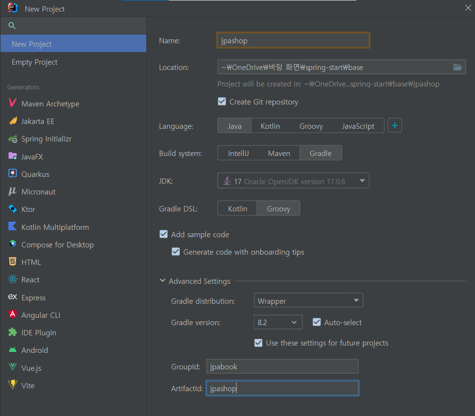
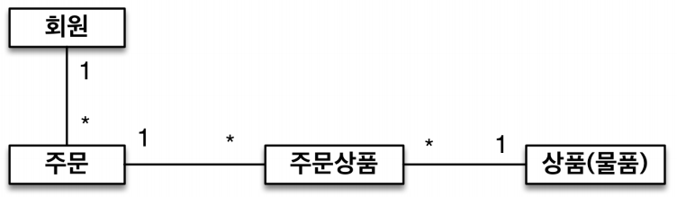
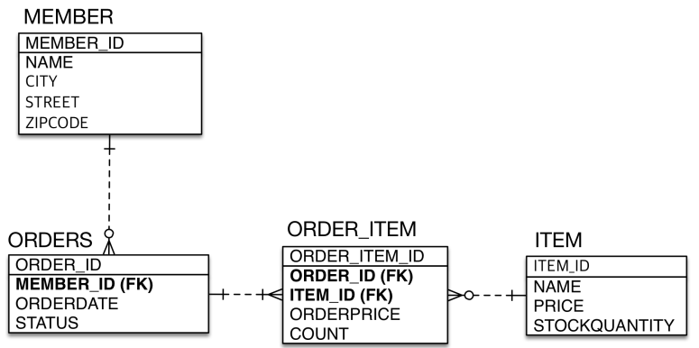
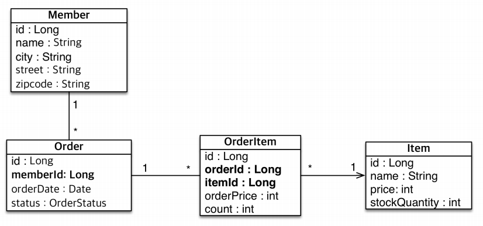

# 실전 예제 1 - 요구사항 분석과 기본 매핑    
<!-- TOC -->
* [실전 예제 1 - 요구사항 분석과 기본 매핑](#실전-예제-1---요구사항-분석과-기본-매핑-)
      * [gradle](#gradle)
      * [resources/META-INF/persistence.xml](#resourcesmeta-infpersistencexml-)
    * [요구사항 분석](#요구사항-분석-)
    * [기능 목록](#기능-목록)
    * [도메인 설계](#도메인-설계-)
    * [테이블 설계](#테이블-설계-)
    * [엔티티 설계](#엔티티-설계-)
      * [Member Entity](#member-entity)
      * [Order](#order-)
      * [OrderItem](#orderitem)
      * [Item](#item)
      * [main](#main-)
    * [데이터 중심 설계의 문제점](#데이터-중심-설계의-문제점-)
<!-- TOC -->
<div style="text-align: center;"></div>  
프로젝트 생성 방법  
  
#### gradle
```groovy
plugins {
    id 'java'
}

group = 'jpabook'
version = '1.0-SNAPSHOT'

repositories {
    mavenCentral()
}

dependencies {
    testImplementation platform('org.junit:junit-bom:5.9.1')
    testImplementation 'org.junit.jupiter:junit-jupiter'
    //hibernate spring boot version : '2.7.17'
    implementation 'org.hibernate:hibernate-entitymanager:5.6.15.Final'
    //test h2
    testImplementation 'com.h2database:h2:2.1.214'
    //h2
    implementation 'com.h2database:h2:2.1.214'
    //lombok
    compileOnly 'org.projectlombok:lombok:1.18.30'
    //test-lombok
    testCompileOnly 'org.projectlombok:lombok:1.18.30'
}

test {
    useJUnitPlatform()
}
```  
#### resources/META-INF/persistence.xml  
```xml
<?xml version="1.0" encoding="UTF-8" ?>
<persistence version="2.2"
             xmlns="http://xmlns.jcp.org/xml/ns/persistence" xmlns:xsi="http://www.w3.org/2001/XMLSchema-instance"
             xsi:schemaLocation="http://xmlns.jcp.org/xml/ns/persistence http://xmlns.jcp.org/xml/ns/persistence/">
    <!-- EntityManagerFactory 생성 시 unit name과 일치해야 합니다 -->
    <persistence-unit name="hello">
        <properties>
            <!-- DB Driver -->
            <property name="javax.persistence.jdbc.driver" value="org.h2.Driver"/>
            <!-- DB user info -->
            <property name="javax.persistence.jdbc.user" value="sa"/>
            <property name="javax.persistence.jdbc.password" value="1234"/>
            <!-- DB url -->
            <property name="javax.persistence.jdbc.url" value="jdbc:h2:tcp://localhost/C:\kamser\h2\jpa-base\jpa-study"/>
            <!-- DB Dialect 설정 -->
            <property name="hibernate.dialect" value="org.hibernate.dialect.H2Dialect"/>

            <!-- 옵션 -->
            <!-- SQL show -->
            <property name="hibernate.show_sql" value="true"/>
            <!-- SQL 정렬 -->
            <property name="hibernate.format_sql" value="true"/>
            <!-- SQL에 관한 주석 처리 -->
            <property name="hibernate.use_sql_comments" value="true"/>
            <!-- application 실행 시 ddl 전략 -->
            <property name="hibernate.hbm2ddl.auto" value="create"/>
            <property name="hibernate.jdbc.batch_size" value="5"/>
        </properties>
    </persistence-unit>
</persistence>
```  
### 요구사항 분석  
+ 회원은 상품을 주문할 수 있다.
+ 주문 시 여러 종류의 상품을 선택할 수 있다.  

### 기능 목록
+ 회원 기능
  + 회원등록
  + 회원조회
+ 상품 기능
  + 상품등록
  + 상품수정
  + 상품조회
+ 주문 기능
  + 상품주문
  + 주문내역조회
  + 주문취소  

### 도메인 설계 
<div style="text-align: center;"></div>  
  
### 테이블 설계  
<div style="text-align: center;"></div>
  
### 엔티티 설계  
<div style="text-align: center;"></div>  
  
#### Member Entity
```java
@Entity
@Getter @Setter
@NoArgsConstructor
@Table(indexes = {
        @Index(name = "member_idx_name", columnList = "name", unique = true),
        @Index(name = "member_idx_address", columnList = "city,street,zip", unique = false)})
public class Member {

    @Id
    @Column(name = "member_id")
    @GeneratedValue(strategy = GenerationType.SEQUENCE)
    private Long id;
    @Column(length = 10,nullable = false)
    private String name;
    @Column(length = 16)
    private String city;
    @Column(length = 16)
    private String street;
    @Column(length = 5)
    private String zip;
}
```  

강사분께서는 엔티티 안에 DB 테이블에 관련된 정보를 기입하는게 좋다고 합니다.  
저도 동의하는 부분인 이유는 MyBatis를 사용할 때에는 무조건 DB 툴을 들어가서 제약조건을 확인해야합니다.  
```java
@Table(indexes = {
        @Index(name = "member_idx_name", columnList = "name", unique = true),
        @Index(name = "member_idx_address", columnList = "city,street,zip", unique = false)})
@Column(length = 10,nullable = false)
private String name;
```  
결국 JPA도 쿼리가 복잡해지거나 필요한 데이터만 가져오려면 JPQL을 사용해야하는데  
엔티티에 DB에 관련된 정보가 기입이 되어있으면 DB 정보를 DB 툴이나 CLI로 확인하지 않아도 됩니다.  
한편으로는 시간이 지나서 엔티티에 작성된 정보를 신뢰할 수 있을지는 의문입니다.  

#### Order  
```java
@Entity
@Table(name = "ORDERS")
@Getter
@Setter
@NoArgsConstructor
public class Order {
    @Id
    @Column(name = "order_id")
    @GeneratedValue
    private Long id;
    @Column(name = "member_id")
    private Long MemberId;
    private LocalDateTime orderDateTime;
    @Enumerated(EnumType.STRING)
    private OrderStatus status;
}
```  
#### OrderItem
```java
@Entity
@Getter
@Setter
@NoArgsConstructor
public class OrderItem {
    @Id
    @Column(name = "order_item_id")
    @GeneratedValue
    private Long id;
    @Column(name = "order_id")
    private Long orderId;
    @Column(name = "item_id")
    private Long itemId;
    private int orderPrice;
    private int count;
}
```  
#### Item
```java
@Entity
@Getter
@Setter
@NoArgsConstructor
public class Item {
    @Id
    @GeneratedValue
    @Column(name = "itme_id")
    private Long id;
    private String name;
    private int price;
    private int stockQuantity;
}
```  

#### main  
```java
public class Main {
  public static void main(String[] args) {
    EntityManagerFactory emf = Persistence.createEntityManagerFactory("hello");
    EntityManager em = emf.createEntityManager();
    EntityTransaction tx = em.getTransaction();
    try {
      tx.begin();

      Member findMember = em.find(Member.class, 1L);
      Long findMemberId = findMember.getId();

      List<Order> orders = em.createQuery("select o from Order o where o.MemberId = :memberId", Order.class)
              .setParameter("memberId", findMemberId)
              .getResultList();

      tx.commit();
    } catch (Exception e) {
      e.printStackTrace();
      tx.rollback();
    } finally {
      em.close();
    }
    emf.close();
  }
}
```  
  
위 코드는 회원의 고유 번호를 알아서 주문 정보를 조회한다고 생각하고 작성한 코드입니다.  
식별자로 테이블에서 정보를 찾아가는 방식으로 객체 지향적이라기보다 관계형 DB를 객체에 맞췄습니다.  
  
### 데이터 중심 설계의 문제점  
+ 현재 방식은 객체  설계를 테이블 설계에 맞춘 방식
+ 테이블의 외래키를 객체에 그대로 가져옴
+ 객체 그래프 탐색이 불가능
+ 참조가 없으므로 UML도 잘못됨  
  
객체 지향적이라면 참조를 통해서 엔티티 정보를 가져와야하는데 현재는 불가능합니다.  
이때 필요한게 연관관계 매핑을 통해서 객체지향적으로 설계할 수 있습니다.
