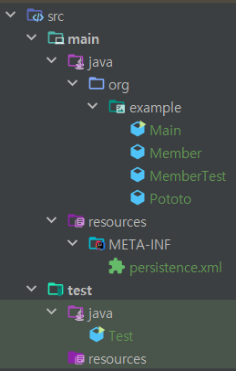

# Java로 JPA 사용하기

> Spring , Spring boot를 사용하지 않고 JPA를 활용하기

#### 프로젝트 생성
</center>

#### 프로젝트 구조
</center>


#### build.gradle
```groovy
plugins {
    id 'java'
}

group = 'org.example'
version = '1.0-SNAPSHOT'

repositories {
    mavenCentral()
}

dependencies {
    testImplementation platform('org.junit:junit-bom:5.9.1')
    testImplementation 'org.junit.jupiter:junit-jupiter'
    //hibernate spring boot version : '2.7.17'
    implementation 'org.hibernate:hibernate-entitymanager:5.6.15.Final'
    //h2
    testImplementation 'com.h2database:h2:2.1.214'

}

test {
    useJUnitPlatform()
}
```
#### "gradle사용 과 라이브러리 관리"
라이브러리는 그래들을 사용해서 관리한다.  
그래들은 메이븐과 같이 라이브러리를 관리해주는 도구인데  
gradle 파일에 groovy 언어나 kotlin 언어로 설정을 할수 있다.  
[요즘IT - "빌드 툴이란?"](https://yozm.wishket.com/magazine/detail/1700/)


+ 스프링 부트 2.7.17는 Hibernate 5.6.15을 사용
+ 데이터 베이스는 h2를 사용

#### persistence.xml 설정
```xml
<?xml version="1.0" encoding="UTF-8" ?>
<persistence version="2.2"
             xmlns="http://xmlns.jcp.org/xml/ns/persistence" xmlns:xsi="http://www.w3.org/2001/XMLSchema-instance"
             xsi:schemaLocation="http://xmlns.jcp.org/xml/ns/persistence http://xmlns.jcp.org/xml/ns/persistence/">
    <!-- EntityManagerFactory 생성 시 unit name과 일치해야 합니다 -->
    <persistence-unit name="hello">
        <class>org.example.Member</class>
        <class>org.example.Pototo</class>
        <properties>
            <!-- 필수 속성 -->
            <!-- DB Driver -->
            <property name="javax.persistence.jdbc.driver" value="org.h2.Driver"/>
            <!-- DB user info -->
            <property name="javax.persistence.jdbc.user" value="sa"/>
            <property name="javax.persistence.jdbc.password" value="1234"/>
            <!-- DB url -->
            <property name="javax.persistence.jdbc.url" value="jdbc:h2:tcp://localhost/C:\kamser\h2\jpa-base\jpa-study"/>
            <!-- DB Dialect 설정 -->
            <property name="hibernate.dialect" value="org.hibernate.dialect.H2Dialect"/>

            <!-- 옵션 -->
            <!-- SQL show -->
            <property name="hibernate.show_sql" value="true"/>
            <!-- SQL 정렬 -->
            <property name="hibernate.format_sql" value="true"/>
            <!-- SQL에 관한 주석 처리 -->
            <property name="hibernate.use_sql_comments" value="true"/>
            <!-- application 실행 시 ddl 전략 -->
            <property name="hibernate.hbm2ddl.auto" value="none"/>
            <!-- 쓰기 버퍼시 배치 사이즈 설정 -->
            <property name="hibernate.jdbc.batch_size" value="5"/>
        </properties>
    </persistence-unit>
</persistence>
```
+ JPA는 persistence.xml을 사용해서 필요한 설정 정보를 관리한다.  
이 설정 파일이 META-INF/persistence.xml 클래스 패스 결로에 있으면 별도 설정없이 JPA가 인식한다.
+ 현재 Hibernate가 Java 클래스와 persistence.xml Resource가 존재하는 Classpath가 다를 경우 Entity 자동인식을 못한다. 따라서 <class> 명시가 더 확실할 수 있다.
```xml
<persistence version="2.2"
             xmlns="http://xmlns.jcp.org/xml/ns/persistence" xmlns:xsi="http://www.w3.org/2001/XMLSchema-instance"
             xsi:schemaLocation="http://xmlns.jcp.org/xml/ns/persistence http://xmlns.jcp.org/xml/ns/persistence/">
```
설정 파일은 persistence로 시작한다. 이곳에 XML 네임스페이스와 사용할 버전을 지정한다.  
JPA 2.2를 사용하려면 이 xmlns와 version을 명시하면 된다.
```xml
<!-- 영속성 유닛을 등록하는데 DB당 하나의 영속성 유닛을 등록한다. 고유 이름을 부여후 사용한다. -->
<persistence-unit name="hello">
    <!-- Entity로 사용할 클래스의 class path를 입력한다. -->
    <class>org.example.Member</class>
    <class>org.example.Pototo</class>
    <properties>
        <!-- 필수 속성 -->
        <!-- DB Driver -->
        <property name="javax.persistence.jdbc.driver" value="org.h2.Driver"/>
        <!-- DB user info -->
        <property name="javax.persistence.jdbc.user" value="sa"/>
        <property name="javax.persistence.jdbc.password" value="1234"/>
        <!-- DB url -->
        <property name="javax.persistence.jdbc.url" value="jdbc:h2:tcp://localhost/C:\kamser\h2\jpa-base\jpa-study"/>
        <!-- DB Dialect 설정 -->
        <property name="hibernate.dialect" value="org.hibernate.dialect.H2Dialect"/>
    </properties>
</persistence-unit>
```  

### 데이터베이스 방언
```xml
<property name="hibernate.dialect" value="org.hibernate.dialect.H2Dialect"/>
```
JPA는 특정 데이터베이스에 종속적이지 않은 기술이다. 따라서 다른 데이터베이스로 쉽게 교체가 가능하다.  
각 데이터베이스마다 제공하는 SQL 문법과 함수가 조금씩 다르다는 문제점이 있다. 
+ 데이터 타입: 가변문자일 경우 MySQL은 `VARCHAR`, ORACLE은 `VARCHAR2`를 사용
+ 함수명 차이: 문자열을 자르는 함수로 SQL 표준은 `SUBSTRING()`,오라클은 `SUBSTR()`을 사용
+ 페이징 처리: MySQL은 `LIMIT`, 오라클은 `ROWNUM`을 사용한다.    

SQL 표준을 지키지 않거나 특정 데이터베이스만의 고유한 기능을 JPA에서는 방언(Dialect)이라 한다.  
애플리케이션 개발자가 특정 데이터베이스에 종속되지 않는 기술을 많이 사용하면 나중에 교체하기 어렵다.  
하이버네이트를 포함한 대부분의 JPA 구현체들은 이런 문제를 해결하기 위해 다양한 DB Dialect을 제공한다.  

<div style="text-align: center;"></div>

## 어플리케이션 개발
+ Entity
```java
package org.example;

import javax.persistence.Entity;
import javax.persistence.GeneratedValue;
import javax.persistence.GenerationType;
import javax.persistence.Id;

@Entity
public class MemberTest {
    @Id
    @GeneratedValue(strategy = GenerationType.AUTO)
    private Long id;
    private String name;

    public MemberTest() {}
    
    public MemberTest(String name) {
        this.name = name;
    }
    
    //gettger,setter는 생략
}
```
+ Jpa 사용방법
```java
import org.example.Pototo;

import javax.persistence.EntityManager;
import javax.persistence.EntityManagerFactory;
import javax.persistence.EntityTransaction;
import javax.persistence.Persistence;

public class Test {

    public static void main(String[] args) {
        // persistence.xml 정보로 엔티티매니저 팩토리 생성
        EntityManagerFactory emf = Persistence.createEntityManagerFactory("hello");
        // 설정정보를 통해 커넥션을 내장한 엔티티 매니저 생성
        EntityManager em = emf.createEntityManager();
        
        // JPA는 트랜잭션 기반으로 동작하기때문에 트랜잭션 시작
        EntityTransaction tx = em.getTransaction();
        tx.begin();
        try {
            MemberTest entity = new MemberTest("둘리");
            // DB에 저장
            em.persist(entity);
            tx.commit();
        } catch (Exception e) {
            //예외 발생시 롤백
            System.out.println(e);
            tx.rollback();
        } finally {
            //종료시 커넥션을 내장한 엔티티 매니저 반납
            em.close();
        }
        //code
        emf.close();
    }
}
```  
> 코드는 크게 3부분으로 나눈다.  
+ 엔티티 매니저 설정
+ 트랜잭션 관리
+ 비즈니스 로직

### 엔티티 매니저 설정  
<div style="text-align: center;"></div>  

#### 엔티티 매니저 팩토리 생성
persistence.xml 설정 정보를 사용해서 엔티티 매니저 팩토리를 생성한다.  
`EntityManagerFactory emf = Persistence.createEntityManagerFactory("hello");`  
이렇게 하면 META-INF/persistence.xml에서 이름이 `hello`인 영속성 유닛의 설정 정보를 읽어서  
JPA를 동작시키기 위한 기반 객체를 만들고 JPA 구현체에 따라서는 데이터베이스 커넥션 풀도 생성한다  
엔티티 매니저 팩토리를 생성하는 비용은 아주 크다.  
따라서 엔티티 매니저 팩토리는 애플리케이션 전체에서 한 번만 생성하고 공유해서 사용해야 한다.  

 + 엔티티 매니저 팩토리는 여러 쓰레드가 동시에 접근해도 안전하다.   
 + 서로 다른 스레드 간에 공유가 가능하다.  
    


#### 엔티티 매니저 생성  
`EntityManager em = emf.createEntityManager();`  
엔티티 매니저 팩토리에서 엔티티 매니저를 생성한다. JPA의 기능 대부분은 엔티티 매니저가 제공한다.  
**엔티티 매니저를 사용해서 엔티티를 데이터베이스에 등록/수정/삭제/조회할 수 있다.**  
엔티티 매니저는 내부에 데이터소스(데이터베이스 커넥션)을 유지하면서 데이터베이스와 통신한다.  
엔티티 매니저를 가상의 데이터베이스로 생각할 수 있다.  
**참고로 엔티티 매니저는 데이터베이스 커넥션과 밀접한 관계가 있으므로 스레드 간에 공유하거나 재사용하면 안된다.**  
+ 엔티티 매니저는 데이터베이스 커넥션과 관련이 있으므로 절대 공유해서는 안된다.  
+ 엔티티 매니저는 데이터베이스 연결이 필요한 시점까지 커넥션을 획득하지 않는다.  
+ **트랜잭션을 시작할때 커넥션을 획득한다**  
```text
J2SE 환경(자바 프로그래밍 언어의 표준 버전) :
하이버네이트를 포함한 JPA구현체들은 EntityManagerFactory를 생성할 때 커넥션 풀도 생성한다.
J2EE 환경(스프링 프레임워크 환경) : 
해당 컨테이너가 제공하는 데이터소스를 활용하여 EntityManagerFactory를 생성한다.
```
#### 종료  
엔티티 매니저와 엔티티 매니저 팩토리는 데이터베이스의 커넥션 리소스를 사용하기 때문에  
사용후에 리소스를 반납해야한다.  
```java
entityManager.close();
entityManagerFactory.close();
```