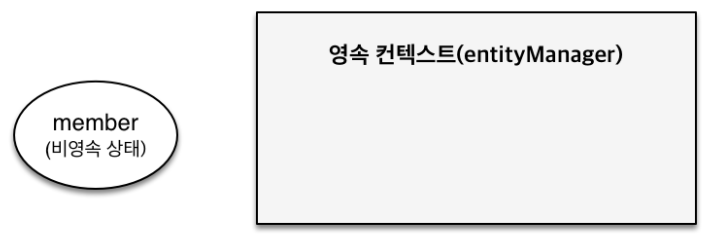
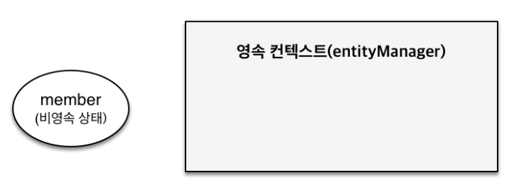
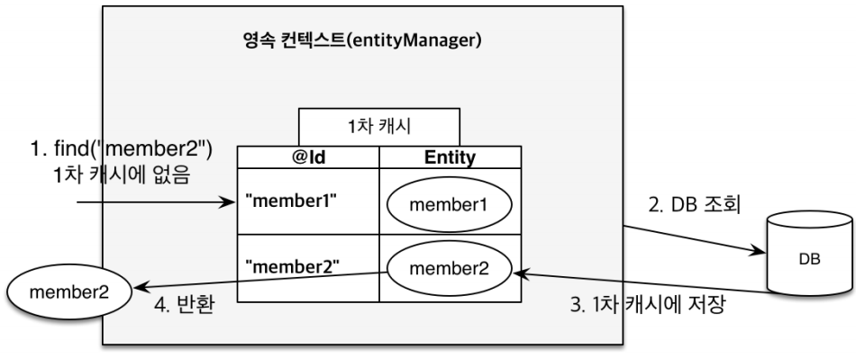
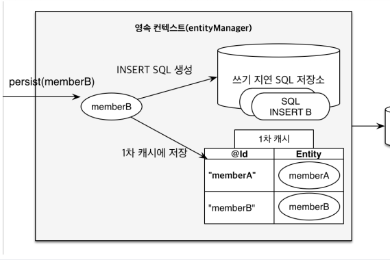

# 영속성 컨택스트    
<!-- TOC -->
* [영속성 컨택스트](#영속성-컨택스트-)
      * [JPA 정리](#jpa-정리)
  * [영속성 컨택스트란](#영속성-컨택스트란-)
  * [엔티티의 생명 주기](#엔티티의-생명-주기)
    * [비영속](#비영속-)
    * [영속](#영속-)
    * [준영속](#준영속-)
    * [삭제](#삭제-)
  * [영속성 컨텍스트의 특징](#영속성-컨텍스트의-특징)
      * [영속성 컨텍스트와 식별자 값](#영속성-컨텍스트와-식별자-값-)
      * [영속성 컨텍스트와 데이터베이스 저장](#영속성-컨텍스트와-데이터베이스-저장-)
      * [영속성 컨텍스트가 엔티티를 관리할 경우 장점](#영속성-컨텍스트가-엔티티를-관리할-경우-장점-)
    * [엔티티 조회](#엔티티-조회)
    * [영속 엔티티의 동일성 보장](#영속-엔티티의-동일성-보장)
    * [엔티티 등록](#엔티티-등록)
    * [엔티티 수정](#엔티티-수정)
      * [변경 시 변경 감지에 대한 이해](#변경-시-변경-감지에-대한-이해-)
    * [엔티티 삭제](#엔티티-삭제)
  * [플러시](#플러시-)
    * [영속성 컨텍스트를 플러시하는 방법 3가지](#영속성-컨텍스트를-플러시하는-방법-3가지)
      * [직접호출](#직접호출)
      * [트랜잭션 커밋시 플러시 자동 호출](#트랜잭션-커밋시-플러시-자동-호출)
      * [JPQL 쿼리 실행시 플러시 자동 호출](#jpql-쿼리-실행시-플러시-자동-호출-)
    * [플러시 모드 옵션](#플러시-모드-옵션)
  * [준영속](#준영속--1)
    * [준영속 상태의 특징](#준영속-상태의-특징-)
    * [영속성 컨텍스트 명령어 정리](#영속성-컨텍스트-명령어-정리)
    * [데이터베이스 예외가 발생할 경우](#데이터베이스-예외가-발생할-경우)
<!-- TOC -->
영속성 컨택스트를 배우기 전에 JPA의 정의를 다시 살펴보면  

JPA(Java Persistence API)  
영속성 : 서버가 재시작되어도 데이터는 영구적으로 저장되는 속성  
자바 진영의 ORM(Object-Relational Mapping)  
*__API: 정해진 규칙(약속)__*   
**데이터를 영구적으로 보관하기 위해 Java 진영에서 정해진 규칙**입니다. 

#### JPA 정리
```text
자바 객체와 관계형 DB의 테이블을 짝지어
데이터를 영구적으로 저장할 수 있도록 정해진 Java 진영의 규칙
```
JPA는 API를 사용할 때 Mapping된 SQL을 DB에 전달하기 전에 성능과 기능을 제공하기 위해  
`영속성 컨텍스트(persistence context)`에서 보관하고 관리한다.
```text
JPA(Hibernate) -> 영속성 컨택스트 -> SQL -> DB
DB(MySQL)-> InnoDB(버퍼풀-메모리) -> Disk
MySQL의 버퍼풀 처럼 메모리 영역으로 객체와 인덱스를 캐시하는 영역이라는 유사한 공통점이 있습니다.  
```  
## 영속성 컨택스트란  
엔티티(객체와 테이블을 매핑한 결과)를 `영구 저장하는 환경`이라는 뜻이다.  
엔티티 매니저로 엔티티를 저장하거나 조회하면 엔티티 매니저는 영속성 컨택스트에 엔티티를 보관하고 관리한다.  
1. 영속성 컨택스트는 논리적인 개념에 가깝다.  
2. 엔티티 매니저를 생성할 때 하나 만들어진다.  
   `여러 엔티티 매니저가 같은 영속성 컨텍스트에 접근할 수도 있다.`
3. 엔티티 매니저를 통해 접근및 관리를 할 수 있다.  

## 엔티티의 생명 주기
엔티티에는 4가지 상태가 존재하고 엔티티 매니저를 통해 변경할 수 있다.  
+ 비영속(new/transienct): 영속성 컨택스트와 전혀 관계가 없는 상태  
+ 영속(managed): 영속성 컨텍스트에 저장된 상태  
+ 준영속(detached): 영속성 컨텍스트에 저장되었다가 분리된 상태  
+ 삭제(removed): 삭제된 상태  

### 비영속  
JPA와 DB에 전혀 관련이 없는 순수 자바 객체(오브젝트)다  
```java
//객체를 생성한 상태
Member member = new Member(1L,"둘리");
```
    

<br/>  

### 영속  
엔티티 매니저를 통해 엔티티를 영속성 컨텍스트에 저장한다.  
영속성 컨텍스트가 관리하는 엔티티를 **영속 상태**라 한다.  
`em.find()나 JPQL을 사용해서 조회한 엔티티도 관리하는 영속 상태다.`
  
엔티티 매니저는 순수 자바 객체를 감시 지역에 옴겨놓는 역할이라 생각하면 된다.   
  
<br/>  

### 준영속  
영속성 컨텍스트가 관리하던 영속 상태의 엔티티를 영속성 컨텍스트가 관리하는 영역을 벗어난 상태  
특정 엔티티를 준영속 상태로 만들려면 `em.detach()`를 호출하면 된다.  
또는 `em.close()`를 호출해서 영속성 컨택스트를 닫거나 ,`em.clear()`를 호출해서 영속성 컨택스트를 초기화해도  
영속성 컨텍스트가 관리하던 영속 상태의 엔티티는 준영속 상태가 된다.  

### 삭제  
엔티티를 영속성 컨텍스트와 데이터베이스에서 삭제한다.  
> JPA 설명은 영속성 컨텍스트에서 삭제한다는데 정말 삭제될까?  
> 해당 매서드를 사용하면 바로 영속성 컨텍스트에서 삭제된지 확인해 보았습니다.
```java
@DisplayName("엔티티 삭제후 1차 캐시에서 정말 삭제가 될까?")
@Test
void removeTest(){
    //given
    EntityManagerFactory emf = Persistence.createEntityManagerFactory("hello");
    EntityManager em = emf.createEntityManager();
    EntityTransaction tx = em.getTransaction();
    tx.begin();

    Member member = new Member();
    member.setUsername("둘리");
    em.persist(member);

    em.flush();
    em.clear();

    Member findMember = em.find(Member.class, member.getId());
    em.remove(findMember);
//  em.detach(findMember);
    
    Member removedMember = em.find(Member.class, member.getId());
    System.out.println("=============== ");
    Assertions.assertEquals(findMember.getUsername(),"둘리");
    Assertions.assertEquals(removedMember,null);
    System.out.println("=============== ");
    
    tx.commit();
}
```
```sql
-- remove select 쿼리가 1번 실행된다.
Hibernate:
        select
        member0_.member_id as member_i1_1_0_,
        member0_.team_id as team_id3_1_0_,
        member0_.username as username2_1_0_
        from
        Member member0_
        where
        member0_.member_id=?
        ===============
        ===============
Hibernate:
        /* delete jpabook.Member */ delete
        from Member
        where member_id=?
-- detach : select 쿼리가 2번 실행된다.
Hibernate:
    select
        member0_.member_id as member_i1_1_0_,
        member0_.team_id as team_id3_1_0_,
        member0_.username as username2_1_0_
    from
        Member member0_
    where
        member0_.member_id=?
Hibernate:
    select
        member0_.member_id as member_i1_1_0_,
        member0_.team_id as team_id3_1_0_,
        member0_.username as username2_1_0_
    from
        Member member0_
    where
        member0_.member_id=?
        =============== 
        ===============
```
+ remove() 는 일시적으로 영속성 컨텍스트에 삭제 마킹을 합니다.  
    만약 영속성 컨택스트에서 삭제가 되었다면 select 쿼리가 2번 실행이되어야 하지만
    1번만 실행이 되고 `find`로 remove된 엔티티를 찾아보면 Entity는 `null`이라고 나옵니다. 
+ remove() 역시 persist()와 동일하게 영속성 컨택스트에 관리가 되어지고,  
    트랜잭션 커밋이나 flush()가 되어야 SQL이 실행됩니다.  

## 영속성 컨텍스트의 특징
#### 영속성 컨텍스트와 식별자 값  
영속성 컨텍스트는 엔티티를 식별자 값(`@Id로 테이블의 기본 키와 매핑한 값`)으로 관리한다.  
따라서 **영속  상태는 식별자 값이 반드시 있어야 한다.** 식별자 값이 없으면 예외가 발생한다.  

#### 영속성 컨텍스트와 데이터베이스 저장  
영속성 컨텍스트에 엔티티를 저장하면 이 엔티티는 보통 트랜잭션을 커밋하는 순간 데이터베이스와 동기화를 한다.  
이것을 `flush()`라 한다.  


#### 영속성 컨텍스트가 엔티티를 관리할 경우 장점  
+ 1차 캐시 -> 객체지향적인 이점이 발생
+ 동일성 보장 -> 데이터 베이스 격리수준 (Repeatable Read)를 어플리케이션 레벨에서 보장한다.  
+ 트랜잭션을 지원하는 쓰기 지원
+ 변경 감지
+ 지연 로딩

### 엔티티 조회
영속성 컨텍스트는 내부에 캐시가 있는데, 이것을 1차 캐시라 한다.  
영속 상태의 엔티티는 모두 이곳에 저장된다. 영속성 컨텍스트 내부에 Map이 하나 있다.  
키는 @Id로 매핑한 클래스이고, 값은 엔티티 인스턴스다.
  
1. `em.find(Member.class,"member2")`를 생성
2. `member2`가 1차 캐시에 없을 경우 데이터베이스에서 조회한다.
3. 조회한 데이터로 `member2` 엔티티를 생성하여 1차 캐시에 저장한다(영속 상태)
4. 1차 캐시에 저장한 엔티티를 반환한다.

### 영속 엔티티의 동일성 보장
영속성 컨텍스트는 성능상 이점과 엔티티의 동일성을 보장한다.  

### 엔티티 등록
+ 엔티티 매니저는 트랜잭션을 커밋하기 직전까지 데이터베이스에 엔티티를 저장하지 않는다.  
+ 내부 쿼리 저장소에 INSERT SQL을 모아둔다, 그리고 트랜잭션을 커밋할 시점에  
+ 모아둔 쿼리를 데이터베이스에 데이터베이스에 보내는것을 쓰기 지연이라 한다  
    
`트랜잭션을 커밋하면  엔티티 매니저는 영속성 컨택스트와 DB를 동기화 한다.`  
+ 데이터베이스가 커밋 직전에만 SQL을 전달하면 된다.

### 엔티티 수정
JPA로 엔티티를 수정할 때는 단순히 엔티티를 조회해서 데이터만 변경하면 된다.  
엔티티의 변경사항을 데이터베이스에 자동으로 반영하는 기능을 말한다.  
JPA는 엔티티를 영속성 컨텍스트에 보관할 때, 최초 상태를 복사해서 저장하는데 이것을 스냅샷이라 한다.  
1. 트랜잭션을 커밋하면 엔티티 매니저 내부에서 먼저 플러시가 호출된다.  
2. 엔티티와 스냅샷을 비교해서 변경된 엔티티를 찾는다.  
3. 변경된 엔티티가 있으면 수정 쿼리를 수정해서 쓰기 지연 SQL 저장소에 보낸다.  
4. 쓰기 지연 저장소의 SQL을 데이터베이스에 보낸다.  
5. 데이터베이스 트랜잭션을 커밋한다.  

#### 변경 시 변경 감지에 대한 이해  
1. 변경 감지는 영속성 컨텍스트가 관리하는 영속성 상태의 엔티티만 제공한다.
```java
UPDATE MEMBER
SET NAME=?,
    AGE=?,
    GRADE=?,
WHERE id 
```
Member 테이블의 모든 칼럼을 가져와서 조건이 걸린 데이터만 조회하면 된다.  
**모든 필드를 사용하면 수정 쿼리가 항상 킬다**  
데이터베이스에 동일한 쿼리를 보내면 데이테베이스는 DB이전에 한 번 파싱된 쿼리를 재사용할 수 있다.  
+ 만약 필드가 너무 많거나, 저장되는 내용이 너무 크면 수정된 데이터만 동적으로 UPDATE 할 수 있다.  
```java
@org.hibernate.annotations.DynamicUpdate
```  
해당 애노테이션을 활용하면 수정된 데이터만 UPDATE를 할수 있는 기능을 제공한다.
필드는 30개 이상일 경우 해당 메서드를 사용하는게 좋지만, 테이블에 30개 이상의 칼럼이 있는것도 문제가 있다.

### 엔티티 삭제
삭제 대상 엔티티를 넘겨주면 엔티티를 삭제한다. 즉시 삭제하지 않고 커밋되기 전에  
엔티티 등록과 유사하게 삭제 쿼리를 쓰기 지연 SQL 저장소에 등록한다.  
`EntityManger.remove`도 트랜잭션이 커밋이 되어야 동기화 된다.  
삭제한 엔티티는 재사용하지 않고 자연스럽게 가비지 컬렉션의 대상이 되도록 두는 것이 좋다. 

## 플러시  
플리서(flush())는 영속성 컨텍스트의 변경 내용을 데이터베이스에 반영한다.
1. 변경 감지 동작
2. 영속성 컨텍스트에서 관리중엔 엔티티들을 스냅샷과 비교한다.
3. 변경된 엔티티는 수정 SQL을 만들고 쓰기 지연 저장소에 저장한다.
4. 쓰기 지연 SQL 저장소의 쿼리를 데이터베이스에 전송한다.(등록,수정,삭제 쿼리)  


### 영속성 컨텍스트를 플러시하는 방법 3가지
1. em.flush()를 **직접호출**
2. 트랜잭션 커밋 시 플러시가 자동 호출된다.
3. JPQL 쿼리 실행시 플러시가 자동 호출된다.  

#### 직접호출
직접 호출해서 영속성 컨택스트를 강제로 플러시한다.  
테스트나 다른 프레임워크와 jpa를 함께 사용할 때 제외하고 거의 사용하지 않는다.  
#### 트랜잭션 커밋시 플러시 자동 호출
트랜잭션을 커밋하기 전에 꼭 플러시를 호출해서 영속성 컨택스트의 변경내용을 데이터베이스에 반영해야한다.  
JPA는 이런 문제를 예방하기 위해 트랜잭션을 커밋할 때 플러시를 자동호출한다.  
#### JPQL 쿼리 실행시 플러시 자동 호출  
JPQL은 객체지향으로 SQL을 작성해서 DB와 상관없이 추상화된 SQL을 작성해서 사용한다.  
SQL로 변환되어 처리되기 때문에 영속성 컨텍스트를 통하지 않고 직접 DB에 쿼리를 실행하므로
동기화를 위해 영속성 컨택스트를 flush해서 일치시킨다.  

### 플러시 모드 옵션
엔티티 매니저에 플러시 모드를 직접 지정하려면   
`javax.persistence.FlushModeType`을 사용하면 된다.
+ FlushModeType.AUTO: 커밋이나 쿼리를 실행할 때 플러시(기본)
+ FlushModeType.COMMIT: 커밋할 때만 플러시  
```TEXT
플러시는 영속성 컨택스트에 있는 캐시를 지우는게 아니라 
git에서 add 후 commit을 하면 저장 파일이 commit한 파일로 변경되는 것처럼
기준이 영속성 컨텍스트에 있는걸 DB에 반영하는 것 뿐이다.
```  
`데이터베이스와 동기화를 늦출수 있는 이유는 트랜잭션이라는 작업단위로 동기화 되기때문이다.`  

## 준영속  
영속성 컨택스트가 관리하는 영속 상태의 엔티티가 영속성 컨택스트에서 분리된 것을 말한다.  
**준영속 상태의 엔티티는 영속성 컨택스트가 제공하는 기능을 사용할 수 없다.**  
영속 상태의 엔티티를 준영속 상태로 만드는 방법은 크게 3가지다.  
1. `em.detach(entity)`:특정 엔티티만 준영속 상태로 전환한다.
2. `em.clear()`: 영속성 컨텍스트를 완전히 초기화 한다.  
3. `em.close()`: 영속성 컨택스트를 종료한다.  
> 준영속 메서드를 호출하는 순간 1차 캐시부터 쓰기 지연 SQL 저장소까지  
> 해당 엔티티를 관리하기 위한 모든 정보가 제거된다.  

`em.clear()`같은 경우 기존 영속성 컨텍스트를 제거하고 새로운 영속성 컨텍스트를 만드는 것과 같다.  
### 준영속 상태의 특징  
준영속 상태인 회원 엔티티는 다음과 같은 특징이 있다.
1. 거의 비영속 상태에 가깝다.  
    영속성 컨택스트가 관리하지 않기 때문에 영속성 컨텍스트가 제공하는 기능인  
    1차 캐시,쓰기 지연, 변경감지, 지연 로딩등의 기능이 동작하지 않는다.  
2. 식별자 값을 가지고 있다. 
    비영속 상태는 식별자 값이 없을 수도 있지만 준영속 상태는 이미 한 번 영속 상태였으므로 반드시 식별자 값을 가지고 있다.
3. 지연 로딩을 할 수 없다.  
    지연 로딩(Lazy Loading)은 실체 객체대신 프록시 객체를 로딩해두고 해당 객체를  
    실제 사용할 때 영속성 컨텍스트를 통해 데이터를 불러오는 방법이다.  
    하지만 준영속 상태는 영속성 컨택스트가 관리하지 않기 때문에 지연 로딩 시 문제가 발생한다.  

### 영속성 컨텍스트 명령어 정리
| 메소드 이름 및 매개변수   | 효과                                                                                          |
|-----------------|---------------------------------------------------------------------------------------------|
| persist(Object) | 임시 객체를 영구 객체로 만들고 나중에 실행할 SQL 문을 예약합니다.                                                     |
| remove(Object)  | 영속 객체를 일시적으로 만들고 삭제할 SQL 문을 나중에 예약합니다.                                                      |
| merge(Object)   | 분리된 객체의 상태를 관리되는 영구 인스턴스에 복사하고 영구 객체를 반환합니다.                                                |
| detach(Object)  | 데이터베이스에 영향을 주지 않고 세션에서 영구 객체 연결을 해제합니다.                                                     |
| clear()         | 지속성 컨텍스트를 비우고 모든 엔터티를 분리합니다.                                                                |
| flush()         | 세션과 연관된 영구 객체에 대한 변경 사항을 감지하고, SQL insert, update, delete 문을 실행하여 데이터베이스 상태를 세션 상태와 동기화합니다. |  
  

### 데이터베이스 예외가 발생할 경우

"이러한 작업 중 어떤 것이든 예외를 발생시킬 수 있습니다.  
따라서 데이터베이스와 상호 작용하는 동안 예외가 발생하면,  
현재 영속성 컨텍스트(persistence context)의 상태를 데이터베이스 테이블에 저장된 상태와 동기화하는 좋은 방법이 없습니다.

그러므로 세션(엔티티매니저)은 그 어떤 메서드가 예외를 발생시킨 후에도 _**사용할 수 없는 상태로 간주**_ 됩니다.  

지속성 컨텍스트는 취약합니다. Hibernate에서 예외를 받으면 즉시 현재 세션을 닫고 폐기해야 합니다.   
필요하다면 새로운 세션을 열지만, 먼저 문제가 있는 세션을 버려야 합니다."  
  
_**즉 예외가 발생하면, 세션(엔티티매니저)를 빠르게 종료시키고 필요시 새 엔티티 매니저를 사용합니다.**_