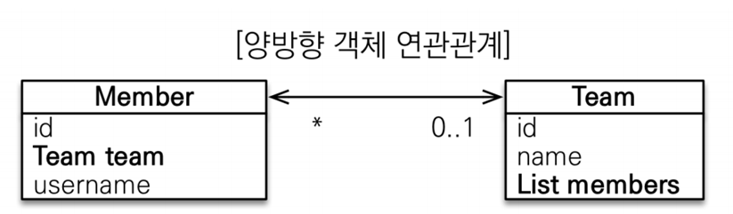

# 양방향 연관관계  
지금까지는 선수에서 팀으로만 접근하는 다대일 단방향 매핑을 적용했습니다.  
이번에는 반대 방향으로 팀에서 회원을 접근하는 관계를 추가하겠습니다.  
JPA 애노테이션을 추가하여 팀 객체를 통해 선수 객체를 접근할 수 있게 매핑하겠습니다.  

<div style="text-align: center;"></div>  
  
객체 연관관계로 살펴보겠습니다.  
선수를 기준으로 팀을 보면 다대 일(N:1) 관계이고,  
팀을 기준으로 선수를 보면 일대 다(1:N) 관계입니다.  
일대 다 관계는 여러 건과 연관관계를 맺을 수 있으므로 컬렉션을 사용해야합니다.  

```java
@Entity
@Getter @Setter
@NoArgsConstructor
public class Team {

    @Id @GeneratedValue
    @Column(name = "team_id")
    private Long id;
    private String name;
    @OneToMany(mappedBy = "team") // 1: N
    private List<Member> members = new ArrayList<>();
    
}
```  
일대 다 관계를 매핑하기 위해 `@OneToMany` 매핑 정보를 사용합니다.  
`mappedBy` 속성은 양방향 매핑일 때 사용하고, 반대쪽 매핑의 필드 이름을 값으로 주면 됩니다.

## 연관관계의 주인  
`mappedBy`가 왜 필요할까?  
데이터베이스에서 부모테이블과 자식테이블의 연관관계를 수정할 때는  
자식 테이블의 참조 칼러만 수정하면 됩니다.  
객체에서 양방향 매핑을 할 경우에는 JPA가 변경 감지기능으로  
양쪽 모두 자식 테이블의 참조 칼럼을 수정할 수 있게 됩니다.  
따라서 기준을 잡기위해서 `mappedBy` 옵션을 사용합니다.  
수정 권한이 있는 객체는 `mappedBy` 옵션을 생략하고  
읽기 권한만 있는 객체는 `mappedBy`로 해당 엔티티의 참조 필드를 매핑해서 사용한다는 걸 표시합니다.  
  
**_연관관계 주인 정하기_**  
연관관계 주인이라는건 수정 권한이 있는 객체를 의미합니다.  
테이블 입장에서보면 자식 테이블의 참조 칼럼을 수정할 권할을 가질 객체를 연관관계 주인이라 할 수 있죠  
  
그래서 특별한 경우가 아니고서 `N`관계를 가진 객체가 연관관계 주인이 되는게 맞습니다.  
자식 테이블을 매핑한 엔티티가 연관관계 주인이 되는게 맞습니다.  
변경감지로 수정이 되었을 때, 매핑된 자기 테이블을 수정하는 것이 유지보수나 성능 측면에서 유리합니다.  
  
### 양방향 연관관계 저장  
양방향 연관관계를 사용하여 팀,선수1,선수2를 저장하고, 팀에서 선수를 조회해보겠습니다.  
```java
@Test
void testSave() {
    //팀 T1 저장
    Team t1 = saveTeam("T1");
    em.persist(t1);
    
    //선수 페이커 등록
    Member faker = saveMember("이상혁", t1);
    em.persist(faker);
    
    //선수 케리아 등록
    Member keria = saveMember("류민석", t1);
    em.persist(keria);
    em.flush();
    //== DB와 영속성 컨텍스트와 동기화 완료 ==//
    em.clear();
    Team findT1 = em.find(Team.class, t1.getId());
    Assertions.assertEquals(findT1.getMembers().size(),2);
    Assertions.assertTrue(findT1.getMembers().containsAll(List.of(faker,keria)));
}
```  
트랜잭션 관련된 코드는 제거했습니다.  
영속성 컨택스트를 동기화 및 초기화 후에 팀 객체를 조회했습니다.  
그리고 팀 내부 필드 `members`를 통해 선수 객체에 접근했다는 것을 확인할 수 있습니다.  
  
### 양방향 연관관계의 주의점  
+ 양방향 연관관계를 설정하고 연관관계 주인이 아닌 엔티티에 값을 저장할 때  
```java
Member faker = createMember("이상혁");
Member keria = createMember("류민석");
em.persist(faker);
em.persist(keria);

//팀 T1 저장
Team t1 = saveTeam("T1");
em.persist(t1);

//Team Entity 변경감지 기능 사용
t1.getMembers().add(faker);
t1.getMembers().add(keria);
em.flush();
em.clear();

Team findT1 = em.find(Team.class, t1.getId());
Member findFaker = em.find(Member.class, faker.getId());

Assertions.assertEquals(findT1.getMembers().size(),0);
Assertions.assertNull(findFaker.getTeam());
```  
Team 객체에 선수를 저장하고 변경감지가 동작해야하는데   
데이터가 저장되지 않은 것을 확인할 수 있습니다.   
`Assertions.assertEquals(findT1.getMembers().size(),0);`  
양방향 연관관계일 때 연관관계 주인만 수정이 가능하기 때문입니다.  
선수에게 팀이 있냐고 물어봐도 없다고 하네요  
`Assertions.assertNull(findFaker.getTeam())`  

### 순수한 객체까지 고려한 양방향 연관관계  
현재까지는 데이터베이스 테이블 관점에서 연관관계 주인에 대해서 설명했습니다.  
순수한 자바 객체로 봤을 때에는 양쪽 방향에 모두 값을 저장하는 것이 맞습니다.  
어차피 연관관계 주인이 아닌 엔티티에 매핑된 필드를 수정해도 변경감지는 무시하기 때문입니다.  
  
+ 순수한 자바 객체로 양방향을 설정해주기
```java
@Test
@DisplayName("양방향 관계일 때에 다른 객체에도 데이터를 저장한다.")
void testSaveWithoutDB(){
    Team t1 = saveTeam("T1");

    Member faker = saveMember("이상혁",t1);
    Member keria = saveMember("류민석",t1);
    //양쪽에 모두 객체를 저장합니다.
    t1.getMembers().addAll(List.of(faker,keria));

    Assertions.assertEquals(faker.getTeam(), t1);
    Assertions.assertEquals(keria.getTeam(), t1);
    Assertions.assertEquals(t1.getMembers().size(), 2);
    Assertions.assertTrue(t1.getMembers().containsAll(List.of(faker,keria)));
}
```
순수한 자바 객체로도 이제 양쪽에 전부 저장을 했습니다.  
테스트도 모두 통과하여 양쪽에서 모두 조회가 가능합니다.  
  
+ JPA를 활용하여 양방향 저장하기  
```java
//팀 T1 저장
Team t1 = saveTeam("T1");
em.persist(t1);

Member faker = createMember("이상혁");
em.persist(faker);
faker.setTeam(t1);          // member -> team t1 계약
t1.getMembers().add(faker); // team -> faker 선수 등록

Member keria = createMember("류민석");
em.persist(keria);
keria.setTeam(t1);          // member -> team t1 계약
t1.getMembers().add(keria); // team -> keria 선수 등록
```
  
### 연관관계 편의 메서드  
양방향 연관관계는 결국 양쪽 객체 모두 신경을 써야합니다.  
사실 선수와 팀이 계약하는건 객체지향으로 볼때 하나의 단위로 봐야하는게 맞습니다.  
  
Member 클래스에 signed() 메서드를 추가하여 코드를 리팩토링해보겠습니다.
```java
public class Member {
    private Team team;
    public void signed(Team team) {
        this.team = team;
        team.getMembers().add(this);
    }
}
```  
이전 예제 코드를 리팩토링 해보겠습니다.   
```java
//팀 T1 저장
Team t1 = saveTeam("T1");
em.persist(t1);

Member faker = createMember("이상혁");
em.persist(faker);
faker.signed(t1);

Member keria = createMember("류민석");
em.persist(keria);
keria.signed(t1);
```   
이렇게 하면 좀더 의미가 부여가 되었고, 양쪽 객체 모두 연관관계를 설정할 수 있습니다.  
  
### 연관관계 편의 메소드 작성시 주의사항  
류민석 선수가 팀 DRX에 있다가, 팀 T1과 계약을 했습니다.  
그런데 DRX에서 류민석 선수가 조회가 되는 경우가 발생합니다.
```java
@Test
@DisplayName("이중계약이 발생한다.")
    void testSigned(){
    Team drx = saveTeam("DRX");
    Team t1 = saveTeam("T1");
    
    Member keria = createMember("류민석");
    keria.signed(drx);
    //시간이 흘렀습니다.
    keria.signed(t1);
    
    //drx 팀 소속 인원을 확인하고 싶습니다.
    List<Member> drxMembers = drx.getMembers();
    Assertions.assertTrue(drxMembers.contains(keria)); // true
}
```  
아직도 DRX 선수단에는 류민석 선수가 포함되어있습니다.  
이런 경우가 왜 발생할까요?  
양방향 연관관계 일때 양쪽 객체에 참조을 넣어주고  
변경할 때에는 이전 객체에 참조를 정리하지 않았기 때문입니다.  
  
양방향 편의 메서드를 수정하여 이전에 참조하던 객체를 정리해보겠습니다.  
```java
public void signed(Team team) {
    if (this.team != null) {
    // 이전에 계약된 팀이 있다면 정리를 한다.
        this.team.getMembers().remove(this);
    }
    this.team = team;
    team.getMembers().add(this);
}
```  
아까 테스트 코드를 수정해보겠습니다.   
```java
@Test
@DisplayName("이중계약이 발생한다.")
void testSigned(){
    Team drx = saveTeam("DRX");
    Team t1 = saveTeam("T1");

    Member keria = createMember("류민석");
    keria.signed(drx);
    //시간이 흘렀습니다.
    keria.signed(t1);

    //drx 팀 소속 인원을 확인하고 싶습니다.
    List<Member> members = drx.getMembers();
    Assertions.assertFalse(members.contains(keria));
    //assertTrue -> assertFalse 로 변경후 테스트 결과는 true입니다.
}
```  
객체 양방향 연관관계는 단반향 연관관계 2개를 양방향 처럼 보이게 하기 위해 많은 노력이 필요하다.  
데이터베이스에서 수정할 수 있는 권한이 있는건 연관관계 주인 엔티티만 가능하기 때문에  
다른 단방향 객체의 필드를 초기화 하지 않아도 문제가 없다.  
다만, 같은 영속성 컨텍스트에서 양방향 관계를 변경할 경우 이전 관계를 제거하는 것이 안전하다.  
  
## 정리  
단방향 매핑과 비교해서 양방향 매핑은 복잡합니다.  
1. 단반향 매핑만으로 테이블과 객체의 연관관계 매핑은 이미 완료되었습니다.  
2. 단방향을 양방향으로 만들면 반대방향으로 객체 그래프 탐색 기능이 추가됩니다.  
3. 양방향 연관관계를 매핑하려면 객체에서 양쪽 방향을 모두 관리해야 합니다.  

양방향 매핑시 무한 루프에 빠지지 않게 주의해야합니다.  
`toString()`을 Member,Team 모두 오버라이드했다고 했을때    
```java
@Override
public String toString() {
    return "Member{" +
            "id=" + id +
            ", username='" + username + '\'' +
            ", team=" + team +
            '}';
}
@Override
public String toString() {
    return "Team{" +
            "id=" + id +
            ", name='" + name + '\'' +
            ", members=" + members +
            '}';
}
```  
무한 루프에 빠지게 됩니다. 비슷한 예로 엔티티를 json으로 변환할 때도 발생합니다.  


