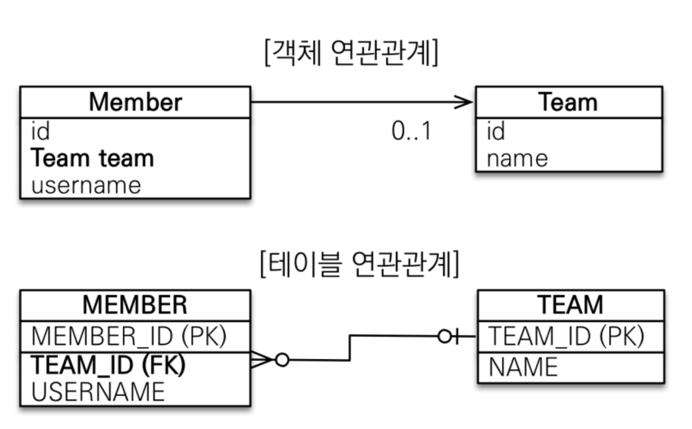
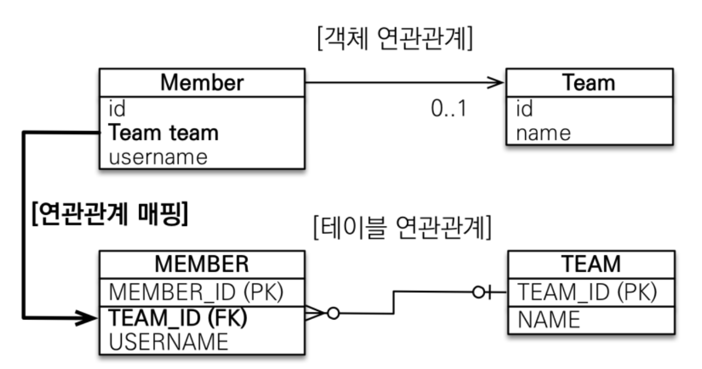

# 연관관계 매핑 기초
<!-- TOC -->
* [연관관계 매핑 기초](#연관관계-매핑-기초)
    * [목표](#목표)
      * [용어이해](#용어이해-)
  * [연관관계가 필요한 이유](#연관관계가-필요한-이유-)
  * [단반향 연관관계](#단반향-연관관계-)
    * [객체 연관관계](#객체-연관관계-)
    * [테이블 연관관계](#테이블-연관관계-)
    * [객체 연관관계와 테이블의 연관관계의 가장 큰 차이](#객체-연관관계와-테이블의-연관관계의-가장-큰-차이-)
    * [객체 연관관계 vs 테이블 연관관계 정리](#객체-연관관계-vs-테이블-연관관계-정리-)
      * [객체 그래프 탐색](#객체-그래프-탐색-)
      * [테이블 연관관계](#테이블-연관관계--1)
      * [객체 관계 매핑](#객체-관계-매핑-)
    * [`@JoinColumn`](#joincolumn-)
      * [`@JoinColumn` 생략](#joincolumn-생략-)
    * [`@ManyToOne`](#manytoone-)
    * [연관관계 사용](#연관관계-사용-)
      * [저장-C](#저장-c)
      * [조회](#조회-)
      * [수정](#수정-)
      * [연관관계 제거](#연관관계-제거-)
      * [연관된 엔티티 삭제](#연관된-엔티티-삭제-)
<!-- TOC -->

### 목표
+ 객체와 테이블 연관관계 차이를 이해
+ 객체의 참조와 테이블의 외래 키를 매핑
#### 용어이해  
+ 방향(Direction): 단방향, 양방향
+ 다중성(Multiplicity): 다대일(N:1),일대다(1:N),일대일(1:1),다대다(N:M) 이해
+ 연관관계의 주인(Owner): 객체 양방향 연관관계는 관리 주인이 필요  
  개인적인 생각은 MySQL의 Master와 Slave 관계와 유사하다고 생각했습니다.
    데이터를 읽고 쓸수 있는 Master와 조회만 가능한 슬레이브 차이라고 생각됩니다.  
  
## 연관관계가 필요한 이유  
```java
@Entity
public class Orders {

  @Id
  @GeneratedValue
  private Long id;

  @Column(name = "member_id")
  private Long memberId;
  
  //getter,setter
}
```
```sql
create table Orders (
    id bigint primary key ,
    member_id bigint
)
```
연관관계가 없을 경우에는 엔티티에 입력한 데이터 그대로 테이블이 생성됩니다.  
하지만 객체에서 참조 대신에 데이터베이스의 외래 키를 그대로 가지고 있으므로  
`orders.getMember()` 처럼 객체 그래프를 탐색할 수 없고 객체의 특성도 살릴 수 없습니다.  
객체가 다른 객체를 참조하지도 않으므로 UML(클래스 다이어그램)도 잘못되었습니다.  
객체는 `왜래 키`를 저장하는 필드 대신에 객체 `참조`를 사용해야 합니다.  
  
JPA를 사용하는 이유는 객체 지향적인 설계를 통해 엔티티끼리 협력을 통해서  
역할을 분담을 통한 유지보수를 쉽게하려는게 목적입니다.  
그러면 역할을 분담하는게 왜 좋을까요?  
1. 유지보수가 간단해 집니다.  
2. 트랜잭션 스크립트 패턴처럼 절차지향적으로 작성이 되어있다면  
비즈니스 코드를 DB연결 없이 테스트가 가능합니다.  
[예시코드](https://github.com/kamser0415/study-jpa/blob/main/active-1/domain-development2.md#2-%ED%8A%B8%EB%9E%9C%EC%9E%AD%EC%85%98-%EC%8A%A4%ED%81%AC%EB%A6%BD%ED%8A%B8-%ED%8C%A8%ED%84%B4-vs-%EB%8F%84%EB%A9%94%EC%9D%B8-%EB%AA%A8%EB%8D%B8-%ED%8C%A8%ED%84%B4-%EC%B0%A8%EC%9D%B4)

## 단반향 연관관계  
<div style="text-align: center;"></div>  
  
1. 회원(테이블)과 팀(테이블)이 있습니다.  
2. 회원은 하나의 팀에만 소속될 수 있습니다.  
3. 팀과 회원은 1: N 관계입니다.  
  
### 객체 연관관계  
+ 회원 객체는 Member.team 필드(멤버변수)로 팀 객체와 연관관계를 맺습니다.  
  + 회원 객체와 팀 객체는 단방향 객체입니다. 회원은 팀 객체의 공개된 속성과 기능을 사용할 수 있습니다.  
  + 하지만 팀 객체는 회원 객체의 참조가 없으므로 회원 객체를 사용할 수 없습니다.  
### 테이블 연관관계  
+ 회원 테이블은 TEAM_ID 외래 키로 팀 테이블과 연관관계를 맺습니다.  
+ 회원 테이블과 팀 테이블은 양방향 관계입니다.  
  공통속성(칼럼)인 TEAM_ID의 값으로 조인이 가능합니다.  
  ```sql
  SELECT *
  FROM MEMBER A 
  JOIN TEAM B ON A.team_id = B.id;
  ```  
### 객체 연관관계와 테이블의 연관관계의 가장 큰 차이  
테이블은 내부 컬럼에 공통 속성 저장하여 관계를 나타낼 수 있지만  
객체는 내부 필드에 다른 객체를 저장하는 방법은 단방향 입니다.  
그래서 테이블처럼 양방향으로 조회가 가능하게 하려면 객체는 단방향+단방향으로 관계를 표현합니다.  
```java
//단방향
class A {
    private B b;
}
class B {}
//양방향
class A {
    private B b;
}
class B {
    private A a;
}
```
### 객체 연관관계 vs 테이블 연관관계 정리  
+ 객체는 참조(주소값)로 연관관계를 맺는다.
+ 테이블은 외래 키(공통 속성)으로 연관 관계를 맺는다.  
  
데이터를 조회할 때 객체는 참조를 사용하지만, 테이블은 조인을 사용합니다.  
  
+ 참조를 사용하는 객체의 연관관계는 단방향입니다.  
  `A->B(a.b)`
+ 공통 속성을 사용하는 테이블의 연관관계는 양방향이다.  
  `A JOIN B ON A.id = B.id`  
+ 객체를 양방향으로 참조해서 데이터를 조회하려면 단방향 2개가 필요합니다.  
  `A->B(a.b)`,`B->A(b.a)`  
  
#### 객체 그래프 탐색  
```java
public class Member {
    private String id;
    private String username;
    private Team team;

  public void setTeam(Team team) {
      this.team = team;
  }
  //Getter,Setter
}
public class Team {
    private String id;
    private String name;
    //Getter,Setter
}
```
순수한 자바 코드로 멤버는 팀을 의존하고, 멤버를 통해서 팀 객체를 가져올 수있다.  
```java
public static void main(String[]args){
    //생성자
    Member faker = new Member("Faker","이상혁");    
    Member keria = new Member("KERIA","케리아");    
    Team t1 = new Team("T1","티원");

    faker.setTeam(t1);
    keria.setTeam(t1);
    
    Team findTeam = faker.getTeam();
```  

코드를 보면 페이커 선수와 케리아 선수는 T1에 소속했다.  
그리고 페이커 선수를 통해서 현재 속한 팀 객체를 얻을 수 있다.  
**객체는 참조를 사용해서 연관관계를 탐색할 수 있다.**  
_**이것을 객체 그래프 탐색이라 한다.**_  
  
#### 테이블 연관관계  
테이블에서는 외래 키를 이용해서 두 테이블의 관계를 나타낼 수 있다.  
외래 키를 사용하지 않아도 두 테이블의 공통 속성으로 조인해서 사용할 수 있다.  

#### 객체 관계 매핑  
<div style="text-align: center;"></div>  
  
Java 객체를 JPA 애노테이션으로 테이블과 매핑을 한다.  
```java
@Entity
@Getter @Setter
@NoArgsConstructor
public class Member {

    @Id
    @Column(name = "member_id")
    @GeneratedValue(strategy = GenerationType.SEQUENCE)
    private Long id;
    @Column(length = 10,nullable = false)
    private String username;

    @ManyToOne
    @JoinColumn(name = "team_id")
    private Team team;
    
}
@Entity
@Getter @Setter
@NoArgsConstructor
public class Team {

  @Id
  @GeneratedValue
  @Column(name = "team_id")
  private Long id;

  private String name;

  @OneToMany(mappedBy = "team")
  private List<Member> members = new ArrayList<>();
}
```  
선수 엔티티를 매핑하고, 팀 엔티티를 매핑했습니다.  
+ 객체 연관관계: 선수 객체의 Member.team 필드 사용  
+ 테이블 연관관계: 선수 테이블의 MEMBER.team_id 외래 키 칼럼을 사용  
  
```java
@ManyToOne
@JoinColumn(name = "team_id")
private Team team;
```  
선수 엔티티에 연관관계를 매핑하기 위한 새로운 애노테이션이 추가되었습니다.  
+ `@ManyToOne`: **_필수!!_**  
  이름 그대로 `N:1` 관계를 나타냅니다. 선수와 팀은 다대일 관계로  
  테이블과 다르게 연관관계를 JPA에게 객체끼리의 관계를 나타내야 합니다.   
+ `@JoinColumn`: **생략가능**  
  `@JoinColumn`은 엔티티 관계나 요소 컬렉션을 조인하는 데 사용되는 열(Column)을 지정합니다.  
  **엔티티 간의 관계를 매핑**하고 관계형 데이터베이스에서 **데이터를 저장하는 방법을 지정**합니다.  
  @JoinColumn은 관계를 맺는 **엔티티의 컬럼**과 **외래 키(Foreign Key)를 매핑**하는 데 사용됩니다.
  
### `@JoinColumn`   
`@JoinColumn`은 외래 키를 매핑할 때 사용합니다.  

| 속성                                                              | 기능                                                 | 기본값                     |
|-----------------------------------------------------------------|----------------------------------------------------|-------------------------|
| name                                                            | 매핑할 외래 키(칼럼) 이름                                    | '필드명'+'_'+'참조 테이블의 칼럼명' |
| referencedColumnName                                            | 외래 키가 참조하는 대상 테이블의 칼럼명                             | 참조하는 테이블의 기본키 칼럼명       |
| foreignKey(DDL)                                                 | 외래키 제약조건을 직접 지정할 수 있다.<br/>이 속성은 테이블을 생성할 때만 사용한다. |                         |
| unique,nullable,insertable<br/>updatable,columnDefinition,table | @Column의 속성과 같다                                    |                         |

+ referencedColumnName 사용 방법: 
  @JoinColumn을 할때 외래키가 참조하는 대상의 칼럼명이 달라질 수 있습니다. 그런 경우에 이 옵션을 사용합니다. 
  이 옵션을 사용하지 않는다면 참조하는 테이블의 기본키 칼럼명이 됩니다. 복잡할 경우 옵션을 사용해서 사용할 때가 있습니다. 
  ```java
  TableA
  id int identity
  tableb_key varchar
 
  TableB
  id int identity
  key varchar unique 
  // in class for TableA
  @JoinColumn(name="tableb_key", referencedColumnName="key")
  ```

#### `@JoinColumn` 생략  
`@JoinColumn`을 생략하면 외래 키를 찾을 때 기본 전략을 사용합니다.  
```java
@ManyToOne
private Team team;
```  
+ 기본 전략: 필드명 + _ + 참조하는 테이블의 칼럼명  
  예) `필드명(team)+_(밑줄)+참조하는 테이블의 칼럼명(team_id)`= `team_team_id`

### `@ManyToOne`  

| 속성           | 기능                                                         | 기본값                                                      |
|--------------|------------------------------------------------------------|----------------------------------------------------------|
| optional     | false로 설정하면 연관된 엔티티가 항상 있다.                                | true                                                     |
| fecth        | 글로벌 페치 전략을 설정한다.                                           | @ManyToOne=FetchType.EAGER<br/>@OneToMany=FetchType.LAZY |
| cascade      | 영속성 전이 기능을 사용한다                                            |                                                          |
| targetEntity | 연관된 엔티티의 타입정보를 설정한다. 거의 사용하지 않는다.<br/>제네릭으로 타입 정보를 알 수 있다. |                                                          |
  
```sql
-- @ManyToOne
create table Member (
    member_id bigint not null,
    username varchar(10) not null,
    team_id bigint,
    primary key (member_id)
)
-- @ManyToOne(optional = false)
create table Member (
    member_id bigint not null,
    username varchar(10) not null,
    team_id bigint not null,
    primary key (member_id)
)
```  
  
### 연관관계 사용  
연관관계를 C(등록),R(조회),U(수정),D(삭제) 예제로 연관관계를 이해하겠습니다.

**_테스트 코드 준비_**  
```java
public class MemberTest {

    private EntityManager em;
    private static EntityManagerFactory emf = Persistence.createEntityManagerFactory("hello");
    @BeforeEach
    void setUp(){
        em = emf.createEntityManager();
    }
    @AfterAll
    static void finish(){
        emf.close();
    }
    @Test
    void xxxxxxxx(){
        EntityTransaction tx = em.getTransaction();
        try {
            tx.begin();
            //여기에 코드가 추가됩니다.
            tx.commit();
        } catch (Exception e) {
            e.printStackTrace();
            tx.rollback();
        } finally {
            em.close();
        }
    }
}
```


#### 저장-C
+ 테스트
```java
public class MemberTest {

  private EntityManager em;
  private static EntityManagerFactory emf = Persistence.createEntityManagerFactory("hello");
  @BeforeEach
  void setUp(){
    em = emf.createEntityManager();
  }
  @AfterAll
  static void finish(){
    emf.close();
  }
  @Test
  void testSave(){
    EntityTransaction tx = em.getTransaction();
    try {
      tx.begin();

      //팀 T1 저장
      Team t1 = saveTeam("T1");
      em.persist(t1);

      //선수 페이커 등록
      Member faker = saveMember("이상혁", t1);
      em.persist(faker);

      //선수 케리아 등록
      Member keria = saveMember("류민석", t1);
      em.persist(keria);
      em.flush();
      //== DB와 영속성 컨텍스트와 동기화 완료 ==//
      em.clear();
      //== 영속성 컨텍스트 초기화 완료==//
      Member findFaker = em.find(Member.class, faker.getId());
      Member findKeria = em.find(Member.class, keria.getId());

      Assertions.assertEquals(findFaker.getTeam().getId(),findKeria.getTeam().getId());
      Assertions.assertEquals(findFaker.getId(),faker.getId());
      Assertions.assertEquals(keria.getId(),findKeria.getId());

      tx.commit();
    } catch (Exception e) {
      e.printStackTrace();
      tx.rollback();
    } finally {
      em.close();
    }

  }

  private Team saveTeam(String name) {
    Team t1 = new Team();
    t1.setName(name);
    return t1;
  }

  private Member saveMember(String 류민석, Team t1) {
    Member keria = new Member();
    keria.setUsername(류민석);
    keria.setTeam(t1);
    return keria;
  }
}
```  
**_JPA에서 엔티티를 저장할 때 연관된 모든 엔티티는 영속 상태여야 한다._**  

#### 조회  
연관관계가 있는 엔티티는 조회하는 방법은 크게 2가지입니다.  
1. 객체 그래프 탐색(객체 연관관계를 사용한 조회)
2. 객체지향 쿼리 사용(`JPQL`)  

+ 객체 그래프 탐색  
  `findFaker.getTeam()`을 사용해서 member와 연관된 team엔티티를 조회할 수 있습니다.
  ```java
  Member findFaker = em.find(Member.class, faker.getId());
  Team fakerTeam = findFaker.getTeam();
  System.out.println("팀 이름 = "+fakerTeam.getName());
  ```  
  객체를 통해 관련된 엔티티를 조회하는 것은 그래프 탐색이라고 합니다.  
+ 객체지향 쿼리사용
  ```java
   @Test
    void jpqlSelect(){
        EntityTransaction tx = em.getTransaction();
        try {
            tx.begin();

            //팀 T1 저장
            Team t1 = saveTeam("T1");
            em.persist(t1);

            //선수 페이커 등록
            Member faker = saveMember("이상혁", t1);
            em.persist(faker);

            //선수 케리아 등록
            Member keria = saveMember("류민석", t1);
            em.persist(keria);
            em.flush();
            //== DB와 영속성 컨텍스트와 동기화 완료 ==//
            em.clear();
            //== 영속성 컨텍스트 초기화 완료==//
            String qlString = "select m from Member as m join m.team t where t.name =: teamName";
            List<Member> resultList = em.createQuery(qlString, Member.class)
                    .setParameter("teamName","T1")
                    .getResultList();
            Assertions.assertEquals(resultList.size(),2);
            Assertions.assertTrue(resultList.containsAll(List.of(keria,faker)));

            tx.commit();
        } catch (Exception e) {
            e.printStackTrace();
            tx.rollback();
        } finally {
            em.close();
        }
    }  
  ```
  선수가 팀과 관계를 가지고 있는 m.team을 통해서 Member와 Team을 조인했습니다.  
  `:=teamName`과 같이 :로 시작하는 것은 파라미터를 바인딩받는 문법입니다.  
  
#### 수정  
연관관계를 수정하는지 알아보겠습니다.  
DRX 소속이였던 류민석 선수를 T1 소속으로 변경해보겠습니다.  
```java
@Test
void changeTeam(){
    EntityTransaction tx = em.getTransaction();
    try {
        tx.begin();
        //DRX였던 류민석 선수
        Team drx = saveTeam("DRX");
        Team t1 = saveTeam("T1");
        em.persist(drx);
        em.persist(t1);
        Member keria = saveMember("류민석", drx);
        em.persist(keria);
        em.flush();
        em.clear();
        Member faKeria = em.find(Member.class, keria.getId());
        faKeria.setTeam(t1);
        em.flush();
        em.clear();
        Member member = em.find(Member.class, faKeria.getId());
        Assertions.assertEquals(t1.getName(),member.getTeam().getName());

        tx.commit();
    } catch (Exception e) {
        e.printStackTrace();
        tx.rollback();
    } finally {
        em.close();
    }
}
```
```sql
Hibernate: 
    /* update
        jpabook.Member */ update
            Member 
        set
            team_id=?,
            username=? 
        where
            member_id=?
```  
em.update() 같은 메소드가 없습니다. 단순히 불러온 엔티티의 값만 변경하면  
em.flush()나 트랜잭션 commit이 발생할 때 변경 감지 기능이 작동합니다.  
그리고 변경사항을 데이터베이스에 자동으로 반영합니다.

#### 연관관계 제거  
이제 선수가 팀을 나가게 되어 FA상태를 나타내보겠습니다.
`@ManyToOne(optional=true)`이거나 nullable일때 가능합니다. 
```java
// @ManyToOne(optional=false) 일 때에 null 삽입시
not-null property references a null or transient value
```
```java
 @Test
void faMember(){
    EntityTransaction tx = em.getTransaction();
    try {
        tx.begin();
        //DRX였던 류민석 선수
        Team drx = saveTeam("DRX");
        em.persist(drx);
        Member keria = saveMember("류민석", drx);
        em.persist(keria);
        em.flush();
        em.clear();
        Member faKeria = em.find(Member.class, keria.getId());
        faKeria.setTeam(null);
        em.flush();
        em.clear();
        Member findkeria = em.find(Member.class, faKeria.getId());
        Assertions.assertNull(findkeria.getTeam());
        tx.commit();
    } catch (Exception e) {
        e.printStackTrace();
        tx.rollback();
    } finally {
        em.close();
    }
}
```  
#### 연관된 엔티티 삭제  
연관된 엔티티를 삭제하려면 기존에 있던 연관관계를 먼저 제거하고 삭제해야합니다.  
그렇지 않으면 외래키 제약조건으로 인해, 데이터베이스 오류가 발생합니다.  
```java
 @Test
void foreignKeyError(){
    EntityTransaction tx = em.getTransaction();
    try {
        tx.begin();
        //DRX였던 류민석 선수
        Team drx = saveTeam("DRX");
        em.persist(drx);
        Member keria = saveMember("류민석", drx);
        em.persist(keria);
        em.flush();
        em.clear();
        Team team = em.find(Team.class, drx.getId());
        em.remove(team);
        tx.commit();
    } catch (Exception e) {
        System.out.println(e);
//            e.printStackTrace();
        tx.rollback();
    } finally {
        em.close();
    }
}
ERROR: Referential integrity constraint violation: 이하생략 
SQL statement: /* delete jpabook.Team */ delete [23503-214]
```