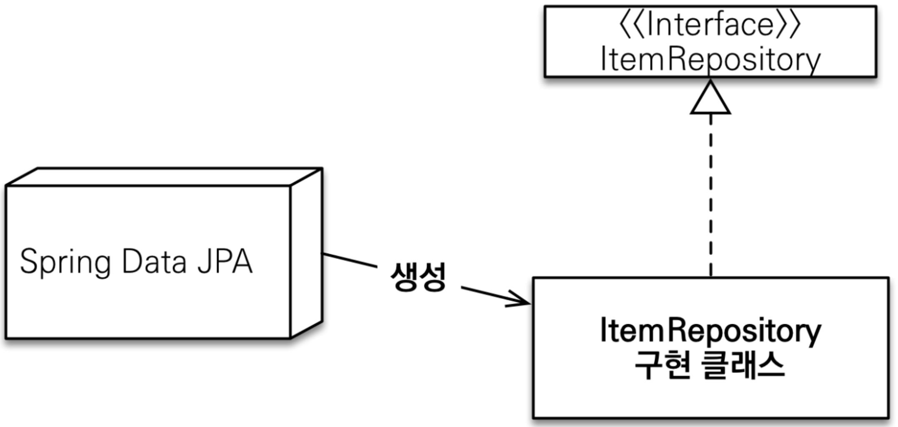
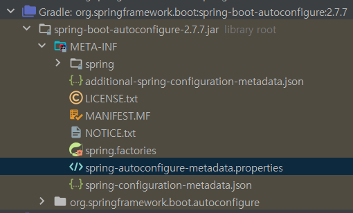
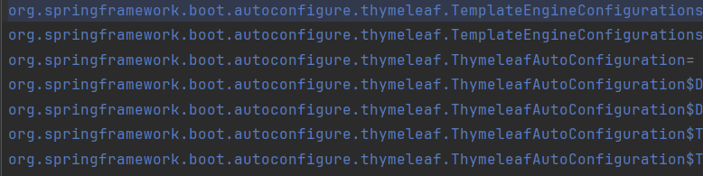

# 공용 인터페이스 설정  
```Java  
@Configuration
@EnableJpaRepositories(basePackages = "jpabook.jpashop.repository")
public class AppConfig {}
```  
+ 스프링 부트 사용시 `@SpringBootApplication`위치를 지정(해당 패키지와 하위패키지 인식)  
+ 만약 `@SpringBootApplication`의 스캔 범위가 아닌 경우에는 `@EnableJpaRepositories`로 설정합니다.  
  
### 스프링 데이터 JPA가 구현 클래스 대신 생성  
<div style="text-align: center;"></div>  

> 스프링 Data JPA는 `org.springframework.data.repository.Repository`를 상속한 인터페이스를 프록시 객체로 만들어서 빈으로 등록합니다.  
>  
스프링 부트가 시작할 때 Spring Data JPA에 대한 로그를 남겨줍니다.  
Data JPA에 관한 로그를 살펴보겠습니다.
```Java
Bootstrapping Spring Data JPA repositories in DEFAULT mode.
RepositoryConfigurationDelegate : Finished Spring Data repository scanning in 29 ms. Found 1 JPA repository interface.
```  
## Data JPA 초기화 방식
첫번째 줄을 보면 `Data JPA repository`를 초기화 할 때 여러가지 모드가 있다는 걸 확인할 수 있습니다.  
초기화 방식은 이번 주제에 벗어나기 때문에 공식 문서와 예제 문서를 남기겠습니다. 

BootStrap할 때 `DEFAULT(기본)`,`LAZY(지연)`,`Deferred(연기)` 을 설정할 수 있습니다.  
레포지토리를 언제 초기화 할지 설정할 수 있으면 상세한 설명은 아래 링크를 참조하시면 됩니다.
+ [공식문서](https://docs.spring.io/spring-data/jpa/docs/current-SNAPSHOT/reference/html/#jpa.bootstrap-mode)
+ [예제](https://www.baeldung.com/jpa-bootstrap-mode)    

기본 설정은 싱글톤 범위로 지정되어 있으며 즉시 초기화됩니다.  

## Data JPA 스캔  
정확히 무슨 일을 했는지 모르지만 `RepositoryConfigurationDelegate`가 `Data repositories`를 스캔을 완료했고 1개의 `JPA repository interface`를 찾았다고 로그를 남겼습니다.  
클래스 명에 `Delegate`라고 붙은 걸 보면 초기화를 하는 클래스가 `RepositoryConfigurationDelegate`에게 역할을 위임했을 거라 생각이 듭니다.  
  
Data JPA를 사용하려면 `Repository<T,ID>{}` 인터페이스를 상속해야 사용할 수 있습니다. 
스프링 부트는 어떻게 해당 인터페이스를 상속한 인터페이스를 찾는지 알아보겠습니다.

### Spring Data JPA가 스캔하는 방법   
```Java
@Indexed
public interface Repository<T, ID> { }
```
DataJPA는 마커 인터페이스인 `Repository<T,ID>`를 상속한 인터페이스를 찾아서 구현체를 빈 오브젝트로 등록합니다.  

JPA 리포지토리를 활성화하기 위한 어노테이션 `@EnableJpaRepositories`에 스캔할 범위 및 설정을 추가합니다.
`@EnableJpaRepositories(basePackages = "study.datajpa.repository")`처럼 스캔할 영역을 지정하거나, 
지정하지 않을 경우 해당 어노테이션이 있는 패키지를 기준으로 하위 패키지를 스캔합니다.  

SpringBoot를 사용하면 해당 어노테이션이 없어도 `@SpringBootApplication`의 스캔 범위에 포함되는 `Data JPA Repositories`는 빈 오브젝트로 등록이 됩니다.  

`@SpringBootApplication`의 메타 어노테이션으로 `@EnableJpaRepositories`는 없지만, 대신
메타 어노테이션인 `@EnableAutoConfiguration`가 대신 스캔하는 역할 클래스를 등록해주기 때문입니다.  
   
#### @EnableAutoConfiguration  
자동구성 어노테이션의 코드를 살펴보면  
```Java
@Import({AutoConfigurationImportSelector.class})
public @interface EnableAutoConfiguration {}
```  
`@Import({AutoConfigurationImportSelector.class})`를 확인할 수 있습니다.  
`@Import`의 매개변수로 클래스 정보를 넣어주면 해당 클래스가 스프링 컨테이너에 빈 오브젝트로 등록이 됩니다.  
예시 코드 입니다:
```Java
@Configuration
@Import({YourConfigurationClass1.class, YourConfigurationClass2.class}) // 클래스 여러 개 등록
public class MainConfiguration {
    // Configuration settings
}
```  
한 두개가 아니라 그 이상을 같이 등록해야할 경우에는 스프링 부트는 두 가지 방법을 사용합니다.
1. **ImportSelector**  
    ```Java
    public class YourImportSelector implements ImportSelector {
        @Override
        public String[] selectImports(AnnotationMetadata importingClassMetadata) {
            // 여기서 동적으로 클래스를 선택하여 반환합니다.
            return new String[] {
                YourConfigurationClass1.class.getName(),
                YourConfigurationClass2.class.getName(),
                // 원하는 클래스를 여기에 추가합니다.
            };
        }
    }
    @Configuration
    @Import(YourImportSelector.class)
    public class MainConfiguration {
        // Configuration settings
    }
    ```  
   빈 오브젝트로 등록할 클래스를 문자열로 반환하는 것을 확인할 수 있습니다.
2. **ImportBeanDefinitionRegistrar**  
    ```Java
    public class YourBeanDefinitionRegistrar implements ImportBeanDefinitionRegistrar {
        @Override
        public void registerBeanDefinitions(
                AnnotationMetadata importingClassMetadata, BeanDefinitionRegistry registry) {
    
            // 여기서 실제 로직을 구현합니다. 여기서는 Person을 상속하는 클래스를 찾아서 빈으로 등록하는 예시를 보여줍니다.
            // 여기서는 단순화를 위해 패키지 내의 클래스만 검사하는 것으로 가정합니다.
            String basePackage = "your.base.package"; // 검색할 패키지명을 지정해주세요.
    
            // 패키지 내의 모든 클래스를 검색하고, Person을 상속하는 클래스를 빈으로 등록합니다.
            ClassPathScanningCandidateComponentProvider scanner = new ClassPathScanningCandidateComponentProvider(false);
            scanner.addIncludeFilter(new AssignableTypeFilter(Person.class));
            // 패키지 범위에서 scanner에 입력한 필터 조건과 스캔 범위내에서 후보 컴포넌트를 찾습니다.
            // 후보를 찾아서 중복을 제외하여 Set<BeanDefinition> 형식으로 반환합니다. 
            for (BeanDefinition candidate : scanner.findCandidateComponents(basePackage)) {
                try {
                    Class<?> clazz = Class.forName(candidate.getBeanClassName());
                    // Person을 상속하는 클래스를 빈으로 등록합니다.
                    if (Person.class.isAssignableFrom(clazz)) {
                        RootBeanDefinition beanDefinition = new RootBeanDefinition(clazz);
                        //아래 코드는 @Import(clazz.getName())과 유사합니다.
                        registry.registerBeanDefinition(clazz.getSimpleName(), beanDefinition);
                    }
                } catch (ClassNotFoundException e) {
                    // 예외 처리
                }
            }
        }
    }
    @Configuration
    @Import(YourBeanDefinitionRegistrar.class)
    public class MainConfiguration {
        // Configuration settings
    }
    ```  
    `ImportBeanDefinitionRegistrar`는 복잡한 방식이지만, 어노테이션 정보와 스프링 컨테이너 저장소를 받습니다.
   1. 스캔 인스턴스를 생성합니다( 필터조건, 스캔 범위를 인수로 전달합니다. )
   2. 스캔 대상을 찾으면 후보(`candidate`)로 반환합니다.
   3. 후보 클래스를 로드한 뒤 클래스 정보로 빈정의 인스턴스를 만듭니다.
   4. 인수로 받은 빈 저장소에 저장을 합니다.
  
### `@EnableJpaRepositories`가 없어도 동작하는 이유
 
`EnableAutoConfiguration`어노테이션의 코드를 살펴보겠습니다.  
```Java
@Import({AutoConfigurationImportSelector.class})
public @interface EnableAutoConfiguration {}  
```    
**AutoConfigurationImportSelector**에 대해서 간단하게 설명을 드리면  
`META-INF/spring-autoconfigure-metadata.properties`에 작성된 클래스가 의존성이 추가되어 
메모리에 로드를 할 수 있으면 빈 오브젝트로 등록하는 역할을 합니다. 
<div style="text-align: center;"></div>
META-INF/spring-autoconfigure-metadata.properties 이미지  

<div style="text-align: center;"></div>  
  
이렇게 문자열로 스프링 부트가 기본 설정으로 만든 구성 클래스가 문자열로 작성되어있습니다. 
 
JPA에 관련된 구성 정보 클래스를 찾을 수 있습니다. 
```Java
org.springframework.boot.autoconfigure.data.jpa.JpaRepositoriesAutoConfiguration=
```  
해당 클래스를 찾아서 확인해보면 
```Java
@Import(JpaRepositoriesImportSelector.class)
public class JpaRepositoriesAutoConfiguration {}
```  
`JpaRepositoriesImportSelector.class`를 `@Import`를 통해서 빈 오브젝트를 등록하는데 
클래스 타입이 아니라 `ImportSelector`라는 이름이 클래스 명에 붙은걸 보면 문자열을 반환할거 같습니다.
```Java
static class JpaRepositoriesImportSelector implements ImportSelector {}
```  
해당 클래스는 `JpaRepositoriesAutoConfiguration`의 
정적 멤버 클래스로 문자열을 반환하는 `ImportSelector`를 확인할 수 있습니다.  
  
`JpaRepositoriesImportSelector`의 메소드를 확인해보면 
빈 오브젝트로 등록할 클래스 문자열을 반환하는 `selectImports()`와 내부 메서드인 `determineImport()`를 가지고 있습니다.
```Java
@Override
public String[] selectImports(AnnotationMetadata importingClassMetadata) {
   return new String[] { determineImport() };
}

private String determineImport() {
   return ENVERS_AVAILABLE ? EnversRevisionRepositoriesRegistrar.class.getName()
           : JpaRepositoriesRegistrar.class.getName();
}
```
`ENVERS_AVAILABLE`는 `EnableEnversRepositories`가 로드될 수 있으면 true를 반환합니다. 의존성을 추가하지 않았기 때문에 `false`입니다.  
`JpaRepositoriesImportSelector`의 결과로 `JpaRepositoriesRegistrar.class`가 반환됩니다.  

JPA 레포지토리를 확성화하는 애노테이션인 `@EnableJpaRepositories`를 다시 보겠습니다. 
```Java
@Import({JpaRepositoriesRegistrar.class})
public @interface EnableJpaRepositories {}
```  
똑같은 `JpaRepositoriesRegistrar.class`를 사용하는 것을 볼 수 있습니다.  
  
그래서 `@SpringBootApplication`에 `@EnableJpaRepositories`를 추가하지 않아도 
정상 동작하는 이유입니다.   
기본적인 스캔 범위는 `@SpringBootApplication`을 따라갑니다.  

### JpaRepositoriesRegistrar 역할  
`JpaRepositoriesRegistrar`는 `RepositoryBeanDefinitionRegistrarSupport`를 상속하고 있습니다.  
`RepositoryBeanDefinitionRegistrarSupport`의 클래스 명을 보면 어노테이션 정보와 스프링 컨테이너의 빈 저장소를 주입받아 특정 클래스를 찾아서 등록할 수 있는 클래스인 `ImportBeanDefinitionRegistrar`를 상속한 클래스라는걸 확인할 수 있습니다.  
```Java
//== JpaRepositoriesRegistrar.class
class JpaRepositoriesRegistrar extends RepositoryBeanDefinitionRegistrarSupport {

	@Override
	protected Class<? extends Annotation> getAnnotation() {
		return EnableJpaRepositories.class;
	}

	@Override
	protected RepositoryConfigurationExtension getExtension() {
		return new JpaRepositoryConfigExtension();
	}
}

//== RepositoryBeanDefinitionRegistrarSupport.class
abstract class RepositoryBeanDefinitionRegistrarSupport 
      implements ImportBeanDefinitionRegistrar
```  
`JpaRepositoriesRegistrar`클래스는 `getAnnotation`와 `getExtension`을 오버라이딩했습니다.  
1. `getAnnotation`
   이 클래스의 상위 클래스는 어노테이션의 정보를 활용해서 빈을 등록한다고 했습니다.  
   그때 사용할 어노테이션을 오버라이딩으로 `EnableJpaRepositories.class`을 반환합니다.
2. `getExtension`  
   반환되는 클래스의 역할은 저장소의 특정 콜백과 `BeanDefinition 후처리(post-processing)`를 합니다.
   `Data Jpa Repository`의 후처리 클래스인 `JpaRepositoryConfigExtension`를 반환합니다.
  
`JpaRepositoryConfigExtension`는   

1. JPA 특정 구성 확장: XML 네임스페이스 및 `@EnableJpaRepositories` 어노테이션에서 사용자 지정 속성을 파싱합니다.
2. `PersistenceAnnotationBeanPostProcessor`를 등록하여 PersistenceContext/PersistenceUnit에 주석이 달린 속성 및 메서드에 주입을 트리거합니다.
3. `PersistenceExceptionTranslationPostProcessor`를 등록하여 영속성 특정 예외를 Spring의 `DataAccessException` 계층 구조로 변환하여 예외 번역을 활성화합니다.  

#### JpaRepositoriesRegistrar 정리  
`Data JPA`에 관련된 애노테이션을 사용할 수 있게하고, 예외 처리 와 주석 및 속성을 주입하는 역할입니다.

### RepositoryBeanDefinitionRegistrarSupport 역할
`JpaRepositoriesRegistrar`는 `Data JPA`에 관련된 클래스를 반환하는 하위 클래스 입니다.  
실제 빈을 등록하는 클래스는 `RepositoryBeanDefinitionRegistrarSupport`가 되겠습니다.
```Java
public abstract class RepositoryBeanDefinitionRegistrarSupport
		implements ImportBeanDefinitionRegistrar, ResourceLoaderAware, EnvironmentAware
```
`ImportBeanDefinitionRegistrar`는 빈 저장소에 등록하기 전에 `Aware`를 구현하여 활용할 수 있습니다.  

구현하는 인터페이스에 대해 간단하게 설명하겠습니다.
1. `ResourceLoaderAware`  
   스프링 컨테이너가 해당 인터페이스를 구현하면 `ResourceLoader`를 주입해줍니다.
   `ResourceLoader`는 애플리케이션 객체가 다양한 파일 리소스에 접근해야 할 때 필요한 도구입니다.
2. `EnvironmentAware`  
   스프링 컨테이너가 해당 인터페이스를 구현하면 `Environment`를 주입해줍니다.  
   `Environment`는 `profiles`과 `properties`를 관리및 접근할 수 있습니다.  
  
`ImportBeanDefinitionRegistrar`는 `registerBeanDefinitions()`메소드를 통해서 필요한 인수를 받고 
내부 로직을 통해 빈을 등록합니다.  

> 참고:  
> `@EnableJpaRepositories`를 사용한다면 `RepositoryBeanDefinitionRegistrarSupport` 실행  
> `@EnableAutoConfiguration`을 사용했다면 `AbstractRepositoryConfigurationSourceSupport` 실행  
> 클래스 이름은 `JpaRepositoriesRegistrar`가 동일하지만, 패키지 위치와 동작 방식에 차이가 있습니다.  
> delegate 클래스는 동일한 `RepositoryConfigurationDelegate`를 사용합니다.  
> `@EnableJpaRepositories`가 없을 경우 `@SpringBootApplication`를 활용하는게 아니라 
> `@EnableJpaRepositories`의 기본 값을 활용합니다.   

`@EnableJpaRepositories`사용할 경우 전체 코드를 살펴보겠습니다.  
빈을 등록하는 `delegate.registerRepositoriesIn(registry, extension)`는 동일합니다.
```Java
@Override
public void registerBeanDefinitions(AnnotationMetadata metadata, BeanDefinitionRegistry registry,
         BeanNameGenerator generator) {
   // 방어코드
   // Guard against calls for sub-classes
   if (metadata.getAnnotationAttributes(getAnnotation().getName()) == null) {
      return;
   }
   // 스프링 저장을 위한 설정 옵션을 포함하는 클래스를 생성합니다.
   AnnotationRepositoryConfigurationSource configurationSource = new AnnotationRepositoryConfigurationSource(metadata,
         getAnnotation(), resourceLoader, environment, registry, generator);
   // 확장 클래스를 반환합니다.
   RepositoryConfigurationExtension extension = getExtension();
   // 학장 클래스와 설정 옵션 클래스를 빈 오브젝트로 저장합니다.
   RepositoryConfigurationUtils.exposeRegistration(extension, registry, configurationSource);
   // 스프링 부트에서 보던 대행 클래스를 생성합니다.
   RepositoryConfigurationDelegate delegate = new RepositoryConfigurationDelegate(configurationSource, resourceLoader,
                                                      environment);
   // 대행자가 빈 저장소에 등록합니다.
   delegate.registerRepositoriesIn(registry, extension);
}
```  
주요 코드를 실행하기 전에 방어코드가 있습니다.
```Java
// Guard against calls for sub-classes
if (metadata.getAnnotationAttributes(getAnnotation().getName()) == null) {
   return;
}
protected abstract Class<? extends Annotation> getAnnotation();
```  
`getAnnotation()`를 구현할 때 애노테이션에 대한 정보가 없으면 실행이 되지 않습니다. 

그 다음 코드로 넘어가보겠습니다.
```Java
AnnotationRepositoryConfigurationSource configurationSource = new AnnotationRepositoryConfigurationSource(metadata,
				getAnnotation(), resourceLoader, environment, registry, generator);
```
`AnnotationRepositoryConfigurationSource`는 어노테이션 기반의 Repository 구성을 처리하고 필요한 설정 정보를 추출하는 데 사용됩니다. 
매개변수로 `getAnnotation()`를 가져오는데 `JpaRepositoriesRegistrar.getAnnotation()`이 오버라이딩으로 동작해서 
`EnableJpaRepositories.class`의 애노테이션 클래스 정보가 들어갑니다.  

`RepositoryConfigurationExtension extension = getExtension();`으로 `JpaRepositoryConfigExtension`해당 오브젝트가 저장됩니다.  

```Java
RepositoryConfigurationDelegate delegate = new RepositoryConfigurationDelegate(configurationSource, resourceLoader,
				environment);
delegate.registerRepositoriesIn(registry, extension);
```  
해당 코드가 마지막으로 `registerBeanDefinitions`메소드가 종료됩니다.  
클래스 이름만 봐도 알수 있듯이 `delegate` 대리자로 특정한 빈의 구성을 
위해 다른 빈이나 설정 클래스로 처리를 위임하거나, 특정한 작업을 수행하는 데 
필요한 로직을 다른 클래스에 위임하는 등의 방식으로 대리자(delegate)를 활용합니다. 
  
대리자를 초기화할때 필요한 매개변수를 간단하게 살펴보면
1. `configurationSource`  
   Spring Data Repository 구성을 위한 소스로서, 주로 XML 또는 어노테이션과 같은 구성 요소로부터 Repository 설정 정보를 읽어옵니다. 
   예를 들어, 어노테이션 기반의 설정이나 XML 파일에서 Repository 구성에 필요한 정보를 추출하는 역할을 합니다.
2. `resourceLoader`  
   다양한 리소스에 접근할 수 있는 방법을 제공합니다. Repository 구성에 필요한 외부 파일이나 리소스에 접근하여 로드하는 데 사용될 수 있습니다.
3. `environment`  
   pring 애플리케이션의 환경 설정 정보에 접근할 수 있는 인터페이스입니다. 애플리케이션의 프로파일, 속성, 구성 등과 관련된 정보에 접근하여 
   Repository 구성 시 필요한 환경에 맞는 데이터를 제공하는 데 사용됩니다.  
  
`delegate.registerRepositoriesIn(registry, extension)`
초기화를 통해 만들어진 `delegate`는 주어진 BeanDefinitionRegistry에 조건에 일치하는 리포지토리들을 등록합니다.  

#### BeanDefinitionRegistrarSupport 정리  
스프링 부트는 `@EnableJpaRepositoies`에 대해서 알지 못해도 `@EnabaleAutoConfiguration`가 있는 패키지와 하위 패키지를 스캔하고 
빈으로 등록할 수 있도록 자동 등록합니다.  
스캔 범위가 벗어나거나 추가 속성을 정의하고 싶을 경우 `@EnableJpaRepositoies`을 사용하면 됩니다.  
사용할 경우 스캔 범위는 `기본 설정 범위 + 추가 설정 범위`로 작성해야합니다. 

### RepositoryConfigurationDelegate 빈 등록
`@EnableJpaRepositoies` 명시적으로 사용하던 안하던 최종 빈 등록을 위임받은 클래스입니다.  
`RepositoryConfigurationDelegate.registerRepositoriesIn`의 코드를 확인해 보겠습니다.

```Java
public List<BeanComponentDefinition> registerRepositoriesIn(BeanDefinitionRegistry registry,
			RepositoryConfigurationExtension extension) {
   //..이하생략
   Collection<RepositoryConfiguration<RepositoryConfigurationSource>> configurations = extension
            .getRepositoryConfigurations(configurationSource, resourceLoader, inMultiStoreMode);
   //.. 이하생략 
}  
```  
`getRepositoryConfigurations()`를 통해 레포지토리구성정보를 컬렉션으로 반환합니다.
> 참고:  
> 명시적으로 `@EnableJpaRepositories`를 사용 유무에 상관없이  
> `RepositoryConfigurationExtensionSupport`를 사용합니다.

```Java
//RepositoryConfigurationExtensionSupport.class
public <T extends RepositoryConfigurationSource> Collection<RepositoryConfiguration<T>> getRepositoryConfigurations(
			T configSource, ResourceLoader loader, boolean strictMatchesOnly) {
   // 1
   for (BeanDefinition candidate : configSource.getCandidates(loader)) {
      
      RepositoryConfiguration<T> configuration = getRepositoryConfiguration(candidate, configSource);
      Class<?> repositoryInterface = loadRepositoryInterface(configuration,
                              getConfigurationInspectionClassLoader(loader));
      
      if (repositoryInterface == null) {
         result.add(configuration);
         continue;
      }
      
      RepositoryMetadata metadata = AbstractRepositoryMetadata.getMetadata(repositoryInterface);
      
      //strictMatchesOnly는 false로 고정입니다.
      boolean qualifiedForImplementation = !strictMatchesOnly || configSource.usesExplicitFilters()
            || isStrictRepositoryCandidate(metadata);
      
      if (qualifiedForImplementation && useRepositoryConfiguration(metadata)) {
         result.add(configuration);
      }
   }

   return result; 
}
```

1번 코드인 `configSource.getCandidates(loader)`는 
```Java
@Override
public Streamable<BeanDefinition> getCandidates(ResourceLoader loader) {
   레포지토리 스캐너를 만드는데 getIncludeFilters()로 필터 조건을 넣습니다.
   RepositoryComponentProvider scanner = new RepositoryComponentProvider(getIncludeFilters(), registry);
   // 이하 생략
}
```  
`RepositoryComponentProvider`를 초기화 할 때 `getIncludeFilters()`를 실행하는데 
이때 `EnableJpaRepositories`애노테이션의 메타 정보중 `includeFilters`를 가져옵니다.

예를 들면:  
```Java
@EnableJpaRepositories(includeFilters =
                @ComponentScan.Filter(type = FilterType.ANNOTATION, classes = MyCustomAnnotation.class))
//            
@Target(ElementType.TYPE)
@Retention(RetentionPolicy.RUNTIME)
public @interface MyCustomAnnotation {}
```
이렇게 필터로 추가하여 다양하게 레포지토리 오브젝트에 추가할 수 있습니다.  

### RepositoryComponentProvider 역할
`RepositoryComponentProvider`는 특정 컴포넌트를 찾아주는 레포지토리 특화 스캐너입니다.  
필터를 저장하고 만족하는 컴포넌트를 찾아줍니다.
```Java
public RepositoryComponentProvider(Iterable<? extends TypeFilter> includeFilters, BeanDefinitionRegistry registry) {
   // 스캔할 대상 레포지토리 보관
   this.registry = registry;
   // 메타어노테이션 필터정보가 있을 경우 반복문으로 추가합니다.
   if (includeFilters.iterator().hasNext()) {
      for (TypeFilter filter : includeFilters) {
          addIncludeFilter(filter);
      }
   } else {
      // Repository.class
      super.addIncludeFilter(new InterfaceTypeFilter(Repository.class));
      super.addIncludeFilter(new AnnotationTypeFilter(RepositoryDefinition.class, true, true));
   }
   addExcludeFilter(new AnnotationTypeFilter(NoRepositoryBean.class));
}
```   
코드를 보면 인터페이스와 어노테이션 필터를 추가하는 것을 확인할 수 있습니다.  

만약 사용자 정의 필터를 추가한다면 `else`가 이하 구문이 실행안되기 때문에 
`Repository` 인터페이스나 `RepositoryDefinition` 애노테이션은 필터에 추가가 안되는 건가 생각이 들수 있습니다.  

`addIncludeFilter(filter)` 코드를 살펴보겠습니다.
```Java
@Override
public void addIncludeFilter(TypeFilter includeFilter) {
   //.. 생략
   filterPlusInterface.add(includeFilter);
   filterPlusInterface.add(new InterfaceTypeFilter(Repository.class));
   filterPlusAnnotation.add(new AnnotationTypeFilter(RepositoryDefinition.class, true, true));
   //.. 생략
}
```  
사용자 정의 필터의 유무에 상관없이 내부에 추가합니다.  
`addExcludeFilter(new AnnotationTypeFilter(NoRepositoryBean.class))` 코르를 보면 
제외 필터로 `@NoRepositoryBean`가 포함되었습니다.

`Repository`인터페이스를 상속한 인터페이스는 싱글톤 오브젝트로 등록이 되는데 
`JpaRepository,CRUDRepository`는 싱글톤 오브젝트로 등록이 되지 않습니다.  
```Java
@NoRepositoryBean
public interface CrudRepository<T, ID> extends Repository<T, ID> {}
@NoRepositoryBean
public interface JpaRepository<T, ID> {}
@NoRepositoryBean
public interface ListPagingAndSortingRepository<T, ID> {}
```
모두 `@NoRepository`를 추가하여 제외되는 것을 확인할 수 있습니다. 


#### 중복 레포지토리가 등록되는걸 설정 방법
```Java
@EnableJpaRepositories(considerNestedRepositories = true)  

//==  AnnotationRepositoryConfigurationSource.class
// @EnableJpaRepositories를 사용하는 경우 스캐너에 추가 설정이 가능합니다.
scanner.setConsiderNestedRepositoryInterfaces(shouldConsiderNestedRepositories());
@Override
public boolean shouldConsiderNestedRepositories() {
   return attributes.containsKey(CONSIDER_NESTED_REPOSITORIES) && attributes.getBoolean(CONSIDER_NESTED_REPOSITORIES);
}
```  
#### RepositoryComponentProvider 정리  
애노테이션 정보와 내부에 자동으로 추가되는 필터를 활용해서 후보 컴포넌트를 찾아주는 클래스입니다.

#### 레포지토리 로드하기
```Java
// 클래스로더로 메모리에 올립니다.
Class<?> repositoryInterface = loadRepositoryInterface(configuration,
        getConfigurationInspectionClassLoader(loader));
}
```  


#### AbstractRepositoryMetadata.getMetadata()
```Java
public static RepositoryMetadata getMetadata(Class<?> repositoryInterface) {
   return Repository.class.isAssignableFrom(repositoryInterface) ? new DefaultRepositoryMetadata(repositoryInterface)
          : new AnnotationRepositoryMetadata(repositoryInterface);
}
```
`ParentClazz.isAssignableFrom(ChildClazz)`는 Parent가 Child의 상위 클래스나 상위 인터페이스 일 경우 
`true`를 반환합니다. 애노테이션으로 등록된 경우에는 `AnnotationRepositoryMetadata`가 반환되고 인터페이스를 상속한 경우 `DefaultRepositoryMetadata`를 반환합니다.  
내부에서는 공통적으로 domainClass와 IdClass를 구분해서 저장하는 역할을 합니다.  

`qualifiedForImplementation`는 특정 의존성을 추가하지 않는 이상 true입니다. 
그리고 `useRepositoryConfiguration`는 기본값이 ture이고 반응형 레포지토리를 사용한다면 예외가 발생합니다.  
  
### `registerRepositoriesIn()` 빈 등록하기
```Java
for (RepositoryConfiguration<? extends RepositoryConfigurationSource> configuration : configurations) {

   configurationsByRepositoryName.put(configuration.getRepositoryInterface(), configuration);
   
   BeanDefinitionBuilder definitionBuilder = builder.build(configuration);
   // 1번
   extension.postProcess(definitionBuilder, configurationSource);
   
   if (isXml) {
      extension.postProcess(definitionBuilder, (XmlRepositoryConfigurationSource) configurationSource);
   } else {
      extension.postProcess(definitionBuilder, (AnnotationRepositoryConfigurationSource) configurationSource);
   }
   
   RootBeanDefinition beanDefinition = (RootBeanDefinition) definitionBuilder.getBeanDefinition();
   String beanName = configurationSource.generateBeanName(beanDefinition);
   // 2번 빈 오브젝트로 등록합니다.
   registry.registerBeanDefinition(beanName, beanDefinition);
} 
```  
#### 레포지토리 후 처리기  
스프링 부트가 지정한 기본 설정값으로 후 처리를 하고 만약 애노테이션에 개별로 설정된 설정이 있으면 
적용 시키고 빈으로 등록합니다.
```Java
@Override
public void postProcess(BeanDefinitionBuilder builder, RepositoryConfigurationSource source) {
   Optional<String> transactionManagerRef = source.getAttribute("transactionManagerRef");
   builder.addPropertyValue("transactionManager", transactionManagerRef.orElse(DEFAULT_TRANSACTION_MANAGER_BEAN_NAME));
   builder.addPropertyReference("entityManager", entityManagerRefs.get(source));
   builder.addPropertyValue(ESCAPE_CHARACTER_PROPERTY, getEscapeCharacter(source).orElse('\\'));
   builder.addPropertyReference("mappingContext", JPA_MAPPING_CONTEXT_BEAN_NAME);
}
```
## 정리  
스프링 부트는 `@EnableJpaRepositories`를 사용하면 개별 설정이 가능한 빈 등록 클래스를 호출하고 
스프링 부트가 기본 설정한 방식을 사용하면 개발자가 `@EnableJpaRepositories`에 대해서 알지 못해도 
알아서 `Spring Data JPA`가 동작하도록 설계했습니다.

