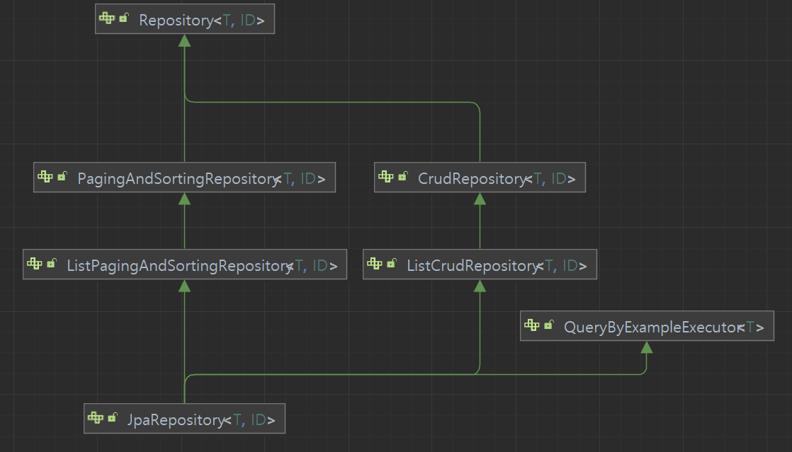

# 공통 인터페이스 
<div style="text-align: center;"></div>  
    
## 공통 인터페이스
#### Repository<T,ID>  
Data JPA Repository로 등록하기 상속하는 마커 인터페이스입니다. 
제네릭 타입으로 <T,ID>를 받고 있으며 T은 엔티티 클래스와 ID는 Serializable를 구현해야합니다.  
기본적인 CRUD에 대한 쿼리를 공용 인터페이스로 사용하려면 `CrudRepository`를 상속해야 합니다.  
필요한 쿼리 인터페이스만 노출하고 싶을 경우 상속후 코드로 작성하면 됩니다.
  
#### CrudRepository<T,ID>
특정 타입에 대한 리포지토리의 일반적인 CRUD(Create, Read, Update, Delete) 작업을 위한 인터페이스입니다.

#### PagingAndSortingRepository<T,ID>
페이징 및 정렬 추상화를 사용하여 엔터티를 검색하는 메서드를 제공하는 리포지토리 프래그먼트입니다.  
  
#### Listxxxx<T,ID>
상위 레포지토리 인터페이스를 확장하여 Iterable 대신 List를 반환합니다.  

#### JpaRepository<T,ID>
JPA 특화 확장 인터페이스입니다.  
  
## 쿼리메소드 기능
### 메소드 이름으로 쿼리 생성  
메소드 이름을 분석해서 JPQL 쿼리 실행합니다. [공식문서 설명](https://docs.spring.io/spring-data/jpa/reference/jpa/query-methods.html#jpa.query-methods.query-creation)  
**단점**은 두개 이상 조건이 필요한 경우 가독성이 떨어진다.  
  
#### 순수 JPA로 코드 작성시
+ 순수 JPA 리포지토리
    ```Java
    public List<Member> findByUsernameAndAgeGreaterThan(String username, int age) {
        return em.createQuery("select m from Member m where m.username = :username and m.age > :age",Member.class)
                .setParameter("username", username)
                .setParameter("age", age)
                .getResultList();
    }
    ```  
+ 테스트 코드  
    ```Java
    @DisplayName("MemberClass 없이 동작하나요?")
    @Test
    void v1ByPure(){
        Member m1 = new Member("AAA", 10);
        Member m2 = new Member("AAA", 20);
        jpaRepository.save(m1);
        jpaRepository.save(m2);
        List<Member> result =
                jpaRepository.findByUsernameAndAgeGreaterThan("AAA", 15);
        assertThat(result.get(0).getUsername()).isEqualTo("AAA");
        assertThat(result.get(0).getAge()).isEqualTo(20);
        assertThat(result.size()).isEqualTo(1);
    }
    ```  
  
### 쿼리 메소드 사용하기  
스프링 부트 Data Commons [공식문서](https://docs.spring.io/spring-data/commons/reference/repositories/core-concepts.html)  
```Java
public interface CrudRepository<T, ID> extends Repository<T, ID> {

    // 주어진 엔티티를 저장합니다.8
    <S extends T> S save(S entity);      
    
    // 주어진 ID로 식별된 엔티티를 반환합니다.
    Optional<T> findById(ID primaryKey); 
    
    // 모든 엔티티를 반환합니다.
    Iterable<T> findAll();       
            
    // 엔티티의 수를 반환합니다.
    long count();              
              
    // 주어진 엔티티를 삭제합니다
    void delete(T entity);    
    long deleteByLastname(String lastname); // 삭제 수 반환
    List<User> removeByLastname(String lastname); // 삭제된 엔티티 반환
               
    // 주어진 ID와 연관된 엔티티의 존재 여부를 나타냅니다.
    boolean existsById(ID primaryKey);   
  
}
```  
추가적으로 `Data JPA`나 `Data Mongo`에 특화된 추상화 인터페이스를 활용할 수 있습니다.  
```Java
public interface PagingAndSortingRepository<T, ID>  {
  Iterable<T> findAll(Sort sort);
  Page<T> findAll(Pageable pageable);
}
```  

> 참고:  
> 이 기능은 엔티티의 필드명이 변경되면 인터페이스에 정의한 메서드 이름도 꼭 함께 변경해야 한다. 그렇지
않으면 애플리케이션을 시작하는 시점에 오류가 발생한다.
이렇게 애플리케이션 로딩 시점에 오류를 인지할 수 있는 것이 스프링 데이터 JPA의 매우 큰 장점이다.  
>  
**예시 코드**
```Java
interface PersonRepository extends Repository<Person, Long> {

  List<Person> findByEmailAddressAndLastname(EmailAddress emailAddress, String lastname);

  // 쿼리에 DISTINCT 플래그를 활성화합니다
  List<Person> findDistinctPeopleByLastnameOrFirstname(String lastname, String firstname);
  List<Person> findPeopleDistinctByLastnameOrFirstname(String lastname, String firstname);

  // 특정 속성의 대소문자 무시를 활성화합니다
  List<Person> findByLastnameIgnoreCase(String lastname);
  // 모든 적합한 속성에 대해 대소문자 무시를 활성화합니다
  List<Person> findByLastnameAndFirstnameAllIgnoreCase(String lastname, String firstname);

  // 정적 ORDER BY를 위한 쿼리를 활성화합니다
  List<Person> findByLastnameOrderByFirstnameAsc(String lastname);
  List<Person> findByLastnameOrderByFirstnameDesc(String lastname);
}
```  
`findDistinctPeopleByLastnameOrFirstname`를 예시로 잡는다면  
쿼리 메소드는 subject와 predicate로 나뉩니다.  
첫 부분(`find...By`)는 쿼리의 `subject`를 정의하고,   
두번째 부분(`LastnameOrFirstname`)는 `predicate`를 형성합니다.  

> 시작 절(subject)에는 추가 표현식이 포함될 수 있습니다.   
find(또는 다른 시작 키워드)와 By 사이의 텍스트는 Distinct와 같은 결과 제한 키워드를 
사용하지 않는 한 설명적으로 취급됩니다.    

`findPeopleDistinctByLastnameOrFirstname`  
+ subject : `findDistinctBy`  
+ predicate : `LastnameOrFirstname`  
+ comment(설명) : `People`   

#### subject keyword

| Keyword                        | Description                                                                                                                                               |
|--------------------------------|-----------------------------------------------------------------------------------------------------------------------------------------------------------|
| find…By                        | 일반적인 쿼리 메소드로, 보통 저장소 유형, Collection 또는 Streamable 하위 유형 또는 Page, GeoResults 등의 결과 래퍼를 반환합니다. findBy..., findMyDomainTypeBy... 또는 추가 키워드와 조합하여 사용할 수 있습니다. |
| exists…By                      | boolean 결과를 일반적으로 반환하는 Exists 프로젝션입니다.                                                                                                                    |
| count…By                       | 숫자 결과를 반환하는 Count 프로젝션입니다.                                                                                                                                |
| delete…By, remove…By           | 결과가 없거나 삭제된 개수를 반환하는 Delete 쿼리 메소드입니다.                                                                                                                    |
| …First<number>…, …Top<number>… | 쿼리 결과를 <number> 개의 첫 번째 결과로 제한합니다. 이 키워드는 find (그리고 다른 키워드)와 by 사이의 subject 어디에서나 작성할 수 있습니다.                                                             |
| …Distinct…                     | 고유한 결과만 반환하기 위해 distinct 쿼리를 사용합니다. 해당 기능이 지원되는지는 저장소별 문서를 참고하세요.                                                                                         |
  
#### predicate keyword
|   Logical Keyword   | Keyword Expressions                      |
|:-------------------:|:-----------------------------------------|
|         AND         | And                                      |
|         OR          | Or                                       |
|        AFTER        | After, IsAfter                           |
|       BEFORE        | Before, IsBefore                         |
|     CONTAINING      | Containing, IsContaining, Contains       |
|       BETWEEN       | Between, IsBetween                       |
|     ENDING_WITH     | EndingWith, IsEndingWith, EndsWith       |
|       EXISTS        | Exists                                   |
|        FALSE        | False, IsFalse                           |
|    GREATER_THAN     | GreaterThan, IsGreaterThan               |
| GREATER_THAN_EQUALS | GreaterThanEqual, IsGreaterThanEqual     |
|         IN          | In, IsIn                                 |
|         IS          | Is, Equals (or no keyword)               |
|      IS_EMPTY       | IsEmpty, Empty                           |
|    IS_NOT_EMPTY     | IsNotEmpty, NotEmpty                     |
|     IS_NOT_NULL     | NotNull, IsNotNull                       |
|       IS_NULL       | Null, IsNull                             |
|      LESS_THAN      | LessThan, IsLessThan                     |
|   LESS_THAN_EQUAL   | LessThanEqual, IsLessThanEqual           |
|        LIKE         | Like, IsLike                             |
|        NEAR         | Near, IsNear                             |
|         NOT         | Not, IsNot                               |
|       NOT_IN        | NotIn, IsNotIn                           |
|      NOT_LIKE       | NotLike, IsNotLike                       |
|        REGEX        | Regex, MatchesRegex, Matches             |
|    STARTING_WITH    | StartingWith, IsStartingWith, StartsWith |
|        TRUE         | True, IsTrue                             |
|       WITHIN        | Within, IsWithin                         |
  
### 테스트 코드
#### IgnoreCase 사용하기
```Java
@DisplayName("IgnoreCase  대소문자 구분하지 않음")
@Test
void v1(){
    //given
    Member memberA = new Member("AAA", 10);
    Member membera = new Member("aaa", 12);
    Member member3 = new Member("AAb", 12);
    memberRepository.save(memberA);
    memberRepository.save(membera);
    memberRepository.save(member3);

    //when
    List<Member> findMembers = memberRepository.findMembersByUsernameIgnoreCase("aaa");

    //then
    Assertions.assertThat(findMembers).hasSize(2);
    Assertions.assertThat(findMembers).extracting("username","age")
            .containsExactlyInAnyOrder(
                    Tuple.tuple("AAA",10),
                    Tuple.tuple("aaa",12));
}
```  
```SQL
select m1_0.member_id,m1_0.age,m1_0.team_id,m1_0.username from member m1_0 where upper(m1_0.username)=upper('aaa');
```
#### Top2 사용하기  
회원중에 특정 이름으로 시작하는 2명가져오는데 정렬은 나이 내림차순입니다.
```Java
// OK
List<Member> findTop2MemberByUsernameStartingWithOrderByAgeDesc(String name);
// NON Top는 subject 바로 뒤에 있어야 정상 동작합니다.
List<Member> findMemberTop2ByUsernameStartingWithOrderByAgeDesc(String name);
```  
```Java
@DisplayName("이름중에 둘리로 시작하고 나이를 내림차순으로 2명 가져옵니다.")
@Test
void v2(){
    //given
    Member member1 = new Member("둘리엄마", 30);
    Member member2 = new Member("둘리아빠", 32);
    Member member3 = new Member("둘리", 10);
    memberRepository.save(member1);
    memberRepository.save(member2);
    memberRepository.save(member3);

    //when
    List<Member> findMembers = memberRepository.findTop2MemberByUsernameStartingWithOrderByAgeDesc("둘리");

    //then
    Assertions.assertThat(findMembers).hasSize(2);
    Assertions.assertThat(findMembers).extracting("username","age")
            .containsExactly(
                    Tuple.tuple("둘리아빠",32),
                    Tuple.tuple("둘리엄마",30));
}
```
```SQL
select
    m1_0.member_id,
    m1_0.age,
    m1_0.team_id,
    m1_0.username 
from
    member m1_0 
where
    m1_0.username like ? escape '\' 
order by
    m1_0.age desc 
fetch
    first ? rows only
```
SQL을 실행해보면 `escape '\'`가 추가되어 쿼리가 실행됩니다. 
`StartWith`,`EndWith`,`contains`처럼 `%`나 `_`가 들어가는 경우 
문자열 그대로 입력이 되기 때문에 특수문자로 인식하기 위해서 `\`를 JPA는 자동으로 삽입합니다.  
변경하고 싶다면 `@EnableJpaRepositories(EnableJpaRepositories=?)`를 통해서 변경할 수 있습니다.  
  
#### Like '둘리%'
```Java
@DisplayName("둘리%%를 문자 그대로 넣는다면")
@Test
void v5(){
    //given
    Member member1 = new Member("둘리엄마", 30);
    Member member2 = new Member("둘리아빠", 32);
    Member member3 = new Member("둘리", 10);
    memberRepository.save(member1);
    memberRepository.save(member2);
    memberRepository.save(member3);

    //when
    long count = memberRepository.countByUsernameIsLike("둘리%");

    //then
    Assertions.assertThat(count).isEqualTo(3);
}
```
```SQL
select count(m1_0.member_id) from member m1_0 where m1_0.username like '둘리' escape '\';
```  

### 메소드 이름으로 쿼리 생성의 한계  
+ 조건이 길어지면 코드의 가독성이 떨어진다.
+ `subject`로 엔티티의 Id나 엔티티 전체만 가져올 수 있다.  
  
  
## JPA NamedQuery
JPA의 NamedQuery를 호출할 수있습니다.  
+ 장점: 컴파일 시점에 문법오류를 잡습니다.
+ 단점: 엔티티 클래스위에 Named쿼리가 붙거나,xml 파일을 별도로 관리해야합니다.  
```Java
@Entity
@NamedQuery(
        name="Member.findByUsernameNamed",
        query="select m from Member m where m.username = :username") 
public class Member {
    //... 
}

// MemberRepository.class
@Query(name = "Member.findByUsernameNamed")
List<Member> findByUsername(@Param("username") String username);
//== 또는
List<Member> findByUsernameNamed(@Param("username") String username);
```  
+ 스프링 데이터 JPA는 선언한 "도메인 클래스 + .(점) + 메서드 이름"으로 Named 쿼리를 찾아서 실행
+ 만약 실행할 Named 쿼리가 없으면 메서드 이름으로 쿼리 생성 전략을 사용한다.
+ 필요하면 전략을 변경할 수 있지만 권장하지 않는다.
+ [공식문서 참고](https://docs.spring.io/spring-data/jpa/reference/jpa/query-methods.html#jpa.query-methods.named-queries)  

## @Query, 리포지토리 메소드에 쿼리 정의하기  
+ @org.springframework.data.jpa.repository.Query 어노테이션을 사용
+ 실행할 메서드에 정적 쿼리를 직접 작성하므로 이름 없는 Named 쿼리라 할 수 있음
+ JPA Named 쿼리처럼 애플리케이션 실행 시점에 문법 오류를 발견할 수 있음(매우 큰 장점!)  

**예제**  
```Java
public interface MemberRepository extends JpaRepository<Member, Long> {
    @Query("select m from Member m where m.username= :username and m.age = :age") 
    List<Member> findUser(@Param("username") String username, @Param("age") int age);
}
```  
### @Query 테스트 코드
```Java
// 레포지토리
@Query("select count(distinct m.username) from Member as m")
long countDistinctUsername();  

@DisplayName("중복없는 이름의 개수")
@Test
void v6(){
    //given
    Member member1 = new Member("둘리엄마", 30);
    Member member2 = new Member("둘리아빠", 32);
    Member member3 = new Member("둘리", 10);
    Member member4 = new Member("둘리", 15);
    memberRepository.save(member1);
    memberRepository.save(member2);
    memberRepository.save(member3);
    memberRepository.save(member4);

    //when
    long count = memberRepository.countDistinctUsername();

    //then
    Assertions.assertThat(count).isEqualTo(3);
}
```  

## @Query, 값, DTO 조회하기  
### 단순히 값 하나를 조회하기 및 와일드 카드  
기본 값이나 값 타입(`Embedded`)도 가능합니다.  
예제는 like
```Java
@Query("select m.username from Member as m where m.username like %:username%")
List<String> findAgesLikeBetween(@Param("username") String username);

@Query("select m.username from Member as m where m.username like %:username")
List<String> findAgesLikeFirst(@Param("username") String username);

@Query("select m.username from Member as m where m.username like :username%")
List<String> findAgesLikeList(@Param("username") String username);

@Query("select m.username from Member as m where m.username like :username_")
List<String> findAgesLikeUnder(@Param("username") String username);
```  
테스트 코드
```Java
@DisplayName("기본 값도 반환합니다.")
@Test
void v7(){
    //given
    Member member1 = new Member("둘리엄마", 30);
    Member member2 = new Member("둘리얌", 10);
    Member member3 = new Member("삼촌둘리", 15);
    memberRepository.save(member1);
    memberRepository.save(member2);
    memberRepository.save(member3);

    //when
    //%둘리% = 둘리엄마,둘리얌,삼촌둘리
    List<String> result1 = memberRepository.findAgesLikeBetween("둘리");
    //%둘리 = 삼촌둘리
    List<String> result2 = memberRepository.findAgesLikeFirst("둘리");
    //둘리% = 둘리엄마,둘리
    List<String> result3 = memberRepository.findAgesLikeLast("둘리");
    
    Assertions.assertThat(result1).containsAll(List.of("둘리엄마","둘리얌","삼촌둘리"));
    Assertions.assertThat(result2).containsAll(List.of("삼촌둘리"));
    Assertions.assertThat(result3).containsAll(List.of("둘리엄마","둘리얌"));
}
```
```SQL
select m.username from member m where m.username like '%둘리%' escape '';
select m.username from member m where m.username like '%둘리' escape '';
select m.username from member m where m.username like '둘리%' escape '';
```  

### DTO로 직접 조회하기  
```Java
@Query("select new study.datajpa.dto.MemberDto(m.id, m.username, t.name) " +
        "from Member m join m.team t")
List<MemberDto> findMemberDto();
```  
기존 JPA와 사용방식은 JPQL을 사용하기 때문에 동일합니다.  
  
## 반환타입
[반환타입 공식문서](https://docs.spring.io/spring-data/jpa/reference/repositories/query-return-types-reference.html#appendix.query.return.types)  
```Java
List<Member> findByUsername(String name); //컬렉션 
Member findByUsername(String name); //단건
Optional<Member> findByUsername(String name); //단건 Optional
```  
**조회 결과가 많거나 없으면?**
+ 컬렉션
    + 결과 없음: 빈 컬렉션 반환
+ 단건 조회
  + 결과 없음: null 반환
  + 결과가 2건 이상: javax.persistence.NonUniqueResultException 예외 발생
> 참고: 단건으로 지정한 메서드를 호출하면 스프링 데이터 JPA는 내부에서 JPQL의
Query.getSingleResult() 메서드를 호출한다. 이 메서드를 호출했을 때 조회 결과가 없으면
javax.persistence.NoResultException 예외가 발생하는데 개발자 입장에서 다루기가 상당히 불편하
다. 스프링 데이터 JPA는 단건을 조회할 때 이 예외가 발생하면 예외를 무시하고 대신에 null 을 반환한다.  
>