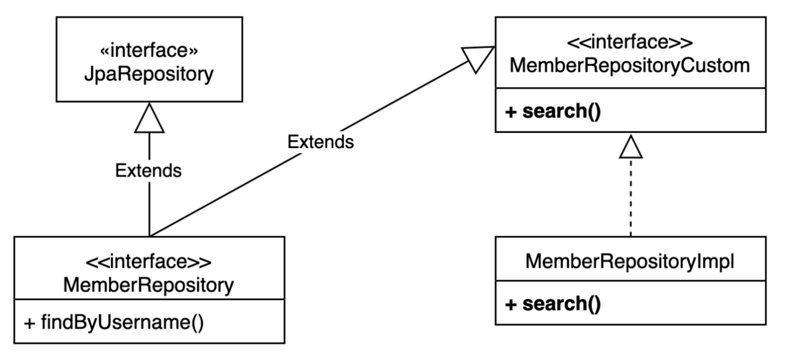

# 스프링 데이터 JPA와 QueryDSL 사용

스프링 데이터 JPA는 이름 메소드와 `@Query`를 사용하여
인터페이스 클래스가 빈 오브젝트로 구현됩니다.  
QueryDSL을 같은 레파지토리에서 사용하기 위해서 스프링 데이터 인터페이스에 구현된
사용자정의 인터페이스를 상속하게 하여 사용합니다.

<div style="text-align: center;"></div>  

#### 1. 사용자 정의 인터페이스 생성

```Java
public interface MemberRepositoryCustom {
    List<MemberTeamDto> search(MemberSearchCondition condition); 
}
```

#### 2. 사용자 정의 인터페이스 구현체 생성

```Java
public class MemberRepositoryImpl implements MemberRepositoryCustom {
    private final JPAQueryFactory queryFactory; 
    public MemberRepositoryImpl(EntityManager em) { 
        this.queryFactory = new JPAQueryFactory(em);
    }
    @Override
    public List<MemberTeamDto> search(MemberSearchCondition condition) { 
        return queryFactory
                .select(new QMemberTeamDto(
                        member.id,
                        member.username,
                        member.age, 
                        team.id, 
                        team.name)) 
                .from(member)
                .leftJoin(member.team, team)
                .where(usernameEq(condition.getUsername()),
                        teamNameEq(condition.getTeamName()), 
                        ageGoe(condition.getAgeGoe()), 
                        ageLoe(condition.getAgeLoe()))
                .fetch(); 
    }
    private BooleanExpression usernameEq(String username) {
        return isEmpty(username) ? null : member.username.eq(username);
    }
    private BooleanExpression teamNameEq(String teamName) { 
        return isEmpty(teamName) ? null : team.name.eq(teamName);
    }
    private BooleanExpression ageGoe(Integer ageGoe) {
        return ageGoe == null ? null : member.age.goe(ageGoe);    
    }
    private BooleanExpression ageLoe(Integer ageLoe) {
        return ageLoe == null ? null : member.age.loe(ageLoe);
    } 
}
```

#### 3. Repository 인터페이스에 상속 추가하기
```Java
public interface MemberRepository extends JpaRepository<Member, Long>, MemberRepositoryCustom 
{
    List<Member> findByUsername(String username); 
}
```
> 필수 : 
> 사용자 정의 인터페이스 구현체는 인터페이스 명 + Impl 이 붙어야 등록이 됩니다.  
  
