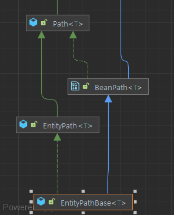

# 10분 우테코 정리
### Querydsl 설정 방법
1. 스프링부트 버전, 인텔리제이 설정, Gradle 버전, Querydsl 버전을 확인한다.
    ```Gradle
    # Querydsl 의존성 추가하기
    dependencies {
        //QueryDSL
        implementation 'com.querydsl:querydsl-jpa:5.0.0:jakarta'
    }
    ```  
    스프링 3.0 버전 이후부터는 `:jakarta` 추가합니다  
2. QClass 생성하기 위한 AnnotationProcessor 추가
    ```Gradle
    dependencies {
        annotationProcessor "com.querydsl:querydsl-apt:5.0.0:jakarta"
        annotationProcessor "jakarta.annotation:jakarta.annotation-api"
        annotationProcessor "jakarta.persistence:jakarta.persistence-api"
    }
    ```
    #### QClass란
    "엔티티 클래스 속성과 구조를 설명해주는 메타데이터 입니다."
    >Querydsl의 핵심 원칙은 타입 안전성(Type safety)입니다. 쿼리는 도메인 타입의 속성을 반영한 생성된 쿼리 타입(QClass)을 기반으로 구성됩니다. 또한 함수/메소드 호출은 완전히 타입 안전한 방식으로 구성됩니다.  
3. Build Tools, 버전차이로 QClass 위치가 변경됩니다.
   ```Gradle
   //QClass 위치 선언
   def generated = 'src/main/generated'
   
   //querydsl QClass 파일 생성 위치를 지정
   tasks.withType(JavaCompile).configureEach {
       options.getGeneratedSourceOutputDirectory().set(file(generated))
   }
   //Gradle clean시 제거할 파일 위치
   clean {
       delete file('src/main/generated')
   }
   ```
4. .gitignore 등록  
   QClass위치를 `src/main/generated`로 사용하고 싶다면 추가합니다. 버전마다 QClass의 생김세가 달라질 수 있기 때문입니다.
   ```gitignore
   ### Querydsl ###
   /src/main/gerated/
   ```

#### Querydsl에서 일관성은 중요합니다.  
쿼리 경로와 작업은 모든 구현에서 동일하며 또한 Query 인터페이스는 공통 기본 인터페이스를 갖습니다.  
Querydsl 쿼리 및 표현 타입의 표현력을 파악하기 위해서는 아래 세가지를 알아야합니다.
+ com.querydsl.core.Query
+ com.querydsl.core.Fetchable
+ com.querydsl.core.types.Expression  

### com.querydsl.core.Query
`Query`는 유창한 쿼리 언어의 주요 쿼리 인터페이스를 정의합니다.  
단 ) from 절은 구현체마다 다릅니다.  
예 ) select, group by 등

### com.querydsl.core.Fetchable  
모든 쿼리 구현체가 `Fetchable`의 인터페이스의 메서드를 구현하여 결과를 적절히 변환할 수 있도록 합니다.  
프로젝션의 결과를 결정하는 인터페이스입니다.
  
### com.querydsl.core.types.Expression   
Expression 인터페이스들은 상수, 연산, 파라미터, 경로 등 다양한 유형의 표현식을 표현하고 다루는 데 사용됩니다.
+ `Constant`: 문자열, 숫자 및 엔티티 인스턴스와 같은 상수에 대한 것
+ `FactoryExpression`: 행 기반 결과 처리를 위한 것
+ `Operation`: 일반적으로 지원되는 연산 및 함수 호출에 대한 것
+ `ParamExpression`: 바인드 가능한 쿼리 파라미터에 대한 것
+ `Path`: 변수, 속성 및 컬렉션 멤버 접근에 대한 것
+ `SubQueryExpression`: 하위 쿼리에 대한 것
+ `TemplateExpression`: 사용자 정의 구문에 대한 것    
  


> QClass는 멤버에 접근하기 위한 Path로 표현된 객체입니다.
```Java
//QClass
@Generated("com.querydsl.codegen.DefaultEntitySerializer")
// Path -> 변수 및 속성 접근을 정의합니다.
public class QPost extends EntityPathBase<Post> {
    public final NumberPath<Long> id = createNumber("id", Long.class);
    public final StringPath name = createString("name");
 }
```  
    
## Querydsl 구현 방식 
1. 사용자 정의 인터페이스 구현
   ```Java
   //1. 사용자 정의 인터페이스 사용
   public interface MemberRepository  {}
   public class MemberRepositoryImpl implements MemberRepository {
      // JpaQueryFactory 주입받기 or extends QuerydslRepositorySupport;
   }
   public interface MainRepository extends JpaRepository<T,ID>, MemberRepository {}
   ```
   **장점** : 특정 엔티티 전용 레포지토리로 유지보수가 쉽다.  
   **단점** : 구현 및 상속해야하는 인터페이스나 클래스가 많다.  
      추가로 여러 엔티티를 사용하는 조회나 비즈니스 로직 레포지토리는 단일 엔티티를 등록하는 방식에는 적합하지 않다.
2. 공통 RepsotoryBean 등록후 사용
   ```Java
   @Repository
   @RequiredArugsConstructor
   public class PaymentRepositoryCustom {
      // JpaQueryFactory 주입받기
   }
   ```  
   **장점** : 빈만 등록하면 상속 구현 필요없이 공통으로 사용 가능하다.  
      특정 엔티티에 구속되지 않은 여러 엔티티를 아우르는 경우 유리합니다.  
   **단점** : 특정 엔티티의 경우 관리해야하는 레포지토리가 늘어난다.    

## 동적 쿼리 
```Java
private BooleanExpression matchesCondition(final String type,final String min) {
   if(type.equals("orderCount"){
      return filterByOrderCount(min);
   }
   if(type.equals("rate") {
      return filterByRate(min);
   }
   return null;
}

private BooleanExpression filterByOrderCount(final String min){
   if(min == null){
      return null;
   }
   return type.count().goe(Long.perseLong(min));
}
```  

## 동적 정렬  
+ 동적인 OrderSpeccifier를 생성해야합니다
+ "OrderSpecifier"은 Query 인스턴스 내에서 정렬 기준 요소를 나타내는 Querydsl 라이브러리 객체입니다.  
> Spring Data Jpa가 제공하는 Pageable 내 Sort나 , Sort 객체를 Convert 해야합니다.
```Java
// type이 orderCount면 주문순정렬,rate면 평점순 정렬
public OrderSpecifier(Order order, Expression<T> target) {
   this(order, target, NullHandling.Default);
   order는 정렬 순서 (ASC,DESC)
   target은 정렬 기준이 되는 QClass 필드(PathBuilder로 동적으로 변경가능);
}
```
### OrderSpecifier[]는 배열로 표현 할 수 있습니다.  
예) `[type.count().asc(),member.age.desc()]`  
```SQL
-- [type.count().asc(),member.age.desc()]
ORDER BY order.count asc ,member.age desc 와 동일
```  
### Pageable의 정렬인 Sort를 사용하여 동적인 OrderSpecifier 생성
```Java
// 주문순 정렬, 주문수가 같은 경우 특정 테이블의 id 순으로 정렬
Sort.by(Direction.DESC,"orderCount","id")
```  
Sort는 식별 변수를 동적으로 변경해야하는 경우에는 적합하지 않습니다.  
#### 동적 정렬 방법
```Java
private Ordercifier[] getSortCondition(final Sort sort){
   final List<OrderSpecifier> orders - new ArrayList<>();
   if(sort.isEmpty(){
      // Sort가 비어있는 상황에 대비하여 기본 정렬을 추가합니다.
      return new OrderSpecifier[](new OrderSpecifier(DESC,store.id));
   }
   for (final Sort.order sortOrder: sort){
      addOrderSpecifierByCurrentCondition(sortOrder,orders);
   }
   return orders.toArray(new OrderSpecifier[0]);
}
```  
+ `addOrderSpecifierByCurrentCondition`
```Java
 private void addOrderSpecifierByCurrentSortCondition(
      final Sort.Order sortOrder,
      final List<OrderSpecifier> specifiers){
   com.querydsl.core.types.Order direction = Order.DESC;
   if(sortOrder.isAscending()){
      direction = Order.ASC; // ASC,DESC 여부 판단을 통해 정렬방향 결정
   }
   
   //Sort.by(Direction.DESC,"orderCount","id")
   //에서 "orderCount"와 "id"가 차례대로 들어옵니다.
   final String orderTarget = sortOrder.getProperty(); // 정렬 기준 값
   if(orderTarget.equals("orderCount")){
      specifiers.add(new OrderSpecifier(direction,order.count()));
      return;
   }
   if(orderTarget.equals("rate")){ // 평점순
      specifiers.add(new OrderSpecifier(direction,review.rate.avg()));
      return;
   }
   if(orderTarget.equals("id")){ // id순
      specifiers.add(new OrderSpecifier(direction,store.id));
      return;
   }
}
// 리팩토링
private void addOrderSpecifierByCurrentSortCondition(
        final Sort.Order sortOrder,
        final List<OrderSpecifier> specifiers) {
        
    com.querydsl.core.types.Order direction = sortOrder.isAscending() ? Order.ASC : Order.DESC;

    Map<String, Expression<?>> orderTargetMapping = new HashMap<>();
    orderTargetMapping.put("orderCount", order.count());
    orderTargetMapping.put("rate", review.rate.avg());
    orderTargetMapping.put("id", store.id);

    final String orderTarget = sortOrder.getProperty();
    if (orderTargetMapping.containsKey(orderTarget)) {
        specifiers.add(new OrderSpecifier(direction, orderTargetMapping.get(orderTarget)));
    } else {
        specifiers.add(new OrderSpecifier(direction, new NullExpression<>(Object.class)));
    }
}
```  

## Querydsl을 사용할 경우 장점  
문자열 JPQL을 Querydsl 빌더를 통해서 코드로 타입과 문법 오류를 잡아줍니다.  
메서드 네이밍을 통해서 쿼리 조건을 명시적으로 작성 할 수 있고
정렬 방식을 유추할 수 있습니다.  
메서드 분리를 통해 재 사용성 향상이 있습니다.

## 단점  
+ 영속성 컨텍스트를 이용할 수 없다.  
+ JPQL 빌더일뿐이다.
+ 업데이트 없다.

### 한방 쿼리를 조심하기
쿼리가 길어지면 비즈니스 로직이 별도로 있는지 확인한다.