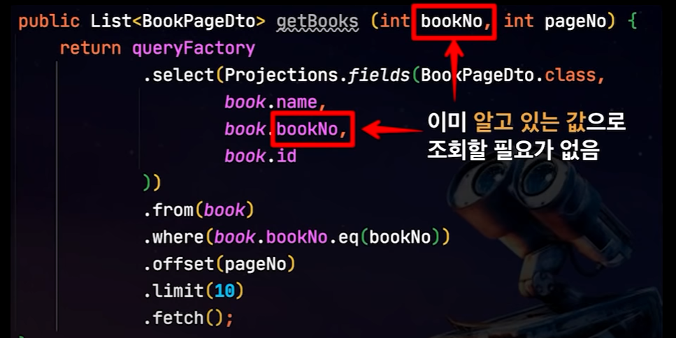
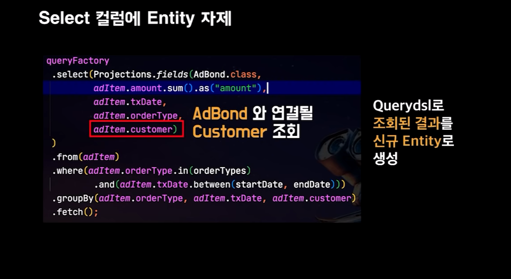
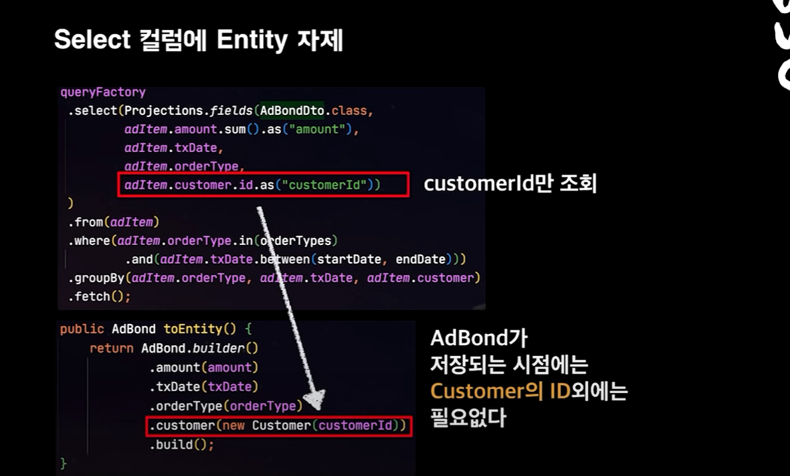
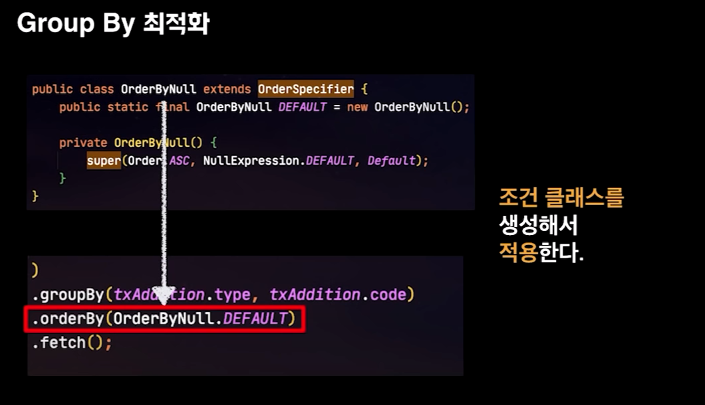
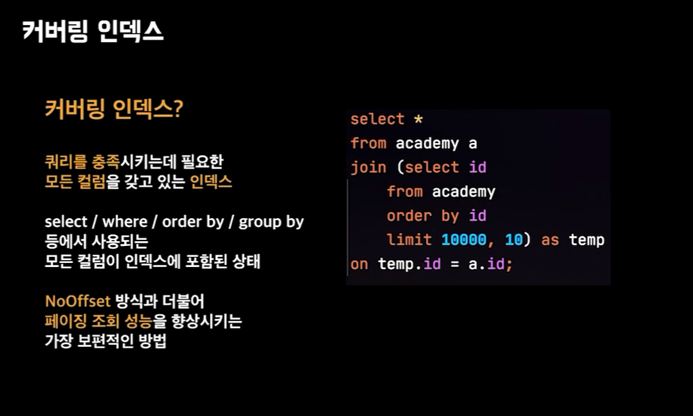
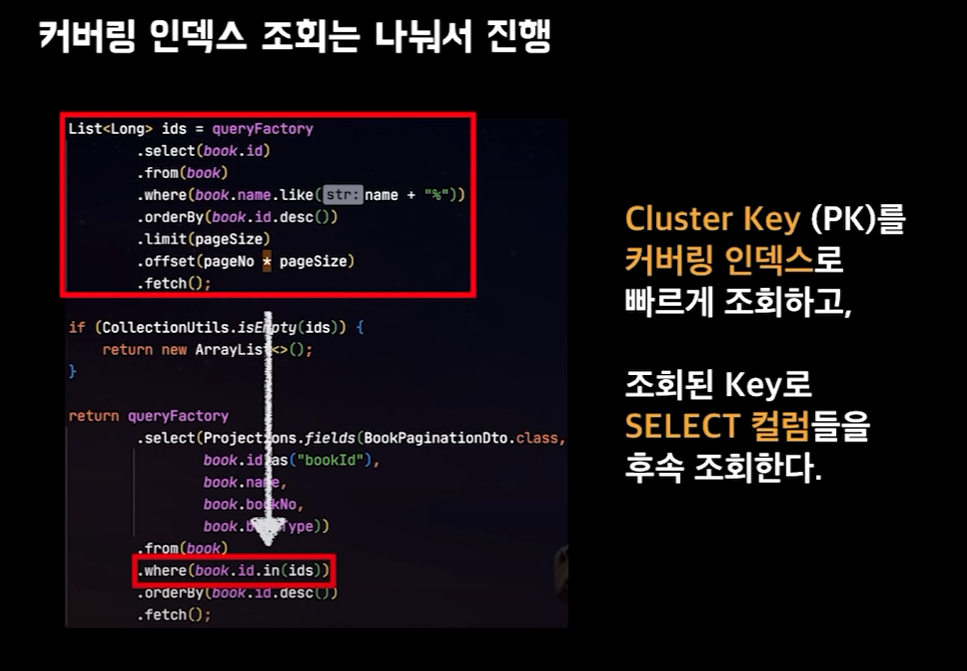

# JPA와 QueryDSL을 배우는 이유
[정리글](https://velog.io/@youngerjesus/%EC%9A%B0%EC%95%84%ED%95%9C-%ED%98%95%EC%A0%9C%EB%93%A4%EC%9D%98-Querydsl-%ED%99%9C%EC%9A%A9%EB%B2%95)  
자바 프로그래밍 언어는 객체지향 언어이고
RDBMS는 데이터 중심입니다.
객체 지향 언어와 데이터 베이스를 매핑해주는 ORM SPI인 JPA의 구현체인 하이버네이트를
사용하기 위해서 배운다.

언어와 기술을 배울 때 왜 등장하게 되었는지,
그리고 이 기술은 어떤 장점이 있고 어떤 한계가 있다.
완벽한 기술은 없기 때문에 어떤 방식으로 우회를 할 수 있는지 해결방법을 모색하는게
개발자가 할 일이다.

## 우아콘 2020 QueryDSL 사용하기
그리고 데이터베이스 , 데이터베이스를 이용하는 라이브러리의 버전마다
어떤 차이가 있기 때문에 주의해서 사용해야하는지 알아야합니다.  
MySQL 5.6에서 인덱스 컨디션 푸시다운과 서브쿼리의 최적화가 진행되었고
QueryDSL의 경우 버전별로 문법 변화가 있기 때문에 통일 해서 사용해야합니다.

### 워밍업
상속과 구현을 사용하지 않는다.
extends/implements 사용하지 않기  
매번 Querydsl을 사용할 때 마다 repository 상속과 custRepsitory 상속
그리고 customRepository 구현체가 필요하다.

매번 customRepository를 상속받기 번거롭다면

QueryRepositorySupport를 상속한 BooktRepsotiroy를 빈으로 등록합니다.
대신 단점은 매번 EntityClass를 수퍼 클래스에 초기화를 해야하고  
해당 클래스를 주입받아서 사용해야합니다.  
extend를 할거야, 아니면 compose 형식으로 사용할거냐 차이가 발생합니다.

상속/ 구현을 받지 않더라도 꼭 특정 엔티티를 지정하지 않더라도 QueryDsl를 사용해야하는 환경이라면  
이 방법을 사용하는 방식이 있습니다.

결국은 jpqQueryFactory만 있으면 QueryDsl을 사용할 수 있다.

BooleanBuilder를 사용하면 어떤 목적인지 메소드를 지정할 수가 없다.

BooleanExpression을 사용해서 검색조건 메소드를 추출해서 이름을 지정할 수 있고
메소드 체이닝을 사용할 수 있습니다.
```Java
private BooleanExpression eqName(String name) {
    if(StringUtils.isEmpty(name)){
        return null;    
    }
    return user.name.eq(name);
}
```  
조건 필터에 메소드 명을 붙여서 명시적으로 조건을 확인할 수 있습니다.  
모든 조건이 null일 경우에는 필터가 사라지므로 주의가 필요합니다.

### select 절
Querydsl의 exist 금지 (2500만건 기준)
```SQL
-- exist
select exists (
    select 1
    from ad_item_sum
    where created_date > '2020-01-01'
)

-- count(1)
select count(1)
from ad_item_sum
where created_date > '2020-01-01'
```
exsist는 조건에 만족하는 경우 쿼리가 종료되지만,
count 쿼리는 모든 데이터를 훑고 갯수를 세기 때문에 차이가 발생한다.  
스캔대상이 앞에 있을 수록 더 심한 차이가 발생한다.

Querydsl 5.0 미만은 리팩토링이 exists를 사용하면 안됩니다.
```Java
// 5.0 미안
@Override
public boolean exists(Predicate predicate){
    return createQuery(predicate).fetchCount() > 0;
}
// 5.0
@Override
public boolean exists(Predicate predicate) {
    return createQuery(predicate).select(Expressions.ONE).fetchFirst() != null;
}
```  
반대로 count() 쿼리를 조심해야합니다.
```Java
@Override
public long count(Predicate predicate) {
    return createQuery(predicate).fetchCount();
}
```
fetchCount()는 `@Deprecated`되었습니다.  
이유는 GroupBy와 Having을 사용할 경우 쿼리를 실행후 갯수를 세기 때문에 문제가 발생합니다.

jpql은 from 없이는 쿼리를 생성할 수 없다.
SQL과 다르게 JPQL은 도메인을 기준으로 쿼리를 실행하기 때문입니다.

그래서 해결 방안은 SQL의 exsist가 어떤 원리로 결과를 추출하는지 이해를 하고
jpql에서는 어떠한 방식으로 해결하면 되는지 고민을 해볼 필요가 있습니다.
1. exsist는 처음 결과를 찾아내면 쿼리를 종료합니다.
2. limit 1 도 조건에 만족하는 레코드를 찾으면 종료합니다.

exists가 jpql로 구현하기 어렵다면
limit 1 이라는 방식을 통해서 구현할 수 있다는 해결 방안이 생겼습니다.

QueryDSL은 fetchFirst == limit(1).fetchOne(); 결과 하나만 반환한다.

묵시적 Join으로 Cross join이 발생할 수 있다.  
쿼리를 항상 실행해보고 원하는 쿼리인지 확인해야한다.

엔티티와 DTO는 JPA와 엔티티는 동일 선상이 아니다
JPA는 엔티티라는 걸 사용할 수 있도록 도와주는 것.
DTO 장점 :
+ 하이버네이트 1차 2차 캐시의 문제 발생
+ 불필요한 칼럼이 조회가 되거나
+ OneToOne 에서 지연로딩이 안되는 문제

단순 조회 기능에서도 성능 이슈 요소가 많다.  
Entity와 DTO를 구분할 필요가 있다.  
Entity 조회
- 실시간으로 변경감지를 통해 Entity 수정이 필요한 경우
  Dto 조회
- 고강도 성능 개선 및 대량의 데이터 조회가 필요한 경우

여기서 고민인 점 : 엔티티보다 dto를 사용하는데 좀 더 개선된 방향은 뭘까?
1. 조회 칼럼 최소화 하기
     
   as 표현식으로 상수 값으로 대체할 수 있다.

2. select 절에 Entity를 자제
   
   이유는 Entity를 select 절에 넣으면 테이블 전체를 가져오기 때문이다.
+ 따라서 1. entity.id 만읽어오기
  만약에 1:1 관계가 있는경우 연관관계 주인이 반대편에 있으면
  해당 엔티티도 매번 읽어오게 됩니다.

만약 반대편에도 1:1 매핑이 되어있으면 수십배의 쿼리가 발생합니다.

엔티티간 연관관계를 맺으려면 반대편 엔티티가 있어야한다.
연관된 엔티티에 save를 위해서 반대편 Entity의 ID만 있으면 됩니다.  
Joincolumn에 들어갈 id만 필요한 것.

DTO -> toEntity() 메서드로 반환을 할 때에
엔티티의 대한 정보는 결국 id만 필요하기 때문에


위에 처럼 toEntity로 변환을 할때에는 id로 빈 엔티티를 만들면 됩니다.  
그리고 엔티티를 DTO로 만들고 toEntity로 만들면
불필요한 쿼리를 만들 여지를 없앨수 있습니다.  
만약 그냥 Entity로 반환 할 경우에는 캐시문제 , n+1 문제 ,1:1 문제를 고려해햐하지만
id만 반환하게해서 entity로 만들면 그 경우를  아예 배제할 수 있습니다.

만약 distinct까지 붙게되면 group by가 모든 칼럼에 붙기 때문에
중복을 체크하기위해서 임시 테이블이 만들어집니다.

gruop by 최적화  
order by null을 하면 파일솔트가 발생하지 않는다.   

> 현재 MySQL 8.0 부터는 Group By를 사용하더라도 묵시적 정렬이 수행되지 않기 때문에 
> 정렬된 결과가 필요없는 경우 굳이 "ORDER BY NULL"을 추가하지 않아도 됩니다.


조회결과가 100건 이하라면 애플리케이션에서 정렬한다.
만약 페이징일 경우 order by null을 사용하지 못한다.

DB 서버와 WAS 서버는 대부분 WAS 서버가 더 많기 때문에
WAS 자원을 이용하는게 좋다.  
우리회사는 1:1 이기 때문에 DB자원을 이용하는게 낫다.


페이징 성능을 상향 시킬수 있다.


지금은 가능하지만
클러스터 키를 커버링 인덱스로 빠르게 조회하고  
한번 더 쿼리를 실행해서 값을 조회하는 방법을 사용할 수 있습니다.

대용량 벌킅 쿼리는
```Java
Cache eviction은 캐시에서 항목을 제거하는 프로세스를 가리킵니다. 캐시는 일반적으로 시스템 성능을 향상시키기 위해 사용되며, 데이터나 연산의 결과를 더 빠르게 검색하거나 계산하기 위해 메모리에 저장하는 기술입니다.

캐시는 제한된 용량을 가지고 있기 때문에 메모리 공간이 부족하거나 더 이상 필요하지 않은 데이터를 제거하여 새로운 데이터나 더 중요한 데이터를 저장할 수 있어야 합니다. 이 때문에 캐시 관리는 중요한 측면이며, 이를 위해 eviction(제거)이 필요합니다.

Cache eviction은 다음과 같은 상황에서 발생할 수 있습니다:

용량 제한: 캐시에 저장 가능한 항목의 개수나 용량에 제한이 있는 경우, 이를 초과하는 항목을 제거하여 공간을 확보합니다.
만료 시간: 일부 캐시 항목은 특정 시간 이후에 만료되어야 합니다. 이러한 경우, 만료된 데이터는 eviction을 통해 캐시에서 제거됩니다.
LRU(Least Recently Used) 등 정책: 가장 최근에 사용되지 않거나 가장 적게 사용된 캐시 항목을 제거하는 정책을 사용하여 eviction이 발생할 수 있습니다.
유효하지 않은 데이터: 캐시에 저장된 데이터가 더 이상 유효하지 않거나 필요하지 않을 때, eviction을 통해 해당 데이터를 제거합니다.
Eviction은 캐시의 성능을 최적화하고 메모리를 효율적으로 관리하기 위해 중요합니다. 올바른 eviction 정책을 선택하고 구현하는 것은 캐시 시스템의 효율성과 성능에 큰 영향을 미칠 수 있습니다.
```

일괄 업데이트 최적화
1. 더티체킹은
    + 실시간 비즈니스 처리, 실시간 단건 처리시
2. 벌크성 쿼리
    - 대용량 데이터를 일괄로 업데이트시

하이버네이트 캐시 갱신이 필요없는 서비스에서 사용하면 좋다.

공통은 jpa라고해서 마술을 부리는게 아니기 대문에 db는 성능 이슈를 고민해야한다.  
진짜 필요한 항목만 조회는걸 추천한다.

벌크 insert rewireteBatchedStatement으로 insert 합치기 옵션을 넣어도
jpa는 auto_increment일때 insert 합치기가 적용되지 않는다.
  
----------------------------------------
QueryDsl 테크톡

DSL 특정 도메인에서 발생하는 문제를 효과적으로 해결하기 위해 설계된 언어
QClass
엔티티 클래스 속성과 구조를 설명해주는 메타데이터다
Type-safe하게 쿼리 조건 설정이 가능하다.

  